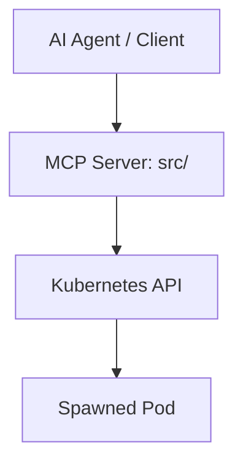

# Gemini CLI Mandate: nogoo9 / no-crd

This repository is a platform for agent-driven, on-demand pod orchestration in Kubernetes (k8s/k3s) **without Custom Resource Definitions**. It provides dynamic pod lifecycle management similar to JupyterHub or cloud IDE services, but agnostic to actual use cases.

## Project Overview

- **Purpose:** Let AI agents (and APIs) dynamically spin up, route to, and manage ephemeral pods on Kubernetes — without requiring CRDs or cluster-level operators.
- **Architecture:**
  - **MCP Server** (`src/`): Model Context Protocol server exposing pod lifecycle tools — spawn, stop, list, templates — to AI agents.
- **Technology Stack:** Bun, Deno, Node.js, TypeScript, Moon (task runner), Biome (linting/formatting), Docker, k3d (local k8s), Kubernetes client-node.

## Architecture Map



## Repository Structure

```
nogoo9/
├── src/                 # MCP server for pod lifecycle tools (cross-runtime)
│   └── polyfill.ts      # Global environment polyfills for Deno/Node compatibility
├── infra/
│   └── k3d/             # Local k3d cluster setup + manifests
├── .agents/             # AI agent rules & workflows
├── .moon/               # Moon workspace + toolchain config
├── .github/             # CI workflows
├── deno.json            # Deno import maps for Node module compatibility
└── package.json         # Package configuration & conditional exports
```

## Development Conventions

- **Toolchain:** Supports **Bun**, **Deno**, and **Node.js** runtimes. Pinned via `.prototools` and `.moon/toolchain.yml`.
- **Linting & Formatting:** Strictly adhere to **Biome**. Run `bun run check` to auto-fix and format. Do NOT use ESLint or Prettier.
- **Testing (Mandatory):**
  - **TDD:** Write unit tests before implementing features or fixes.
  - **Unit Tests:** Located in `src/**/*.test.ts`.
  - **Run all tests:** `moon run mcp:test` or `bun run test`.
- **Error Handling:** Use clear descriptive messages. MCP tools must return structured error responses.

## Key Development Commands

| Command | Description |
|---|---|
| `bun install` | Install all dependencies |
| `bun run typecheck` | TypeScript project check |
| `bun run lint` | Biome linting |
| `bun run format` | Biome lint + auto-fix |
| `bun run dev:bun` | Start MCP server from source using Bun |
| `bun run dev:deno` | Start MCP server from source using Deno |
| `bun run dev:node` | Start MCP server from source using Node.js |
| `bun run run:bun` | Run built MCP server bundle using Bun |
| `bun run run:deno` | Run built MCP server bundle using Deno |
| `bun run run:node` | Run built MCP server bundle using Node.js |
| `moon run mcp:test` | Run all unit tests |
| `moon run mcp:build` | Build MCP package (Node target) |
| `moon run mcp:deploy-wsl` | Rebuild, push, and deploy MCP to k3d cluster (localhost registry) |
| `moon run mcp:deploy` | Rebuild, push, and deploy MCP to k3d cluster |

## Key Files & Directories

- `src/index.ts`: MCP server entry point — transport selection (HTTP/STDIO) and signal handling.
- `src/server.ts`: HTTP server setup with CORS, runtime detection, and SSE keep-alive streaming.
- `src/polyfill.ts`: Sets up global variables (`global`, `Buffer`) to ensure seamless execution in Deno.
- `deno.json`: Deno configuration map for Node compatibility imports.
- `src/mcp/`: MCP tool implementations (pods, spawner, templates, auth, config).
- `infra/k3d/`: Local cluster config, bootstrap script, k8s manifests.
- `.moon/workspace.yml`: Moon workspace project discovery.
- `.moon/toolchain.yml`: Pinned Bun + Node + Deno versions.

## AI Agents' Rules & Workflows

Slash-command workflows and always-on rules live in `.agents/`. **Always use them — never bypass.**

### Workflows

| Slash command | File | When to use |
|---|---|---|
| `/format` | `.agents/workflows/format.md` | After **any** code change — `bun run format` + `bun run typecheck` |
| `/commit` | `.agents/workflows/commit.md` | When committing — format → typecheck → safety review → generated commit message → `git add -A && git commit` |
| `/bump` | `.agents/workflows/bump.md` | Version bump — reads commits since last tag, picks semver level, updates `package.json`, CHANGELOG |
| `/test-local` | `.agents/workflows/test-local.md` | Full local gate (no infra) — format, typecheck, all package tests |
| `/security` | `.agents/workflows/security.md` | SAST scan via Semgrep on changed files — mandatory before every push |
| `/setup-skills` | `.agents/workflows/setup-skills.md` | Install required AI agent skills after cloning (skills are gitignored) |
| `/setup-env` | `.agents/workflows/setup-env.md` | Full environment check — verifies Bun, Node, Moon, Deno, Docker, kubectl, k3d, Git, installs deps, runs smoke tests |

### Rules

| Rule | Trigger | Effect |
|---|---|---|
| `.agents/rules/format.md` | `always_on` | Run `/format` after every code change. Task is not done until both `bun run format` and `bun run typecheck` pass with zero errors. |
| `.agents/rules/pre-push.md` | `always_on` | Before `git push`: run `/test-local` (format → typecheck → tests → `/security`). All must pass. Never force-push `main`. |
| `.agents/rules/code-design.md` | `always_on` | Think before coding, simplicity first, surgical changes, goal-driven execution. |
| `.agents/rules/commit.md` | `model_decision` | When user asks to commit/stage, run `/commit` workflow. Never use `git commit --no-verify`. |
