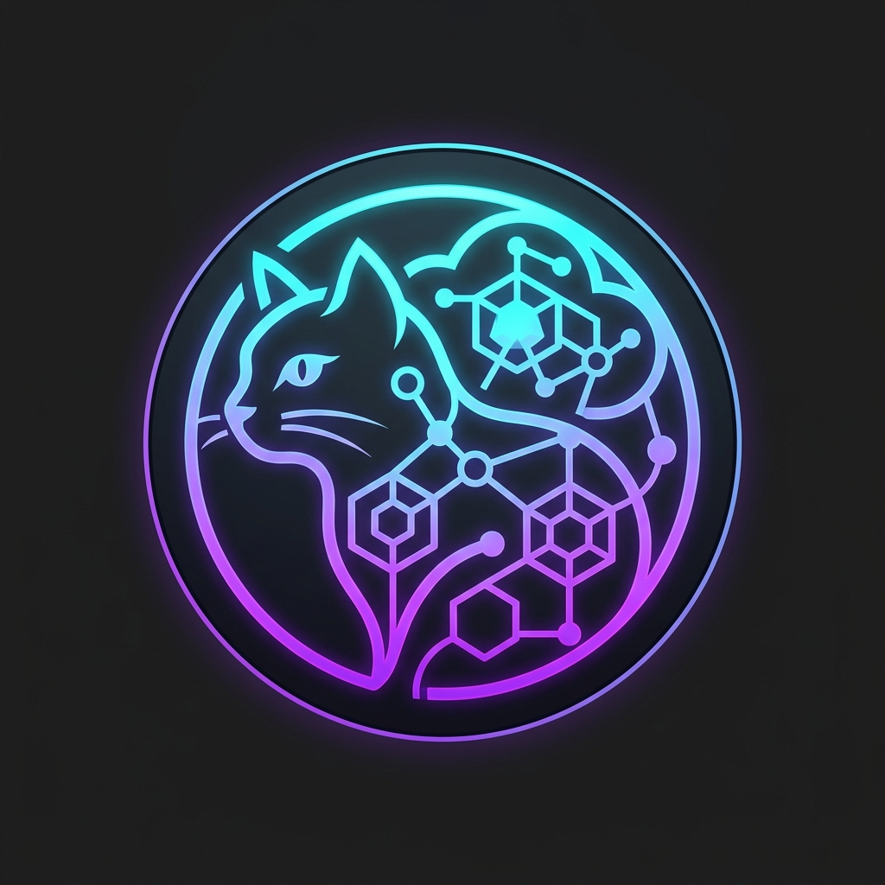

# @nogoo9/no-crd

<p align="center">
  
</p>

> **Agent-Driven, On-Demand Pod Orchestration in Kubernetes — Without Custom Resource Definitions.**

[](https://www.npmjs.com/package/@nogoo9/no-crd)
[](https://www.npmjs.com/package/@nogoo9/no-crd)
[](https://nogoo9.github.io/no-crd/)
[](https://github.com/nogoo9/no-crd/blob/main/LICENSE)
[](https://coveralls.io/github/nogoo9/no-crd?branch=main)
[](https://securityscorecards.dev/viewer/?uri=github.com/nogoo9/no-crd)
[](https://modelcontextprotocol.io)
[](https://bun.sh)
[](https://deno.land)
[](https://nodejs.org)

`@nogoo9/no-crd` is a lightweight, cross-runtime Model Context Protocol (MCP) server that empowers AI agents and APIs to dynamically spawn, route to, and manage ephemeral containerized sandboxes on standard Kubernetes (k8s/k3s) clusters — **without requiring Custom Resource Definitions (CRDs)**, cluster-level operators, or elevated RBAC permissions. 

It provides JupyterHub-like dynamic pod lifecycle management but is completely agnostic to actual workloads and supports multi-runtime execution under **Bun**, **Deno**, and **Node.js**.

📚 **For detailed guides, API reference, and configuration options, visit the public [Documentation Website](https://nogoo9.github.io/no-crd/) or access the built-in documentation served directly at `/docs/` (e.g. `http://localhost:3000/docs/`) when running the server.**

---

## 🚀 Key Features

- **No CRDs Required:** Runs directly against core Kubernetes resources (Pods, ConfigMaps, ServiceAccounts). Highly portable, secure, and compatible with restricted/managed environments (EKS, GKE, K3s).
- **Agent Sandbox Spawner:** Specialized spawner tools that automate workspace provisioning with context validation, init containers, IAM roles, pre-stop hooks, and lifecycle sync.
- **ConfigMap-Based Templates:** Store, version, and load reusable pod templates stored as standard Kubernetes ConfigMaps.
- **Local Filesystem Templates:** Bake YAML/JSON pod templates into Docker images or mount them from host paths — with built-in defaults shipped in the package.
- **Isomorphic Multi-Runtime SDK:** Imports seamlessly as a composable programmatic SDK or MCP server running under Node.js, Bun, or Deno.
- **Workspace Routing Proxy:** Built-in reverse proxy routing that dynamically pipes traffic to running container IPs with secure user token ownership verification, path-scoped session cookies (`nocr_token` and `nocr_sess`), and automatic HMAC-signed session management for short-lived token resilience.
- **Embedded Web UI App:** Exposes an interactive web-based Pod Manager interface featuring a light/dark theme toggle, client-side PKCE OIDC login with proactive silent token refresh, and workspace file preview rendering (supporting HTML sandboxed iframes and custom Markdown rendering).

---

## 📦 Installation & Usage

You can run `@nogoo9/no-crd` directly via `npx`, install it globally, or run it with different JavaScript runtimes.

### Run Directly via NPX (No Installation)
```bash
# Start SSE (HTTP) server on port 3000
npx @nogoo9/no-crd

# Run over standard input/output (stdio)
npx @nogoo9/no-crd --transport stdio
```

### Install Globally
```bash
# Install package
npm install -g @nogoo9/no-crd

# Use the nocrd9 command-line binary
nocrd9 --transport stdio --mode cluster
```

### Run with Bun, Deno, or Node
The CLI dynamically supports routing execution through Deno, Bun, or Node.js runtimes:
```bash
# Run using Deno
nocrd9 --runtime deno --transport http --port 3050

# Run using Node
nocrd9 --runtime node --transport stdio

# Run with HTTPS / custom TLS certificates
bun run src/server-entry.ts --tls-cert cert.pem --tls-key key.pem
```

### Run via Docker

The official container image is published to GitHub Container Registry (GHCR) as [`ghcr.io/nogoo9/no-crd`](https://github.com/nogoo9/no-crd/pkgs/container/no-crd). You can run the MCP server in a container by mounting your local Kubernetes config:

```bash
docker run -d -p 3000:3000 \
  -v "$HOME/.kube/config:/app/.kube/config:ro" \
  -e KUBECONFIG=/app/.kube/config \
  ghcr.io/nogoo9/no-crd:latest
```

### 🦕 Bun & Deno Kubernetes Certificate Compatibility
By default, the `@kubernetes/client-node` package uses Node.js's `https.Agent` to attach client certificates and verify server CAs. Because Bun and Deno use native web-standard HTTP engines, they ignore these Node-specific agents, which typically leads to connection failures (`UnknownIssuer`) or authentication errors (`401 Unauthorized`).

`@nogoo9/no-crd` solves this automatically by intercepting outbound requests with a custom isomorphic transport that:
* **Dynamically Extracts Credentials**: Intercepts the request agent constructed by `@kubernetes/client-node` and extracts the fully-resolved cert, key, and CA certificate data.
* **Propagates to Bun**: Feeds certificate options directly into the native Bun `fetch` `tls` configurations.
* **Propagates to Deno**: Instantiates a temporary `Deno.HttpClient` with `caCerts` to securely perform requests (meaning you do not need the `--unsafely-ignore-certificate-errors` flag for Kubernetes connections).

### 🔌 Bun WebSocket Upgrade Compatibility Warning

When running the MCP server or proxy under **Bun** (versions before the fix in [oven-sh/bun#28871](https://github.com/oven-sh/bun/pull/28871) is fully integrated), there is a known issue where WebSocket connection upgrades through Fastify or `node:http` drop data or close immediately.

*   **Symptoms**: WebSocket connections (e.g. term/GUI access to workspace pods) hang, fail, or return `400 Bad Request` followed by immediate termination.
*   **Root Cause**: Bun's native HTTP parser doesn't switch the socket into raw streaming mode in userland quickly enough when the `upgrade` event handler executes asynchronously. The native C++ HTTP parser keeps expecting subsequent payloads to be HTTP requests and rejects them.
*   **Mitigation**: Run the production container or daemon using **Node.js** (`node dist/server-entry.js` or `npx tsx src/server-entry.ts`) where the upgrade flow behaves natively.

---

## ⚙️ Configuration & Environment Variables

The server and command-line utility are configurable using CLI options or environment variables.
<!-- CONFIG_TABLES_START -->

### 🔌 Server Configuration

| CLI Option | Environment Variable | Default | Allowed Values | Description |
|---|---|---|---|---|
| `-t, --transport` | `TRANSPORT` | `http` | `http`, `stdio`, `both` | Server transport mode. `both` fires up both transports simultaneously. |
| `-p, --port` | `PORT` | `3000` | Number | HTTP server port for SSE transport. |
| `-H, --host` | `HOST` | `0.0.0.0` | String | Host interface to bind the HTTP/SSE server to. |
| `--base-url` | `BASE_URL` | `""` | Path string | Base URL path prefix for hosting behind a reverse proxy (e.g. `/gateway/no-crd`). |
| - | `STATELESS` | `false` | `true`, `false` | Enable stateless request handling (no session affinity). |
| `-l, --log-level` | `LOG_LEVEL` | `info` | `debug`, `info`, `warning`, `error`, `fatal` | Logging verbosity filter. |
| - | `LOG_FILE` | `nogoo9-mcp.log` | String | Output file path for file logging. |

### 🔒 TLS Configuration

| CLI Option | Environment Variable | Default | Allowed Values | Description |
|---|---|---|---|---|
| `--tls-cert` | `TLS_CERT` | - | Path string | Path to TLS certificate file to enable HTTPS. |
| `--tls-key` | `TLS_KEY` | - | Path string | Path to TLS private key file to enable HTTPS. |
| `--tls-ca` | `TLS_CA` | - | Path string | Path to TLS CA certificate file for HTTPS client/verification. |
| - | `NODE_TLS_REJECT_UNAUTHORIZED` | `true` | `0 (false)`, `1 (true)` | Set to `0` to bypass TLS verification (for development/testing only). |

### 🌐 CORS Configuration

| CLI Option | Environment Variable | Default | Allowed Values | Description |
|---|---|---|---|---|
| `--cors-origin` | `CORS_ALLOWED_ORIGIN`, `CORS_ORIGIN` | `*` | String | CORS Allowed Origin header. |
| `--cors-methods` | `CORS_ALLOWED_METHODS`, `CORS_METHODS` | `GET, POST, OPTIONS` | String | CORS Allowed Methods header. |
| `--cors-headers` | `CORS_ALLOWED_HEADERS`, `CORS_HEADERS` | `Content-Type, Authorization, mcp-protocol-version, mcp-session-id` | String | CORS Allowed Headers header. |
| `--cors-allow-credentials` | `CORS_ALLOW_CREDENTIALS`, `CORS_CREDENTIALS` | `false` | `true`, `false` | Enable CORS Access-Control-Allow-Credentials header. |
| `--cors-expose-headers` | `CORS_EXPOSED_HEADERS`, `CORS_EXPOSED` | `mcp-session-id` | String | Custom CORS Access-Control-Expose-Headers header. |
| `--cors-max-age` | `CORS_MAX_AGE` | - | Number | Custom CORS Access-Control-Max-Age header in seconds. |

### ☸️ Kubernetes Configuration

| CLI Option | Environment Variable | Default | Allowed Values | Description |
|---|---|---|---|---|
| `-m, --mode` | `MODE` | `cluster` | `cluster`, `namespaced` | Kubernetes access scope. `namespaced` locks operations to a single namespace. |
| `-n, --namespace` | `NAMESPACE`, `DEFAULT_NAMESPACE` | `nogoo9` | String | Default Kubernetes namespace for operations. |
| `--disable-permission-checks` | `DISABLE_PERMISSION_CHECKS` | `false` | `true`, `false` | Disable Kubernetes RBAC permission checks and assume all tools are enabled. |
| `--managed-only` | `MANAGED_ONLY` | `true` | `true`, `false` | When true, pod tools only operate on pods managed by this server (`nogoo9/managed-by` label). No one bypasses this, not even admins. See [ADR-008](docs/decisions/ADR-008-managed-only-pod-access-control.md). |
| `--default-workspace-port` | `DEFAULT_WORKSPACE_PORT` | - | Number | Default target port inside the workspace pods to proxy traffic to. |
| - | `REGISTRY_URL` | - | URL string | Target container registry URL to query for images (e.g. `http://localhost:5001`). |
| - | `TEMPLATES_DIR` | - | Path string | Path to local directory containing pod template files (YAML/JSON). See [ADR-001](docs/decisions/ADR-001-template-file-format.md). |
| - | `BUILTIN_TEMPLATES` | `true` | `true`, `false` | Set to `false` to disable built-in templates shipped with the package. |

### 🔑 Authentication Configuration

| CLI Option | Environment Variable | Default | Allowed Values | Description |
|---|---|---|---|---|
| `--auth-enabled` | `AUTH_ENABLED` | `false` | `true`, `false` | Enables JWT token authentication on MCP tools and route proxy. |
| - | `JWT_VERIFICATION_REQUIRED` | `true` | `true`, `false` | Enable/disable JWT signature verification (signature checks). |
| - | `JWT_SECRET` | - | String | Symmetric HMAC-SHA256 secret for token verification. |
| - | `JWT_PUBLIC_KEY` | - | String | PEM encoded RSA/ECDSA public key for asymmetric token verification. |
| - | `JWKS_URI` | - | URL string | Remote JWKS endpoint URL to dynamically retrieve verification keys. |
| - | `INTROSPECTION_ENDPOINT`, `JWT_INTROSPECTION_ENDPOINT` | - | URL string | Endpoint for token introspection/validation. |
| - | `OAUTH_CLIENT_ID` | - | String | OAuth client ID for auth configuration. |
| - | `OAUTH_CLIENT_SECRET` | - | String | OAuth client secret for auth configuration. |
| - | `JWT_AUDIENCE` | - | String | Expected token audience. Falls back to `OAUTH_CLIENT_ID` if set. |
| - | `AUTH_ISSUER`, `JWT_ISSUER` | `""` | URL string | Identifier URL for the Authorization Server advertised in metadata discovery. |
| - | `AUTH_SUB_JSONPATH` | `$.sub` | JSONPath | Payload path to extract unique user identity from JWT payload. |
| `--auth-scope-jsonpath` | `AUTH_SCOPE_JSONPATH` | `$.scope` | JSONPath | Payload path to extract scopes claim from JWT payload. |
| `--auth-roles-jsonpath` | `AUTH_ROLES_JSONPATH`, `AUTH_ADMIN_JSONPATH` | `$.realm_access.roles` | JSONPath | Payload path to extract user roles from JWT payload. |
| - | `AUTH_ADMIN_ROLE` | `nogoo9-admin` | String | Role name signifying administrator access. |
| `--auth-required-read-scope` | `AUTH_REQUIRED_READ_SCOPE` | - | String | OAuth scope required for read operations. If not set, read scope check is bypassed. |
| `--auth-required-write-scope` | `AUTH_REQUIRED_WRITE_SCOPE` | - | String | OAuth scope required for write/mutation operations. If not set, write scope check is bypassed. |
| `--auth-required-read-role` | `AUTH_REQUIRED_READ_ROLE` | - | String | User role required for read operations. If not set, read role check is bypassed. |
| `--auth-required-write-role` | `AUTH_REQUIRED_WRITE_ROLE` | - | String | User role required for write/mutation operations. If not set, write role check is bypassed. |
| - | `PROXY_SESSION_TTL` | `1800` | Number | Session cookie expiration lifetime in seconds (sliding window duration). |
| - | `PROXY_SESSION_SECRET` | `""` | String | HMAC secret key used to sign stateless session cookies. Falls back to `JWT_SECRET` if not configured. |

### 🖥️ UI & Themes Configuration

| CLI Option | Environment Variable | Default | Allowed Values | Description |
|---|---|---|---|---|
| - | `UI_ENABLED` | `true` | `true`, `false` | Enables the embedded HTML Pod Manager UI resource. |
| - | `THEMES_DIR` | `themes` | Path string | Local directory path containing custom CSS UI themes. |
| - | `THEMES_CONFIGMAP` | - | String | Name of Kubernetes ConfigMap containing custom UI theme configurations. |
| - | `DOCS_DIR` | `/app/docs (Docker) or docs/.vitepress/dist (Local)` | Path string | Base directory from which static documentation files are served. |
| - | `OAUTH_DISCOVERY_URL` | `""` | URL string | Discovery URL for the OAuth authorization server used by the UI client. |
| - | `OAUTH_CLIENT_ID` | `""` | String | OAuth client ID for UI authorization. |
| - | `OAUTH_LOGIN_METHOD` | `redirect` | `redirect`, `popup` | Login interaction mode for UI OAuth client. |


<!-- CONFIG_TABLES_END -->

---

## ☸️ Kubernetes Setup & RBAC Permissions

For the `@nogoo9/no-crd` MCP server to interact with Kubernetes, it must run with appropriate RBAC permissions. Depending on your configuration, you can deploy it with **Cluster-Wide (ClusterRole)** access or **Namespace-Scoped (Role)** access.

### Tool-to-Permission Mapping
Below is the mapping showing which Kubernetes API resources and verbs each MCP tool requires. The server dynamically checks these permissions at startup (via `SelfSubjectAccessReview`) and only registers tools that the active identity is authorized to use.

<!-- PERMISSIONS_TABLE_START -->

### Resource: `configmaps`

| Required Verb | Associated MCP Tools | Description / Purpose |
|---|---|---|
| `create` | `create_template` | Save a new pod template definition as a ConfigMap. |
| `delete` | `delete_template` | Delete a stored pod template ConfigMap. |
| `get` | `create_pod_from_template` | Read template pod specifications stored in ConfigMaps. |
| `update` | `update_template` | Modify metadata, annotations, or specifications of an existing template. |

### Resource: `namespaces`

| Required Verb | Associated MCP Tools | Description / Purpose |
|---|---|---|
| `list` | `list_namespaces` | Discover namespaces in the cluster (only required in cluster access mode). |

### Resource: `pods`

| Required Verb | Associated MCP Tools | Description / Purpose |
|---|---|---|
| `create` | `create_pod`, `create_pod_from_template`, `spawn_workspace` | Provision and deploy new pods or workspace sandboxes. |
| `delete` | `delete_pod`, `stop_workspace` | Terminate and clean up pods or workspace sandboxes. |
| `get` | `get_pod`, `get_workspace` | Retrieve detailed JSON spec for a specific pod. |
| `list` | `list_pods`, `list_workspaces` | Retrieve lists of pods or agent workspace pods. |
| `patch` | `patch_pod` | Strategic merge patch labels, annotations, or resource requests/limits. |

### Resource: `pods/log`

| Required Verb | Associated MCP Tools | Description / Purpose |
|---|---|---|
| `get` | `get_pod_logs` | Retrieve standard output/error logs from pod containers. |


<!-- PERMISSIONS_TABLE_END -->

### 1. Cluster-Wide Mode (`MODE=cluster`)
Use this mode if you want the MCP server to manage sandboxes across any namespace in the cluster.

Create a `ClusterRole` and `ClusterRoleBinding`:

```yaml
apiVersion: rbac.authorization.k8s.io/v1
kind: ClusterRole
metadata:
  name: nogoo-mcp
rules:
  - apiGroups: [""]
    resources: ["pods"]
    verbs: ["get", "list", "watch", "create", "delete", "patch", "update"]
  - apiGroups: [""]
    resources: ["pods/log"]
    verbs: ["get"]
  - apiGroups: [""]
    resources: ["namespaces"]
    verbs: ["get", "list"]
  - apiGroups: [""]
    resources: ["configmaps"]
    verbs: ["get", "list", "create", "update", "patch", "delete"]
  - apiGroups: [""]
    resources: ["serviceaccounts"]
    verbs: ["get", "list", "create", "update", "patch", "delete"]
---
apiVersion: rbac.authorization.k8s.io/v1
kind: ClusterRoleBinding
metadata:
  name: nogoo-mcp
roleRef:
  apiGroup: rbac.authorization.k8s.io
  kind: ClusterRole
  name: nogoo-mcp
subjects:
  - kind: ServiceAccount
    name: nogoo-mcp
    namespace: nogoo9 # Change to the namespace where your MCP server runs
```

### 2. Namespace-Scoped Mode (`MODE=namespaced`)
Use this mode if the MCP server should be restricted to a single namespace (e.g. `nogoo9`). In this mode, no cluster-level or administrative permissions are needed.

Create a `Role` and `RoleBinding` in the target namespace:

```yaml
apiVersion: rbac.authorization.k8s.io/v1
kind: Role
metadata:
  name: nogoo-mcp
  namespace: nogoo9
rules:
  - apiGroups: [""]
    resources: ["pods"]
    verbs: ["get", "list", "watch", "create", "delete", "patch", "update"]
  - apiGroups: [""]
    resources: ["pods/log"]
    verbs: ["get"]
  - apiGroups: [""]
    resources: ["configmaps"]
    verbs: ["get", "list", "create", "update", "patch", "delete"]
  - apiGroups: [""]
    resources: ["serviceaccounts"]
    verbs: ["get", "list", "create", "update", "patch", "delete"]
---
apiVersion: rbac.authorization.k8s.io/v1
kind: RoleBinding
metadata:
  name: nogoo-mcp
  namespace: nogoo9
roleRef:
  apiGroup: rbac.authorization.k8s.io
  kind: Role
  name: nogoo-mcp
subjects:
  - kind: ServiceAccount
    name: nogoo-mcp
    namespace: nogoo9
```
*(Note: In namespace-scoped mode, the `list_namespaces` tool will only return the target namespace, and namespace parameter inputs to all tools will default to the target namespace.)*

---

## 🛠️ MCP Integration Configs

To let AI coding assistants (like Claude Desktop, Cursor, Cline, or Roo Code) orchestrate Kubernetes workspaces, add `@nogoo9/no-crd` to your MCP configuration. Choose the configuration block below that matches your deployment mode (**Cluster-Wide** vs. **Namespace-Scoped**).

### 1. Claude CLI / Claude Desktop
Add to your server configurations (usually `~/.config/Claude/config.json` or `~/Library/Application Support/Claude/config.json`):

#### Cluster-Wide Mode
```json
{
  "mcpServers": {
    "no-crd": {
      "command": "npx",
      "args": [
        "-y",
        "@nogoo9/no-crd",
        "--transport",
        "stdio",
        "--mode",
        "cluster",
        "--namespace",
        "nogoo9"
      ]
    }
  }
}
```

#### Namespace-Scoped Mode
```json
{
  "mcpServers": {
    "no-crd": {
      "command": "npx",
      "args": [
        "-y",
        "@nogoo9/no-crd",
        "--transport",
        "stdio",
        "--mode",
        "namespaced",
        "--namespace",
        "nogoo9"
      ]
    }
  }
}
```

### 2. Cursor
In Cursor Settings:
1. Go to **Settings** > **Features** > **MCP**.
2. Click **+ Add New MCP Server**.
3. Fill in details based on your variant:
   - **Name**: `no-crd`
   - **Type**: `stdio`
   - **Command**:
     - *Cluster-Wide*: `npx -y @nogoo9/no-crd --transport stdio --mode cluster --namespace nogoo9`
     - *Namespace-Scoped*: `npx -y @nogoo9/no-crd --transport stdio --mode namespaced --namespace nogoo9`

### 3. Cline / Roo Code
Add to `mcp_settings.json` (inside VS Code global storage paths):

#### Cluster-Wide Mode
```json
{
  "mcpServers": {
    "no-crd": {
      "command": "npx",
      "args": [
        "-y",
        "@nogoo9/no-crd",
        "--transport",
        "stdio",
        "--mode",
        "cluster",
        "--namespace",
        "nogoo9"
      ]
    }
  }
}
```

#### Namespace-Scoped Mode
```json
{
  "mcpServers": {
    "no-crd": {
      "command": "npx",
      "args": [
        "-y",
        "@nogoo9/no-crd",
        "--transport",
        "stdio",
        "--mode",
        "namespaced",
        "--namespace",
        "nogoo9"
      ]
    }
  }
}
```

### 4. Local Development / Cross-Runtime Configurations
If you are developing locally or running the server directly from the source repository, you can register the local server with your MCP client using one of the following configurations:

#### Bun (Source execution)
Recommended for development on Bun:
```json
    "nogoo9-no-crd-local-bun": {
      "command": "bun",
      "args": ["run", "src/index.ts"],
      "env": {
        "TRANSPORT": "stdio",
        "NODE_TLS_REJECT_UNAUTHORIZED": "0"
      }
    }
```

#### Deno (Source execution)
Runs the server directly from source using Deno. The flags ensure sloppier Node compatibility imports and ignore self-signed certificate issues with local Kubernetes APIs:
```json
    "nogoo9-no-crd-local-deno": {
      "command": "deno",
      "args": [
        "run",
        "--allow-all",
        "--unstable-sloppy-imports",
        "--unsafely-ignore-certificate-errors",
        "src/index.ts"
      ],
      "env": {
        "TRANSPORT": "stdio",
        "NODE_TLS_REJECT_UNAUTHORIZED": "0"
      }
    }
```

#### Node.js (Pre-compiled execution)
Runs the compiled bundle using Node.js:
```json
    "nogoo9-no-crd-local-node": {
      "command": "node",
      "args": ["dist/index.js"],
      "env": {
        "TRANSPORT": "stdio",
        "NODE_TLS_REJECT_UNAUTHORIZED": "0"
      }
    }
```
*(Make sure to run `bun run build` first to compile the code into the `dist/` directory).*

---

## 📑 Workspace Templates & Spawner Annotations

Templates in `@nogoo9/no-crd` can be loaded from **three sources** (highest to lowest priority):

1. **Kubernetes ConfigMaps** — labeled with `nogoo9/pod-template: "true"` (original mechanism)
2. **Custom local directory** — set via `TEMPLATES_DIR` env var (YAML or JSON files)
3. **Built-in templates** — shipped with the npm package (disable with `BUILTIN_TEMPLATES=false`)

See [ADR-001](docs/decisions/ADR-001-template-file-format.md) for format details.

### 1. How to Define a Template

To register a template with the spawner, create a `ConfigMap` meeting the following requirements:
1. **Discovery Label**: Must be labeled with `nogoo9/pod-template: "true"`.
2. **Spec Key**: The `data` block must contain a key named `spec` whose value is a JSON string conforming to the `PodSpecSchema` (e.g. `containers`, `volumes`, `restartPolicy`).
3. **Behavior Customization**: Set `annotations` on the `ConfigMap` metadata to configure advanced spawner integrations (like IAM role binding, init containers, and pre-stop lifecycle hooks).

#### Example Template Definition:
```yaml
apiVersion: v1
kind: ConfigMap
metadata:
  name: node-workspace-template
  namespace: nogoo9
  labels:
    nogoo9/pod-template: "true"
  annotations:
    nogoo9/description: "A standard Node.js development sandbox with S3 storage sync"
    nogoo9/tag: "node-20"
    nogoo9/required-context: "PROJECT_NAME,REPO_URL"
    nogoo9/iam-role-arn: "arn:aws:iam::123456789012:role/workspace-s3-access"
    nogoo9/init-image: "alpine/git"
    nogoo9/init-command: "git clone $REPO_URL /workspace/$PROJECT_NAME"
    nogoo9/pre-stop-command: "aws s3 sync /workspace s3://my-workspace-backups/$PROJECT_NAME"
    nogoo9/default-grace-period: "120"
data:
  spec: |
    {
      "containers": [
        {
          "name": "workspace",
          "image": "node:20-alpine",
          "command": ["sleep", "infinity"],
          "volumeMounts": [
            {
              "name": "workspace-storage",
              "mountPath": "/workspace"
            }
          ]
        }
      ],
      "volumes": [
        {
          "name": "workspace-storage",
          "emptyDir": {}
        }
      ]
    }
```

### 2. Supported Spawner Annotations

The spawner inspects `ConfigMap` metadata annotations (and custom inline annotations passed during `spawn_workspace`) to customize the workspace lifecycle:

<!-- TEMPLATE_ANNOTATIONS_TABLE_START -->

| Annotation / Label Key | Type | Description |
|---|---|---|
| `nogoo9/pod-template` | Label (`"true"`) | Identifies a Kubernetes `ConfigMap` as a reusable pod template. |
| `nogoo9/type` | Label (`"workspace"`) | Applied automatically by the spawner to identify running agent workspace pods. |
| `nogoo9/workspace-id` | Label | Identifies the unique agent session / workspace ID associated with the running pod. |
| `nogoo9/user-sub` | Label / Annotation | Represents the authenticated user subject (owner) of the workspace pod, used for access control validation and ServiceAccount labeling. |
| `nogoo9/description` | Annotation (String) | A friendly, human-readable summary of the template's purpose and contents. |
| `nogoo9/tag` | Annotation (String) | A version or tag associated with the template environment (e.g. `node-20`). |
| `nogoo9/required-context` | Annotation (Comma-separated) | Validates that target environment variables are provided in the tool call's `context` parameter (e.g. `GITHUB_TOKEN,DATABASE_URL`). |
| `nogoo9/iam-role-arn` | Annotation (AWS Role ARN) | Instructs the spawner to provision a dedicated Kubernetes `ServiceAccount` annotated for EKS IAM Role mapping (IRSA). |
| `nogoo9/init-image` | Annotation (Image string) | The container image to run in the dynamic `spawner-init` init-container. |
| `nogoo9/init-command` | Annotation (Shell command) | The shell command to run in the init-container. It automatically shares the main container's volume mounts. |
| `nogoo9/pre-stop-command` | Annotation (Shell command) | A shell command executed in a Kubernetes `preStop` lifecycle exec hook when the workspace is terminated (e.g. to save/push state). |
| `nogoo9/pre-stop-sidecar-image` | Annotation (Image string) | If specified alongside `pre-stop-command`, runs the pre-stop command inside a dedicated sidecar container instead of the main container. |
| `nogoo9/default-grace-period` | Annotation (Number in seconds) | Overrides the Pod's `terminationGracePeriodSeconds` (defaults to `60` if a pre-stop command is defined) to give cleanup commands time to finish. |
| `nogoo9/workspace-port` | Annotation (Number) | The port inside the container to proxy traffic to. Defaults to `DEFAULT_WORKSPACE_PORT` or `3000`. |
| `nogoo9/workspace-path` | Annotation (String) | The default URL subpath mapping for the workspace web interface (defaults to `/`). |
| `nogoo9/workspace-type` | Annotation (String) | The format specification of the main entry point (e.g. `iframe`, `novnc`). |
| `nogoo9/preview-path` | Annotation (String) | The default folder or file subpath to render in the UI files preview tab. |
| `nogoo9/preview-type` | Annotation (String) | Fallback preview rendering mode for the preview tab (e.g. `markdown`, `html`). |
| `nogoo9/api.<api-name>.port` | Annotation (Number) | Defines an additional HTTP service port exposed by the workspace. |
| `nogoo9/api.<api-name>.path` | Annotation (String) | Defines the subpath routing prefix for this specific API (e.g. `/terminal`). |
| `nogoo9/api.<api-name>.desc` | Annotation (String) | A short description of this additional API, shown in the UI interface. |
| `nogoo9/api.<api-name>.method` | Annotation (String) | Comma-separated list of supported HTTP methods (e.g. `GET,POST`, `*`, defaults to any method). |

<!-- TEMPLATE_ANNOTATIONS_TABLE_END -->


---

## 📦 Programmatic SDK & API Proxy Services

`@nogoo9/no-crd` provides a complete programmatic SDK and dynamic cluster routing proxy to allow developers to build custom pod orchestrators and route workspace traffic natively.

### 1. Composable Programmatic SDK

You can import `@nogoo9/no-crd` in your Bun, Deno, or Node.js codebase to control pod sandboxes and templates programmatically, bypassing the MCP HTTP server.

```typescript
import { KubeConfig } from "@kubernetes/client-node";
import { 
  initK8sContext, 
  spawnWorkspace, 
  stopWorkspace, 
  listWorkspaces 
} from "@nogoo9/no-crd";

// 1. Initialize Kubernetes API Context (optionally pass custom configuration)
const kc = new KubeConfig();
kc.loadFromDefault();
const ctx = initK8sContext(kc);

// 2. Spawn a workspace sandbox from a template
const spawnResult = await spawnWorkspace(ctx, {
  id: "agent-session-42",
  templateRef: "nogoo9/default-agent-workspace",
  context: {
    "S3_BUCKET": "my-bucket",
    "S3_FOLDER": "session-42"
  }
});
console.log(`Spawned pod: ${spawnResult.podName}`);

// 3. List active workspaces running in the namespace
const list = await listWorkspaces(ctx, {
  namespace: "nogoo9"
});
console.log(`Active workspaces count: ${list.workspaces.length}`);

// 4. Terminate the workspace sandbox
await stopWorkspace(ctx, {
  id: "agent-session-42"
});
```

### 2. Workspace Routing Proxy (Experimental)

> [!WARNING]
> The workspace routing proxy and JWT authentication engine are experimental and likely to change in the next version.

The server includes a built-in reverse proxy routing service. HTTP requests targeting:
`http://<mcp-server-host>/route/<workspace-id>/<subpath>`
are dynamically proxied directly to the running workspace pod's IP address inside the cluster.

If `AUTH_ENABLED` is true:
- The proxy requires a valid Bearer token in the `Authorization` header or a `?token=` query parameter.
- The workspace pod's `nogoo9/user-sub` label must match the JWT's subject claim, preventing unauthorized access to other users' workspaces.
- The proxy target port inside the workspace pod defaults to `3000` or can be overridden via pod annotation `nogoo9/workspace-port` or the `DEFAULT_WORKSPACE_PORT` environment variable.
- A **stateless signed session cookie** (`nocr_sess`) is minted on first successful JWT validation, enabling workspace traffic to survive short-lived token expiry. See [ADR-002](docs/decisions/ADR-002-stateless-session-cookies.md) and [ADR-003](docs/decisions/ADR-003-peer-discovery-session-key.md) for design details.

### 3. OAuth Resource Discovery (RFC 9728)

Exposes the standardized metadata endpoint `GET /.well-known/oauth-protected-resource` returning:
- Supported authorization servers.
- Token format specifications.
- Required scopes.

This allows client interfaces (and MCP clients) to automatically discover security requirements and handle dynamic OAuth authentication flows.

### 4. Embedded Web UI & Dashboard Themes

When the server runs in HTTP/SSE transport mode, the visual **React Pod Manager UI Dashboard** is served directly at root `/` (e.g. `http://localhost:3000/`).
- **Dashboard Themes**: The UI includes a system/light/dark toggle and supports custom visual themes.
- **Three-Source Theme Merge Engine**: CSS stylesheets are dynamically scanned and merged from:
  1. **Kubernetes ConfigMap** (`THEMES_CONFIGMAP` environment variable).
  2. **Custom Local Directory** (`THEMES_DIR` environment variable, defaults to `themes/`).
  3. **Built-In Catalog** (pre-baked styles: Dracula, Nord, Stripe, Slack, Vercel, Apple, Superhuman, Notion, and Antigravity).

Duplicate theme IDs are resolved according to priority: ConfigMap > Local Directory > Built-In Catalog. For detailed customization guidelines and CSS templates, see the [Dashboard UI Guide](docs/ui-guide.md).

---

## 🔌 API Reference (MCP Tools & Resources)

### Pod Tools
- **`list_pods`**: Retrieve a summary of pods in the namespace. Filters by `labelSelector`, `fieldSelector`, and `limit`.
- **`get_pod`**: Fetch full Kubernetes API JSON payload for a target pod name.
- **`create_pod`**: Create a custom pod with direct container/volume specifications.
- **`patch_pod`**: Apply a Strategic Merge Patch to modify labels, annotations, or container resource limits dynamically.
- **`delete_pod`**: Terminate a pod with optional `gracePeriodSeconds`.
- **`get_pod_logs`**: Fetch logs for a container with options like `tailLines`, `sinceSeconds`, `timestamps`, `limitBytes`, and `previous`.
- **`list_namespaces`**: List all namespaces accessible with current credentials.
- **`list_registry_images`**: List catalog images from the configured `REGISTRY_URL`.

### Pod Template Tools
Manage preconfigured pod specifications stored as standard Kubernetes ConfigMaps (labeled `nogoo9/pod-template=true`).
- **`list_templates`**: Show available templates.
- **`get_template`**: Get the raw pod template spec.
- **`create_template`**: Store a new pod template spec.
- **`update_template`**: Update labels, annotations, or specs on an existing template.
- **`delete_template`**: Delete a template.
- **`create_pod_from_template`**: Spawn a pod using a template, applying container overrides (environment variables, commands, resources) and top-level overrides.

### Agent Workspace (Spawner) Tools
Specially designed for AI agents to safely spawn and clean up their own workspace sandboxes.
- **`list_workspaces`**: List active agent workspaces (with JWT/owner mapping support).
- **`spawn_workspace`**: Spawn a workspace sandbox pod. Features:
  - **Context Validation (`nogoo9/required-context`)**: Requires the caller to supply critical env variables (e.g. API keys) before spawning.
  - **Init Containers (`nogoo9/init-image` / `nogoo9/init-command`)**: Initialize workspace directories/files before main containers start.
  - **Pre-Stop Hooks (`nogoo9/pre-stop-command`)**: Run custom cleanup commands (e.g., commit/sync code to git or S3) upon termination.
  - **IAM Role Mapping (`nogoo9/iam-role-arn`)**: Dynamically provisions AWS EKS IAM Role service accounts.
- **`stop_workspace`**: Clean up and terminate the workspace pod.

### Utilities
- **`current_namespace`**: Returns active namespace and access mode.

### MCP Resources
- **`pod-template://{namespace}/{name}`**: Exposes stored pod templates directly as read-only MCP resources.
- **`ui://nogoo9/app`**: Exposes the embedded React/web UI app (if `UI_ENABLED=true` and built). When the server runs in HTTP/SSE transport mode, the UI is also served directly at `/` or `/ui` (e.g. `http://localhost:3000/`) and automatically falls back to standard HTTP JSON-RPC calls when loaded outside a postMessage-compatible MCP host (such as in a standard browser tab or the MCP Inspector).

---

## 🏗️ Architecture

```
  ┌───────────────────────┐
  │   AI Agent / Client   │
  └───────────┬───────────┘
              │ (Stdio or SSE Transport)
              ▼
  ┌───────────────────────┐
  │      MCP Server       │ <── (Queries ConfigMaps for specs)
  └───────────┬───────────┘
              │ (Kubernetes API - CoreV1)
              ▼
  ┌──────────────────────────────────────────┐
  │            Kubernetes Cluster            │
  │  ┌────────────────────────────────────┐  │
  │  │         Target Namespace           │  │
  │  │  ┌──────────┐ ┌──────────┐ ┌────┐  │  │
  │  │  │ Agent    │ │ Custom   │ │    │  │  │
  │  │  │ Sandbox  │ │ Workload │ │... │  │  │
  │  │  │ Pod      │ │ Pod      │ │    │  │  │
  │  │  └──────────┘ └──────────┘ └────┘  │  │
  │  └────────────────────────────────────┘  │
  └──────────────────────────────────────────┘
```

The server interacts directly with the Kubernetes API using `@kubernetes/client-node`. By using standard `Pod` and `ConfigMap` resources, the setup is highly scalable, requires no cluster operator installs, and easily adheres to strict enterprise namespace-level security policies.

---

## 🛠️ Development

We use [Moon](https://moonrepo.dev/moon) for toolchain management and task running, and [Biome](https://biomejs.dev) for formatting and linting.

### Prerequisites
- Bun `1.3.11`+
- Node.js `22.14.0`+
- Moon `2.1.3`+
- k3d (for local Kubernetes cluster)

### Setup Environment
```bash
# Install dependencies
bun install

# Auto-fix code formatting and linting via Biome
bun run format

# Run TypeScript compilation checks
bun run typecheck
```

### Running Tests
```bash
# Run unit tests
moon run mcp:test

# Run full spawner workspace lifecycle tests (requires local k3d)
bun run test:lifecycle
```

### Local Cluster Testing (k3d)
Bootstrap a local `k3d` Kubernetes cluster complete with a local registry, built-in mock S3, and Traefik:
```bash
# Spin up development cluster
moon run k3d:bootstrap

# Rebuild, push, and deploy MCP server to the cluster
moon run mcp:deploy

# Tear down the cluster
moon run k3d:teardown
```

---

## 📄 License

This project is licensed under the Apache License 2.0. See [LICENSE](LICENSE) for details.

