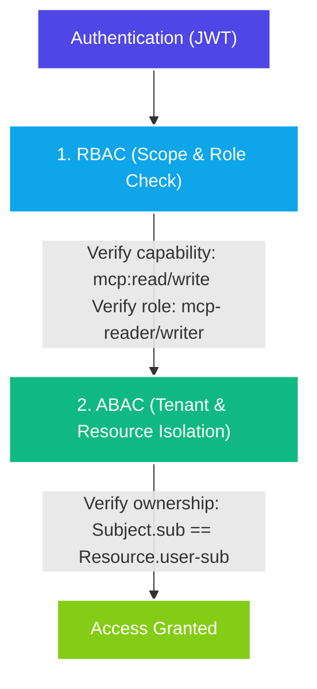
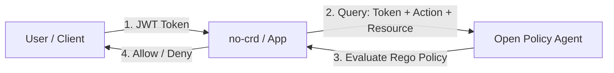

# Advanced Authorization Guide: RBAC, ABAC, and Role Sprawl Prevention

This guide details the advanced authorization capabilities of `@nogoo9/no-crd` and documents strategies for scaling identity and access management across multiple remote applications.

---

## 🛡️ Roles (RBAC) vs. Attributes (ABAC) in `no-crd`

`@nogoo9/no-crd` integrates both **Role-Based Access Control (RBAC)** and **Attribute-Based Access Control (ABAC)** to secure cluster resources.



### 1. Scope & Role Enforcement (RBAC)
This layer authorizes based on the capability of the client application and the job function of the user:
- **Scopes (Client-centric)**: Dictates what the client application is authorized to request (e.g., the UI requests `mcp:write` to write).
- **Roles (User-centric)**: Dictates what the user is authorized to perform (e.g., `writeuser` carries the role `mcp-writer`).

If a user lacks the required write role, the execution is blocked at the gateway boundary before any resource operations are initiated.

### 2. Tenant & Resource Isolation (ABAC)
This layer checks whether the authenticated user has access to a **specific resource instance**. Even if a user is an authorized writer (RBAC), they should not be allowed to read, modify, or terminate workspaces created by other tenants. `no-crd` dynamically enforces this at the Kubernetes API layer:
- **Subject Attribute**: The authenticated user's ID (`sub` claim in the JWT).
- **Resource Attribute**: The `nogoo9/user-sub` label on Kubernetes Pods, ConfigMaps, and ServiceAccounts.
- **Rule**: A standard user can only retrieve, view, modify, or proxy traffic to a resource if `Subject.sub === Resource.user-sub`.

---

## 🔄 Extending to a Pure ABAC Model

In a pure ABAC model, you can eliminate user-centric roles entirely. Instead of verifying roles like `mcp-reader` or `mcp-writer`, the MCP server evaluates dynamic attributes of the subject, resource, and action to grant permissions:

* **Subject attributes**: e.g., `user.clearance_level`, `user.department`, `user.groups`.
* **Resource attributes**: e.g., `pod.environment: "prod"`, `pod.sensitivity: "restricted"`, `pod.owner: "sub-id"`.
* **Action attributes**: e.g., `action.type: "delete"`.

### 1. Implementing the Policy Evaluator

Below is a TypeScript example of a custom ABAC policy engine checking dynamic user and resource properties:

```typescript
interface SubjectClaims {
  sub: string;
  clearance: number;
  env_access: string[];
  department?: string;
}

interface ResourceAttributes {
  owner: string;
  environment: string;
  sensitivity?: "restricted" | "public";
}

/**
 * Evaluates access rules based on subject, action, and resource attributes.
 */
export function checkAbacAccess(
  subject: SubjectClaims,
  action: "read" | "write" | "delete",
  resource?: ResourceAttributes
): boolean {
  // Rule 1: Read Access
  if (action === "read") {
    // Subject must have clearance level >= 1
    if (subject.clearance < 1) return false;
    
    // If resource is specified, user must have access to that environment
    if (resource && !subject.env_access.includes(resource.environment)) {
      return false;
    }
    
    return true;
  }

  // Rule 2: Write/Create Access
  if (action === "write") {
    // Subject must have clearance level >= 2
    if (subject.clearance < 2) return false;
    
    // Users can only write to environments they are assigned to
    if (resource && !subject.env_access.includes(resource.environment)) {
      return false;
    }
    
    return true;
  }

  // Rule 3: Delete Access
  if (action === "delete") {
    // Administrator override (clearance level 3)
    if (subject.clearance === 3) return true;
    
    // Standard user delete check
    if (subject.clearance >= 2 && resource && resource.owner === subject.sub) {
      // Prevent deleting production workspaces unless admin
      return resource.environment !== "production";
    }
    
    return false;
  }

  return false;
}
```

### 2. Integrating ABAC inside MCP Tool Handlers

You can wire this check directly into operations like pod deletion by extracting attributes from the verified token and target Kubernetes spec:

```typescript
import { checkAbacAccess } from "./auth.js";
import { errorResult } from "../errors.js";

// Inside the delete_pod handler:
async function handleDeletePod(name: string, namespace: string, jwtPayload: any) {
  try {
    // 1. Get the existing resource metadata from Kubernetes
    const pod = await k8sApi.readNamespacedPod(name, namespace);
    
    // 2. Extract resource attributes from Pod spec labels
    const resourceAttributes = {
      owner: pod.body.metadata.labels["nogoo9/user-sub"],
      environment: pod.body.metadata.labels["nogoo9/environment"] || "development"
    };

    // 3. Extract subject claims from user token
    const subjectClaims = {
      sub: jwtPayload.sub,
      clearance: Number(jwtPayload.clearance_level || 1),
      env_access: jwtPayload.environment_access || ["development"]
    };

    // 4. Run Policy check
    const allowed = checkAbacAccess(subjectClaims, "delete", resourceAttributes);
    if (!allowed) {
      return errorResult(new Error("Forbidden: ABAC policy denied delete operation."));
    }

    // 5. Proceed with deletion
    await k8sApi.deleteNamespacedPod(name, namespace);
  } catch (err) {
    return errorResult(err);
  }
}
```

---

## 🏢 Enterprise Strategies to Prevent Role Sprawl

When integrating `no-crd` into an enterprise catalog alongside dozens of other applications, creating application-specific roles (e.g. `no-crd-reader`, `app-b-writer`) leads to **Role Sprawl**. This complicates audits and user provisioning.

Use the following strategies to prevent role sprawl:

### Strategy 1: Realm Roles vs. Client-Scoped Roles
Avoid assigning application-level roles directly to users. Instead, split your roles into two tiers:
- **Functional Roles (Realm level)**: Broad business roles (e.g. `SoftwareEngineer`, `DataScientist`). A user is assigned exactly one functional role based on their job.
- **Technical Roles (Client level)**: Application-scoped roles defined inside the OIDC client registry (e.g., client `nogoo9-mcp` defines roles `reader` and `writer`).

In your IdP, configure composite role mappings: when a user is assigned the `SoftwareEngineer` realm role, they automatically inherit the client role `nogoo9-mcp/writer`.

### Strategy 2: Group-Based Access Control (GBAC)
Standardize authorization around organization groups (e.g., `/RnD/Engineering/Platform`).
- Map the user's groups into a custom token claim (`groups`).
- Configure the application backend to map groups to roles or capabilities dynamically. For example, configure the `no-crd` server to recognize any user with group membership matching `/RnD/Engineering/*` as a writer, and `/Product/*` as a reader.

```typescript
// Dynamically deduce role from groups claim
const userGroups = jwtPayload.groups || [];
const isWriter = userGroups.some(g => g.startsWith("/RnD/Engineering/"));
const isReader = userGroups.some(g => g.startsWith("/Product/"));
```

### Strategy 3: Dynamic Scope Mapping
Standardize on capabilities rather than roles. The client application requests the scopes it needs to run (e.g., `scope: "mcp:read mcp:write"`).
- In Keycloak, configure **Client Scope Policies** so that the `mcp:write` scope is dynamically stripped or granted at login based on user attributes or LDAP group memberships.
- The MCP server only verifies the scope claim: if `mcp:write` is present, it allows mutations.

### Strategy 4: Externalized Authorization (Policy-as-Code / OPA)
For complex deployments, decouple authentication from authorization entirely by delegating to a policy engine like **Open Policy Agent (OPA)**.



1. **Authentication (IAM/Keycloak)**: User logs in and obtains a token containing only basic identity/organization attributes (no roles).
2. **Authorization (OPA/Casbin)**: When the user invokes an MCP tool, the application forwards the transaction details (Subject + Action + Resource) to OPA:
   ```json
   {
     "input": {
       "subject": {
         "id": "writeuser",
         "department": "engineering"
       },
       "action": "delete",
       "resource": {
         "owner": "writeuser",
         "environment": "production"
       }
     }
   }
   ```
3. OPA evaluates a centrally managed declarative policy (written in Rego code) and returns a simple allow/deny decision:
   ```rego
   package play

   default allow = false

   # Allow delete if user is owner and environment is not production
   allow {
       input.action == "delete"
       input.subject.id == input.resource.owner
       input.resource.environment != "production"
   }
   ```

This centralizes access rules in Git (GitOps) and eliminates roles from the database entirely.
