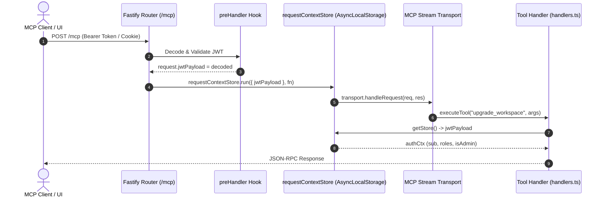

# ADR-025: Request Context Propagation over JSON-RPC via AsyncLocalStorage

## Status
Accepted

## Date
2026-07-28

## Context

In `@nogoo9/no-crd`, Model Context Protocol (MCP) clients invoke spawner and workspace orchestration tools over HTTP via the JSON-RPC endpoint `/mcp`.

When an HTTP request arrives at `/mcp`:
1. Fastify processes HTTP authentication in a `preHandler` hook, validating the Bearer JWT or session cookie and attaching the caller's JWT payload (`jwtPayload` containing `sub`, `roles`, `isAdmin`) to the HTTP request object.
2. The MCP SDK's transport layer (`WebStandardStreamableHTTPServerTransport`) decodes the incoming JSON-RPC payload and dispatches tool requests asynchronously inside its internal transport handler callbacks.

Because transport callbacks execute outside Fastify's route handler scope, the tool handler functions (`list_workspaces`, `spawn_workspace`, `upgrade_workspace`, `upgrade_all_workspaces`, etc.) execute without direct access to the outer Fastify `request` or `reply` objects.

### Problem Statement

Without a mechanism to propagate request context, tool handlers cannot determine:
- Who called the tool (`authCtx.sub`).
- Whether the caller has administrator privileges (`authCtx.isAdmin`).
- What RBAC roles the caller possesses (`authCtx.roles`).

Passing `jwtPayload` as an explicit parameter through every transport function would require mutating standard MCP SDK interfaces, creating heavy coupling and risking missing parameters.

## Decision

We use Node.js's built-in [`AsyncLocalStorage`](https://nodejs.org/api/async_context.html#class-asynclocalstorage) API (`requestContextStore`) to propagate caller authentication context across HTTP preHandler hooks and MCP transport JSON-RPC tool handler bounds.

### Architecture



### Implementation Details

1. **Context Store Definition** ([`src/k8s/client.ts`](file:///home/eterna2/github/nogoo9-no-crd/src/k8s/client.ts)):
   ```typescript
   export interface RequestContext {
       jwtPayload?: Record<string, unknown>;
   }

   export const requestContextStore = new AsyncLocalStorage<RequestContext>();
   ```

2. **HTTP Middleware Binding** ([`src/server/routes/mcp.ts`](file:///home/eterna2/github/nogoo9-no-crd/src/server/routes/mcp.ts)):
   ```typescript
   // Wrap transport.handleRequest inside requestContextStore.run
   await requestContextStore.run({ jwtPayload }, async () => {
       await transport.handleRequest(request.raw, reply.raw);
   });
   ```

3. **Tool Handler Access** ([`src/mcp/spawner/handlers.ts`](file:///home/eterna2/github/nogoo9-no-crd/src/mcp/spawner/handlers.ts)):
   ```typescript
   function resolveActiveJwt(jwtPayload?: Record<string, unknown>): Record<string, unknown> | undefined {
       const store = requestContextStore.getStore();
       return jwtPayload || store?.jwtPayload;
   }
   ```

## Consequences

### Positive

- **Stateless & Clean Signatures**: MCP tool handler signatures remain clean and compliant with standard MCP SDK tool definitions without requiring custom request wrapper parameters.
- **Strict Concurrency Isolation**: `AsyncLocalStorage` guarantees that concurrent HTTP requests executing on the event loop maintain separate, isolated context stores.
- **Seamless Fallback**: Allows tool handlers to operate under both MCP stdio transport (where auth is bypassed for local single-user execution) and HTTP transport (where multi-user JWT context is required).

### Negative

- **Async Context Lifecycle Dependency**: Callbacks must maintain the async call stack chain. Wrapping promises inside manual `setTimeout` without preserving context could detach the store (handled safely via standard async/await).
