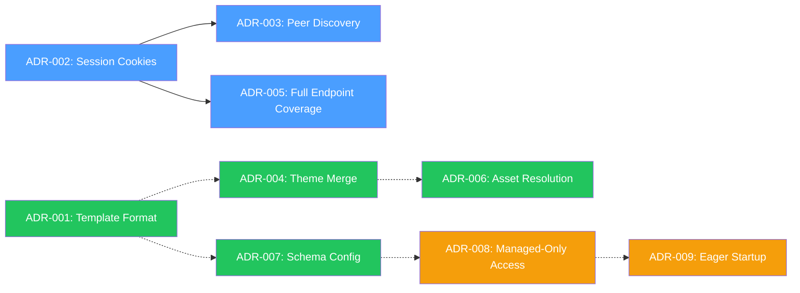

# Architecture Decision Records

Architecture Decision Records (ADRs) capture the reasoning behind significant technical decisions. They document the context, constraints, alternatives considered, and trade-offs that led to each choice.

> [!TIP]
> ADRs are the highest-value documentation in a project. They prevent re-debating the same decisions and help new contributors (human or AI) understand *why* the codebase is shaped the way it is.

## Active Decisions

| ADR | Decision | Status |
|-----|----------|--------|
| [ADR-001](./ADR-001-template-file-format.md) | Support YAML and JSON for Pod Template Files | Accepted |
| [ADR-002](./ADR-002-stateless-session-cookies.md) | Stateless Signed Session Cookies for Proxy Auth | Accepted |
| [ADR-003](./ADR-003-peer-discovery-session-key.md) | Peer Discovery for Session Key Sharing | Accepted |
| [ADR-004](./ADR-004-three-source-theme-merge.md) | Three-Source Theme Merge with Built-In Fallback | Accepted |
| [ADR-005](./ADR-005-ui-proactive-oidc-refresh.md) | Session Cookie Coverage for All Endpoints | Accepted |
| [ADR-006](./ADR-006-packaged-ui-asset-resolution.md) | Packaged UI Asset and Built-in Resource Resolution | Accepted |
| [ADR-007](./ADR-007-schema-driven-configuration.md) | Schema-Driven Configuration & Unified Annotation Keys | Accepted |
| [ADR-008](./ADR-008-managed-only-pod-access-control.md) | Managed-Only Pod Access Control | Accepted |
| [ADR-009](./ADR-009-eager-startup-health-check.md) | Eager MCP Server Initialization with K8s Health Check | Accepted |

## How to Read ADRs

Each ADR follows a standard structure:

- **Status** — `Accepted`, `Deprecated`, or `Superseded by ADR-XXX`
- **Context** — The problem, constraints, and requirements
- **Decision** — What was decided and how it works
- **Alternatives Considered** — What other options were evaluated and why they were rejected
- **Consequences** — What follows from the decision (both positive and negative)

## Relationship Map

- **Blue**: Authentication & session management chain
- **Green**: Template & theme system
- **Amber**: Access control & security
