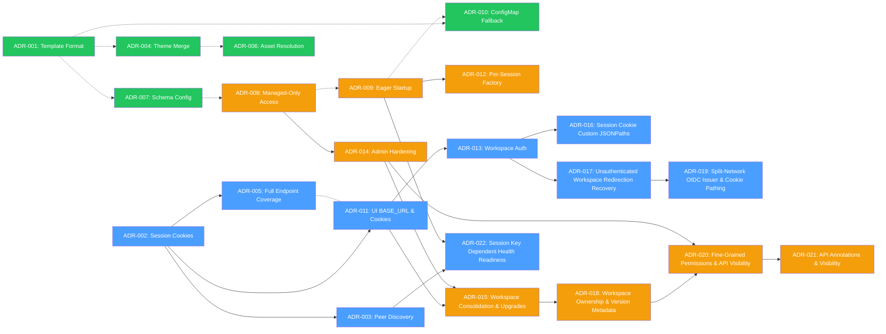

# Architecture Decision Records

Architecture Decision Records (ADRs) capture the reasoning behind significant technical decisions. They document the context, constraints, alternatives considered, and trade-offs that led to each choice.

> [!TIP]
> ADRs are the highest-value documentation in a project. They prevent re-debating the same decisions and help new contributors (human or AI) understand *why* the codebase is shaped the way it is.

## Active Decisions

| ADR | Decision | Status |
|-----|----------|--------|
| [ADR-001](./ADR-001-template-file-format.md) | Support YAML and JSON for Pod Template Files | Accepted |
| [ADR-002](./ADR-002-stateless-session-cookies.md) | Stateless Signed Session Cookies for Proxy Auth | Accepted |
| [ADR-003](./ADR-003-peer-discovery-session-key.md) | Peer Discovery for Session Key Sharing | Accepted |
| [ADR-004](./ADR-004-three-source-theme-merge.md) | Three-Source Theme Merge with Built-In Fallback | Accepted |
| [ADR-005](./ADR-005-ui-proactive-oidc-refresh.md) | Session Cookie Coverage for All Endpoints | Accepted |
| [ADR-006](./ADR-006-packaged-ui-asset-resolution.md) | Packaged UI Asset and Built-in Resource Resolution | Accepted |
| [ADR-007](./ADR-007-schema-driven-configuration.md) | Schema-Driven Configuration & Unified Annotation Keys | Accepted |
| [ADR-008](./ADR-008-managed-only-pod-access-control.md) | Managed-Only Pod Access Control | Accepted |
| [ADR-009](./ADR-009-eager-startup-health-check.md) | Eager MCP Server Initialization with K8s Health Check | Accepted |
| [ADR-010](./ADR-010-graceful-configmap-template-fallback.md) | Graceful ConfigMap Template Fallback | Accepted |
| [ADR-011](./ADR-011-ui-base-url-and-cookie-path-consistency.md) | UI BASE_URL Contract and Cookie Path Consistency | Accepted |
| [ADR-012](./ADR-012-per-session-mcp-server-factory.md) | Per-Session McpServer Factory Pattern | Accepted |
| [ADR-013](./ADR-013-workspace-app-authorization.md) | Workspace App Authorization Support | Accepted |
| [ADR-014](./ADR-014-admin-access-hardening-and-role-mapping.md) | Hardened Administrator Access with Scope and Role Mapping | Accepted |
| [ADR-015](./ADR-015-workspace-view-consolidation-and-template-upgrades.md) | Workspace View Consolidation, Safe Template Upgrades, and STDIO Auth Bypass | Accepted |
| [ADR-016](./ADR-016-session-cookie-custom-jsonpath-compatibility.md) | Session Cookie Reconstitution Compatibility with Custom JSONPaths | Accepted |
| [ADR-017](./ADR-017-unauthenticated-workspace-redirection-recovery.md) | Unauthenticated Workspace Redirection Recovery | Accepted |
| [ADR-018](./ADR-018-workspace-ownership-and-version-metadata.md) | Workspace Owner Association and Server Metadata Reporting | Accepted |
| [ADR-019](./ADR-019-split-network-oidc-issuer-and-cookie-path-alignment.md) | Split-Network OIDC Issuer Alignment and Path-Scoped Cookie Routing | Accepted |
| [ADR-020](./ADR-020-fine-grained-roles-template-ownership-and-api-visibility.md) | Fine-Grained Role Permissions, Template Creator Tracking, and Workspace API Visibility | Accepted |
| [ADR-021](./ADR-021-workspace-api-annotations-and-visibility-controls.md) | Workspace API Annotations and Routing Proxy Visibility Controls | Accepted |
| [ADR-022](./ADR-022-session-key-health-readiness.md) | Session Key Dependent Health Check Readiness | Accepted |

## How to Read ADRs

Each ADR follows a standard structure:

- **Status** — `Accepted`, `Proposed`, `Deprecated`, or `Superseded by ADR-XXX`
- **Context** — The problem, constraints, and requirements
- **Decision** — What was decided and how it works
- **Alternatives Considered** — What other options were evaluated and why they were rejected
- **Consequences** — What follows from the decision (both positive and negative)

## Relationship Map

```mermaid
graph LR
    ADR002["ADR-002: Session Cookies"] --> ADR003["ADR-003: Peer Discovery"]
    ADR002 --> ADR005["ADR-005: Full Endpoint Coverage"]
    ADR001["ADR-001: Template Format"] -.-> ADR004["ADR-004: Theme Merge"]
    ADR004 -.-> ADR006["ADR-006: Asset Resolution"]
    ADR001 -.-> ADR007["ADR-007: Schema Config"]
    ADR007 -.-> ADR008["ADR-008: Managed-Only Access"]
    ADR008 -.-> ADR009["ADR-009: Eager Startup"]
    ADR001 -.-> ADR010["ADR-010: ConfigMap Fallback"]
    ADR009 -.-> ADR010
    ADR002 --> ADR011["ADR-011: UI BASE_URL & Cookies"]
    ADR005 -.- ADR011
    ADR009 --> ADR012["ADR-012: Per-Session Factory"]
    ADR011 --> ADR013["ADR-013: Workspace Auth"]
    ADR008 --> ADR014["ADR-014: Admin Hardening"]
    ADR011 --> ADR015["ADR-015: Workspace Consolidation & Upgrades"]
    ADR014 --> ADR015
    ADR013 --> ADR016["ADR-016: Session Cookie Custom JSONPaths"]
    ADR013 --> ADR017["ADR-017: Unauthenticated Workspace Redirection Recovery"]
    ADR015 --> ADR018["ADR-018: Workspace Ownership & Version Metadata"]
    ADR017 --> ADR019["ADR-019: Split-Network OIDC Issuer & Cookie Pathing"]
    ADR018 --> ADR020["ADR-020: Fine-Grained Permissions & API Visibility"]
    ADR014 --> ADR020
    ADR020 --> ADR021["ADR-021: API Annotations & Visibility"]
    ADR003 --> ADR022["ADR-022: Session Key Dependent Health Readiness"]
    ADR009 --> ADR022
    style ADR002 fill:#4a9eff,color:#fff
    style ADR003 fill:#4a9eff,color:#fff
    style ADR005 fill:#4a9eff,color:#fff
    style ADR001 fill:#22c55e,color:#fff
    style ADR004 fill:#22c55e,color:#fff
    style ADR006 fill:#22c55e,color:#fff
    style ADR007 fill:#22c55e,color:#fff
    style ADR008 fill:#f59e0b,color:#fff
    style ADR009 fill:#f59e0b,color:#fff
    style ADR010 fill:#22c55e,color:#fff
    style ADR011 fill:#4a9eff,color:#fff
    style ADR012 fill:#f59e0b,color:#fff
    style ADR013 fill:#4a9eff,color:#fff
    style ADR014 fill:#f59e0b,color:#fff
    style ADR015 fill:#f59e0b,color:#fff
    style ADR016 fill:#4a9eff,color:#fff
    style ADR017 fill:#4a9eff,color:#fff
    style ADR018 fill:#f59e0b,color:#fff
    style ADR019 fill:#4a9eff,color:#fff
    style ADR020 fill:#f59e0b,color:#fff
    style ADR021 fill:#f59e0b,color:#fff
    style ADR022 fill:#4a9eff,color:#fff
```

- **Blue**: Authentication & session management chain
- **Green**: Template & theme system
- **Amber**: Access control & security

