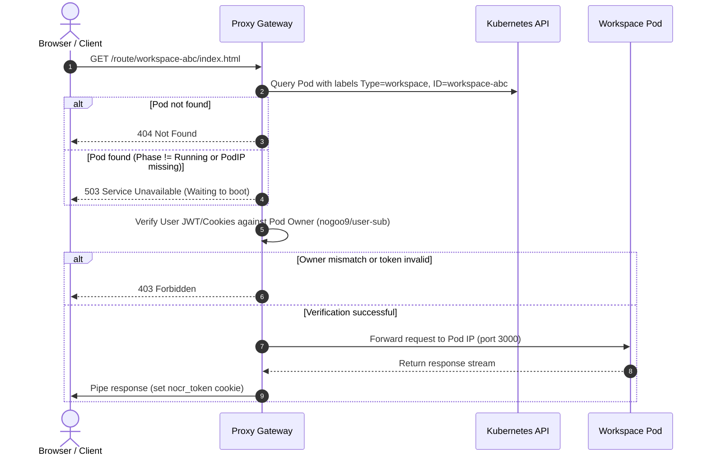
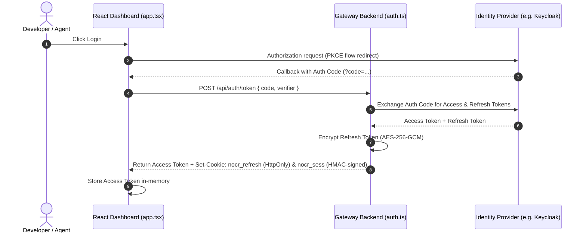
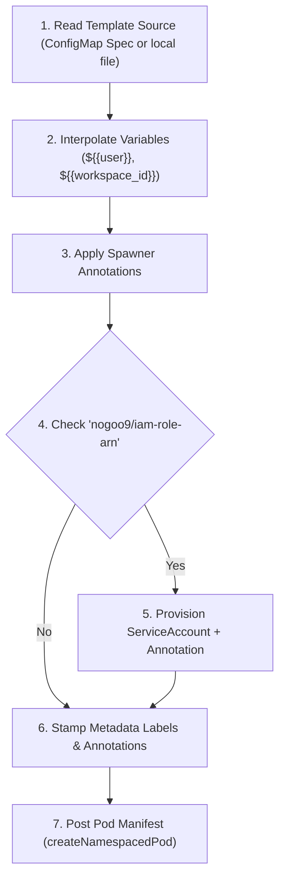
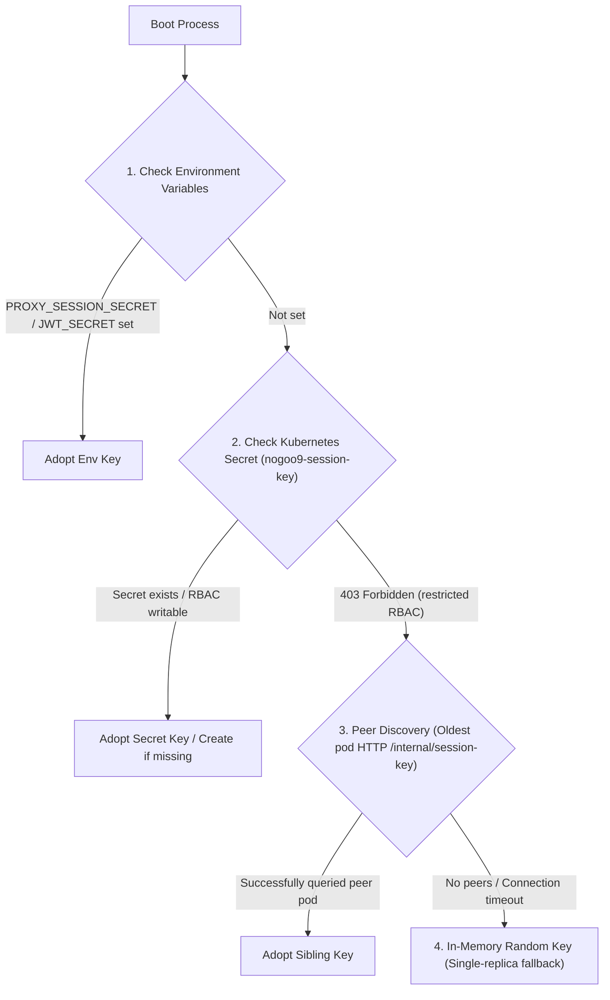

# System Design & Core Architecture

`@nogoo9/no-crd` is designed to be hosted in a Kubernetes cluster as a multi-tenant platform service. It empowers developers and AI agents to spin up containerized workspaces dynamically and route traffic securely to those containers without exposing cluster-level operators or custom resource definitions (CRDs).

This guide walks you through the end-to-end implementation details of the routing proxy, the Backend for Frontend (BFF) authentication flows, the spawner's pod transformation mechanics, and the cluster-wide session key resolution system.

---

## 🏗️ Architecture Topology

The service sits between users (or their IDE-based AI agents) and the Kubernetes API server, acting as both an MCP server gateway and a reverse routing proxy:

<!-- 
PROMPT FOR FUTURE AGENTS:
This image is a professional software architecture diagram for 'nogoo9-no-crd'.
Prompt used for generation:
"A professional and modern software architecture diagram for a system called 'nogoo9-no-crd'. The diagram is laid out horizontally in a sleek dark theme with three clean columns or spaces: 1. Client Space (left): showing boxes for 'AI Agent / MCP Client' and 'Pod Manager UI Dashboard'. 2. MCP Server Gateway (middle): showing boxes for 'MCP Server Entrypoint', 'HTTP Routing Proxy', and 'Auth Engine: RBAC & ABAC'. 3. Kubernetes Cluster (right): showing 'Kubernetes API Server', 'Tenant A Workspace Pod', and 'Tenant B Workspace Pod'. Clear, glow-effect arrows connect them: Agent connects to MCP Entrypoint; UI connects to Routing Proxy; both query the Auth Engine; MCP Entrypoint sends commands to Kubernetes API; Routing Proxy forwards traffic directly to Tenant Pods; Kubernetes API Server orchestrates the Tenant Pods. Premium design with soft gradient glows, clean sans-serif typography, and subtle tech aesthetics."
To regenerate or refine, use the generate_image tool with this prompt.
-->


### Key Internal Components
1. **MCP Server Gateway**: Processes incoming tool requests via Stdio or SSE transport.
2. **HTTP Routing Proxy**: A built-in Fastify-based proxy that maps incoming subpath traffic (`/route/<workspace-id>/*`) directly to the corresponding Pod IP inside the cluster.
3. **Auth Engine (RBAC/ABAC)**: Validates OpenID Connect (OIDC) JWT claims, matches scopes/roles, and maps identity to Kubernetes namespaces.
4. **Workspace Spawner**: Interacts with the Kubernetes API to orchestrate Pod lifecycles, inject init-containers, mount volumes, and manage ServiceAccounts.

---

## 🔌 End-to-End Workspace Proxying

The reverse proxy allows direct web or WebSocket access to containerized workspace interfaces (e.g. terminals, Obsidian, or VNC desktops) via the URL path:
```
http://<mcp-gateway-host>/route/<workspace-id>/<subpath>
```

### 1. Request Interception & Authentication Guard
The proxy flow is managed by `proxyPreHandler` in [auth.ts](file:///home/eterna2/github/nogoo9-no-crd/src/server/auth.ts#L464) and registered in [proxy.ts](file:///home/eterna2/github/nogoo9-no-crd/src/server/routes/proxy.ts#L396).



### 2. Token Bootstrap & Path-Scoped Cookies
Because standard web elements (like `<a>` links or `<iframe>` tags) cannot send custom authorization headers, the gateway implements a path-scoped cookie bootstrapping protocol:

1. **Redirect Bootstrap**: When a user launches a workspace, the dashboard redirects them to `/route/<workspace-id>/?token=<JWT_TOKEN>`.
2. **Cookie Issuance (`nocr_token`)**: The proxy intercepts this request, validates the token, and writes an HttpOnly, path-scoped cookie:
   ```http
   Set-Cookie: nocr_token=<JWT_TOKEN>; Path=/route/<workspace-id>/; SameSite=Lax; HttpOnly; Max-Age=86400
   ```
3. **Path-Scoped Exclusivity**: Because the cookie's path is strictly limited to `/route/<workspace-id>/`, other workspaces cannot see or retrieve this token, preventing cross-workspace token leaks.
4. **Header Injections**: For all requests flowing through to the upstream pod, the proxy extracts user details from the active credentials and injects these headers into the request:
   - `x-user-sub`: The OIDC subject of the owner.
   - `x-user-roles`: Comma-separated list of the user's OIDC roles.
   - `x-workspace-jwt`: The raw JWT token (if `AUTH_INJECT_WORKSPACE_JWT` is `true`).
   - `authorization`: Rewritten as `Bearer <JWT_TOKEN>`.

> [!WARNING]
> **WebSocket Limitations under Bun**:
> Due to a socket write regression in Bun's Node compatibility layer, upgraded WebSocket connections will drop data. If your workspaces require WebSockets (e.g. VS Code, VNC, web terminals), you **must** run the gateway using **Node.js** (e.g. `npx tsx src/server-entry.ts`).

---

## 🔒 Backend for Frontend (BFF) & Auth Flows

The built-in visual React Dashboard in [app.tsx](file:///home/eterna2/github/nogoo9-no-crd/src/ui/app.tsx) handles user logins and active token maintenance.

### Authentication Handshake



### Token Maintenance & Proactive Silent Refresh
1. **In-Memory JWT**: The OIDC Access Token (`access_token`) is stored strictly in client-side Javascript memory.
2. **Encrypted Refresh Cookie (`nocr_refresh`)**: The OIDC Refresh Token is encrypted via **AES-256-GCM** using a key derived from the gateway's session secret (preventing client-side JS access) and saved as a secure, HttpOnly cookie:
   ```http
   Set-Cookie: nocr_refresh=<encrypted-token>; Path=/; SameSite=Lax; HttpOnly; Max-Age=604800
   ```
3. **Transparent Gateway Refresh**: If a workspace request arrives with an expired access token or without one, the gateway's auth hook in [auth.ts](file:///home/eterna2/github/nogoo9-no-crd/src/server/auth.ts#L254) detects the `nocr_refresh` cookie. It decrypts it, exchanges it with the Identity Provider (IdP) for a fresh access token, and transparently updates the cookies (`nocr_sess` and `nocr_refresh`) without interrupting the user session.

---

## ☸️ Template-to-Pod Transformation Engine

When a user calls `spawn_workspace` (implemented in [spawner.ts](file:///home/eterna2/github/nogoo9-no-crd/src/mcp/spawner.ts#L938)), the spawner executes a multi-phase compilation flow to construct the final Kubernetes `Pod` manifest:



### Spawner Annotation Mutations
During step 3, the engine in [annotations.ts](file:///home/eterna2/github/nogoo9-no-crd/src/k8s/annotations.ts#L13) reads specific template annotations to morph the pod specification:

* **Init Container Injection (`nogoo9/init-image` & `nogoo9/init-command`)**:
  Appends a dynamic container named `spawner-init` to `initContainers`. If `nogoo9/init-share-volumes` is not explicitly set to `"false"`, it inherits all volume mounts of the primary container, letting you run git clones or asset downloads before the main app boots.
* **Pre-Stop Cleanups (`nogoo9/pre-stop-command`)**:
  Allows graceful state synchronization. 
  - *Inline mode (default)*: Inserts a `lifecycle.preStop.exec` command directly into the primary container.
  - *Sidecar mode (`nogoo9/pre-stop-sidecar-image`)*: Adds a companion container named `spawner-sidecar`. The pre-stop command is attached to the sidecar, which sleeps infinitely during standard execution but triggers its cleanup execution upon container termination.
* **AWS IAM Role Integration (`nogoo9/iam-role-arn`)**:
  When specified, the spawner automatically creates a Kubernetes `ServiceAccount` stamped as:
  ```yaml
  apiVersion: v1
  kind: ServiceAccount
  metadata:
    name: ws-sa-<workspace-id>
    annotations:
      eks.amazonaws.com/role-arn: <role-arn-value>
  ```
  The pod spec's `serviceAccountName` is then rewritten to bind this account, mapping AWS IAM credentials natively via EKS IRSA.

---

## 🔑 Session Secret Negotiation & Cluster Peer Discovery

All session cookies (`nocr_sess` and `nocr_refresh`) are signed/encrypted via HMAC-SHA256 and AES-256-GCM. To support horizontal pod scaling (multi-replica gateway setups) without requiring database backends, replicas dynamically negotiate and share a unified session key on boot.

### The 4-Step Resolution Cascade
The resolution flow resides in `resolveSessionSecret` inside [session.ts](file:///home/eterna2/github/nogoo9-no-crd/src/k8s/session.ts#L46):



### Eager Blocking Healthchecks
Until `resolveSessionSecret` resolves a key, the `/healthz` and `/mcp/healthz` endpoints respond with a **`503 Service Unavailable`** status:

1. Under Kubernetes, a booting pod remains in the "Unhealthy" ingress pool.
2. The ingress router blocks external user traffic from routing to this replica.
3. Once the key is resolved (either successfully reading from a secret, querying a peer, or falling back to in-memory generation), `/healthz` switches to **`200 OK`**.
4. The pod shifts to "Ready" status and is safely added to the traffic rotation.

---

## 🔍 Troubleshooting & Debugging

If workspaces fail to route or compile, use this checklist to narrow down the root cause:

### 1. Ingress and Cookie Routing Loop
If OIDC redirects loop infinitely, ensure that:
- `BASE_URL` matches your ingress routing prefix.
- The browser cookie path rules align. Cookies like `nocr_token` are path-scoped. If the gateway is running behind a proxy subpath (e.g. `/gateway/no-crd`), the cookie path prefix is adjusted accordingly to prevent the browser from omitting the token on subsequent resource calls (see [ADR-011](file:///home/eterna2/github/nogoo9-no-crd/docs/decisions/ADR-011-ui-base-url-and-cookie-path-consistency.md)).

### 2. Session Secret Adoption Failure
Check pod logs for:
`"Session key generated in-memory. Multi-replica deployments should set PROXY_SESSION_SECRET..."`
If you see this warning across multiple replicas, they do not share a session key. A cookie signed by replica A will be rejected as corrupted by replica B. Set `PROXY_SESSION_SECRET` explicitly in the container deployment `env` list.

### 3. Permission Errors during Pod Spawning
If spawning fails, run:
```bash
kubectl auth can-i create pods --as=system:serviceaccount:<namespace>:nogoo-mcp
```
The server checks RBAC permissions eagerly on startup. Ensure the service account running the gateway pod has the permissions described in the [RBAC Permissions Guide](./rbac-permissions.md).
