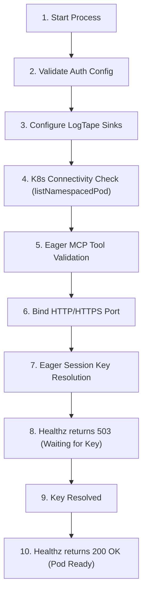

# Configuration & Environment Variables

The `@nogoo9/no-crd` server and CLI utility are configurable using standard command-line flags or environment variables. This guide covers the boot verification process and details all configurable parameters.

---

## 🚦 Service Startup Sequence

When you boot the `nogoo9-no-crd` server, the service executes a startup verification flow to validate configuration parameters and block bad traffic before reporting health status:

### Detailed Startup Steps:

1. **Polyfill & Validation**: Global polyfills (such as `Buffer`) are loaded first for Deno/Node compatibility. If authentication is enabled (`AUTH_ENABLED=true`), the OIDC URL configurations are validated.
2. **Logging Initialization**: Configures `LogTape` logger sinks. If utilizing the `stdio` transport, the console logging outputs are suppressed (`console.log = () => {}`) to preserve stdin/stdout protocol integrity.
3. **Eager Kubernetes Connectivity Check**: Probes the Kubernetes API server using a `listNamespacedPod` request (with `limit: 1`). If the connection is refused or the API is unreachable, the server exits immediately with actionable hints.
4. **Eager MCP Tool Registration Validation**: Constructs a throwaway MCP server instance to verify that the pod's RBAC service account holds the required permissions to list resources and register tools.
5. **Fastify Server Binding**: Binds the HTTP/HTTPS listeners to the designated host and port.
6. **Eager Session Key Resolution**: Initiates the session key negotiation/resolution cascade (`resolveSessionSecret()`):
   - Reads environment variables (`PROXY_SESSION_SECRET` / `JWT_SECRET`).
   - Attempts to read or create a Kubernetes Secret (`nogoo9-session-key`).
   - Queries sibling pods via `/internal/session-key` if RBAC writes are disabled.
   - Generates a random key in-memory as a fallback.
7. **Liveness & Readiness Block**: Until the session key is resolved, `/healthz` and `/mcp/healthz` endpoints will respond with `503 Service Unavailable`. This blocks Kubernetes ingress traffic from routing to the booting pod until it has successfully aligned on the session key.

---

## ⚙️ Configuration Variables

<!-- CONFIG_TABLES_START -->

### 🔌 Server Configuration

| CLI Option | Environment Variable | Default | Allowed Values | Description |
|---|---|---|---|---|
| `-t, --transport` | `TRANSPORT` | `http` | `http`, `stdio`, `both` | Server transport mode. `both` fires up both transports simultaneously. |
| `-p, --port` | `PORT` | `3000` | Number | HTTP server port for SSE transport. |
| `-H, --host` | `HOST` | `0.0.0.0` | String | Host interface to bind the HTTP/SSE server to. |
| `--base-url` | `BASE_URL` | `""` | Path string | Base URL path prefix for hosting behind a reverse proxy (e.g. `/gateway/no-crd`). |
| - | `STATELESS` | `false` | `true`, `false` | Enable stateless request handling (no session affinity). |
| `-l, --log-level` | `LOG_LEVEL` | `info` | `debug`, `info`, `warning`, `error`, `fatal` | Logging verbosity filter. |
| - | `LOG_FILE` | `nogoo9-mcp.log` | String | Output file path for file logging. |
| - | `RATE_LIMIT_MAX` | `100` | Number | Maximum requests allowed per window for rate limited routes. |
| - | `RATE_LIMIT_WINDOW` | `60000` | Number | Time window in milliseconds for rate limited routes. |
| `--proxy-timeout` | `PROXY_TIMEOUT` | `120000` | Number | Timeout in milliseconds for the routing proxy upstream requests. |
| `--proxy-keep-alive` | `PROXY_KEEP_ALIVE` | `true` | `true`, `false` | Enable TCP keep-alive for the routing proxy upstream requests. |

### 🔒 TLS Configuration

| CLI Option | Environment Variable | Default | Allowed Values | Description |
|---|---|---|---|---|
| `--tls-cert` | `TLS_CERT` | - | Path string | Path to TLS certificate file to enable HTTPS. |
| `--tls-key` | `TLS_KEY` | - | Path string | Path to TLS private key file to enable HTTPS. |
| `--tls-ca` | `TLS_CA` | - | Path string | Path to TLS CA certificate file for HTTPS client/verification. |
| - | `NODE_TLS_REJECT_UNAUTHORIZED` | `true` | `0 (false)`, `1 (true)` | Set to `0` to bypass TLS verification (for development/testing only). |

### 🌐 CORS Configuration

| CLI Option | Environment Variable | Default | Allowed Values | Description |
|---|---|---|---|---|
| `--cors-origin` | `CORS_ALLOWED_ORIGIN`, `CORS_ORIGIN` | `*` | String | CORS Allowed Origin header. |
| `--cors-methods` | `CORS_ALLOWED_METHODS`, `CORS_METHODS` | `GET, POST, OPTIONS` | String | CORS Allowed Methods header. |
| `--cors-headers` | `CORS_ALLOWED_HEADERS`, `CORS_HEADERS` | `Content-Type, Authorization, mcp-protocol-version, mcp-session-id` | String | CORS Allowed Headers header. |
| `--cors-allow-credentials` | `CORS_ALLOW_CREDENTIALS`, `CORS_CREDENTIALS` | `false` | `true`, `false` | Enable CORS Access-Control-Allow-Credentials header. |
| `--cors-expose-headers` | `CORS_EXPOSED_HEADERS`, `CORS_EXPOSED` | `mcp-session-id, x-refreshed-token` | String | Custom CORS Access-Control-Expose-Headers header. |
| `--cors-max-age` | `CORS_MAX_AGE` | - | Number | Custom CORS Access-Control-Max-Age header in seconds. |

### ☸️ Kubernetes Configuration

| CLI Option | Environment Variable | Default | Allowed Values | Description |
|---|---|---|---|---|
| `-m, --mode` | `MODE` | `cluster` | `cluster`, `namespaced` | Kubernetes access scope. `namespaced` locks operations to a single namespace. |
| `-n, --namespace` | `NAMESPACE`, `DEFAULT_NAMESPACE` | `nogoo9` | String | Default Kubernetes namespace for operations. |
| `--disable-permission-checks` | `DISABLE_PERMISSION_CHECKS` | `false` | `true`, `false` | Disable Kubernetes RBAC permission checks and assume all tools are enabled. |
| `--managed-only` | `MANAGED_ONLY` | `true` | `true`, `false` | When true, pod tools only operate on pods managed by this server (`nogoo9/managed-by` label). No one bypasses this, not even admins. See [ADR-008](../decisions/ADR-008-managed-only-pod-access-control.md). |
| `--default-workspace-port` | `DEFAULT_WORKSPACE_PORT` | - | Number | Default target port inside the workspace pods to proxy traffic to. |
| - | `REGISTRY_URL` | - | URL string | Target container registry URL to query for images (e.g. `http://localhost:5001`). |
| - | `TEMPLATES_DIR` | - | Path string | Path to local directory containing pod template files (YAML/JSON). See [ADR-001](../decisions/ADR-001-template-file-format.md). |
| - | `BUILTIN_TEMPLATES` | `true` | `true`, `false` | Set to `false` to disable built-in templates shipped with the package. |

### 🔑 Authentication Configuration

| CLI Option | Environment Variable | Default | Allowed Values | Description |
|---|---|---|---|---|
| `--auth-enabled` | `AUTH_ENABLED` | `false` | `true`, `false` | Enables JWT token authentication on MCP tools and route proxy. |
| - | `JWT_VERIFICATION_REQUIRED` | `true` | `true`, `false` | Enable/disable JWT signature verification (signature checks). |
| - | `JWT_SECRET` | - | String | Symmetric HMAC-SHA256 secret for token verification. |
| - | `JWT_PUBLIC_KEY` | - | String | PEM encoded RSA/ECDSA public key for asymmetric token verification. |
| - | `JWKS_URI` | - | URL string | Remote JWKS endpoint URL to dynamically retrieve verification keys. |
| - | `INTROSPECTION_ENDPOINT`, `JWT_INTROSPECTION_ENDPOINT` | - | URL string | Endpoint for token introspection/validation. |
| - | `OAUTH_CLIENT_ID` | - | String | OAuth client ID for auth configuration. |
| - | `OAUTH_CLIENT_SECRET` | - | String | OAuth client secret for auth configuration. |
| - | `JWT_AUDIENCE` | - | String | Expected token audience. Falls back to `OAUTH_CLIENT_ID` if set. |
| - | `AUTH_ISSUER`, `JWT_ISSUER` | `""` | URL string | Identifier URL for the Authorization Server advertised in metadata discovery. |
| - | `AUTH_SUB_JSONPATH` | `$.sub` | JSONPath | Payload path to extract unique user identity from JWT payload. |
| `--auth-scope-jsonpath` | `AUTH_SCOPE_JSONPATH` | `$.scope` | JSONPath | Payload path to extract scopes claim from JWT payload. |
| `--auth-roles-jsonpath` | `AUTH_ROLES_JSONPATH`, `AUTH_ADMIN_JSONPATH` | `$.realm_access.roles` | JSONPath | Payload path to extract user roles from JWT payload. |
| - | `AUTH_ADMIN_ROLE` | `admin` | String | Role name signifying administrator access. |
| `--auth-required-read-scope` | `AUTH_REQUIRED_READ_SCOPE` | `nogoo9:read` | String | OAuth scope required for read operations. If not set, read scope check is bypassed. |
| `--auth-required-write-scope` | `AUTH_REQUIRED_WRITE_SCOPE` | `nogoo9:write` | String | OAuth scope required for write/mutation operations. If not set, write scope check is bypassed. |
| `--auth-required-admin-scope` | `AUTH_REQUIRED_ADMIN_SCOPE` | `nogoo9:admin` | String | OAuth scope required for administrator operations. If not set, admin scope check is bypassed. |
| - | `AUTH_ADMIN_USERS` | `` | Comma-separated list of user subject IDs (sub) | Comma-separated list of user subject IDs (sub) granted admin privileges without requiring OIDC scope/role claims (workaround fallback). |
| `--auth-required-read-role` | `AUTH_REQUIRED_READ_ROLE` | `viewer` | String | User role required for read operations. If not set, read role check is bypassed. |
| `--auth-required-write-role` | `AUTH_REQUIRED_WRITE_ROLE` | `user` | String | User role required for write/mutation operations. If not set, write role check is bypassed. |
| - | `PROXY_SESSION_TTL` | `1800` | Number | Session cookie expiration lifetime in seconds (sliding window duration). |
| - | `PROXY_REFRESH_COOKIE_TTL` | `604800` | Number | Default Max-Age for the encrypted refresh token cookie (nocr_refresh). Overridden by the IdP's refresh_expires_in when available. |
| - | `PROXY_TOKEN_COOKIE_TTL` | `86400` | Number | Default Max-Age for the access token cookie (nocr_token). Overridden by the JWT exp claim when available. |
| - | `PROXY_SESSION_SECRET` | `""` | String | HMAC secret key used to sign stateless session cookies. Falls back to `JWT_SECRET` if not configured. |
| - | `OAUTH_SCOPES` | `openid profile email offline_access` | Space-separated scope string | OAuth scopes to request during authorization. Include 'offline_access' for refresh tokens. |
| - | `OAUTH_AUTHORIZATION_URL` | - | URL string | Direct OAuth authorization URL. |
| - | `OAUTH_SERVER_DISCOVERY_URL`, `OAUTH_DISCOVERY_URL` | - | URL string | Discovery URL for the OAuth server used by the backend gateway. Falls back to OAUTH_DISCOVERY_URL. |
| - | `OAUTH_SERVER_TOKEN_URL`, `OAUTH_TOKEN_URL` | - | URL string | Direct OAuth token exchange endpoint for the backend server. |
| - | `OAUTH_END_SESSION_URL` | - | URL string | Direct OAuth logout endpoint. |
| `--auth-inject-workspace-jwt` | `AUTH_INJECT_WORKSPACE_JWT` | `true` | `true`, `false` | Determines if the custom 'x-workspace-jwt' header containing the raw token is injected into proxy requests. |
| - | `AUTH_DEFAULT_ROLE` | `viewer` | String | Fallback role if the token does not provide scopes/roles. |

### 🖥️ UI & Themes Configuration

| CLI Option | Environment Variable | Default | Allowed Values | Description |
|---|---|---|---|---|
| - | `UI_ENABLED` | `true` | `true`, `false` | Enables the embedded HTML Pod Manager UI resource. |
| - | `THEMES_DIR` | `themes` | Path string | Local directory path containing custom CSS UI themes. |
| - | `THEMES_CONFIGMAP` | - | String | Name of Kubernetes ConfigMap containing custom UI theme configurations. |
| - | `DOCS_DIR` | `/app/docs (Docker) or docs/.vitepress/dist (Local)` | Path string | Base directory from which static documentation files are served. |
| - | `OAUTH_DISCOVERY_URL` | `""` | URL string | Discovery URL for the OAuth authorization server used by the UI client. |
| - | `OAUTH_CLIENT_ID` | `""` | String | OAuth client ID for UI authorization. |
| - | `OAUTH_LOGIN_METHOD` | `redirect` | `redirect`, `popup` | Login interaction mode for UI OAuth client. |
| - | `UI_TITLE` | `nogoo9 Pod Manager` | String | Custom title shown in the dashboard header. |
| - | `UI_SUBTITLE` | `On-demand Kubernetes pod orchestration and agent-sandbox management without CRDs.` | String | Custom subtitle shown below the dashboard title. |

<!-- CONFIG_TABLES_END -->
