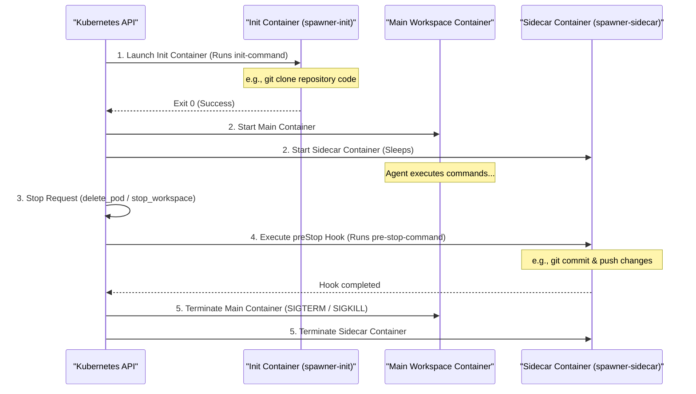
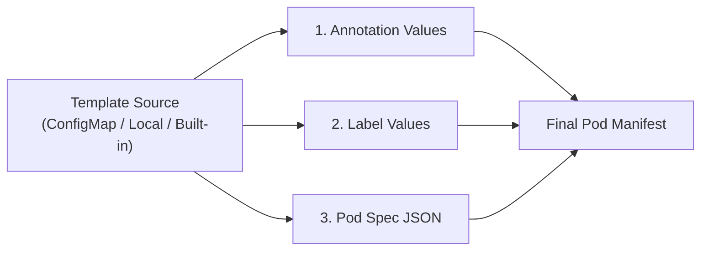
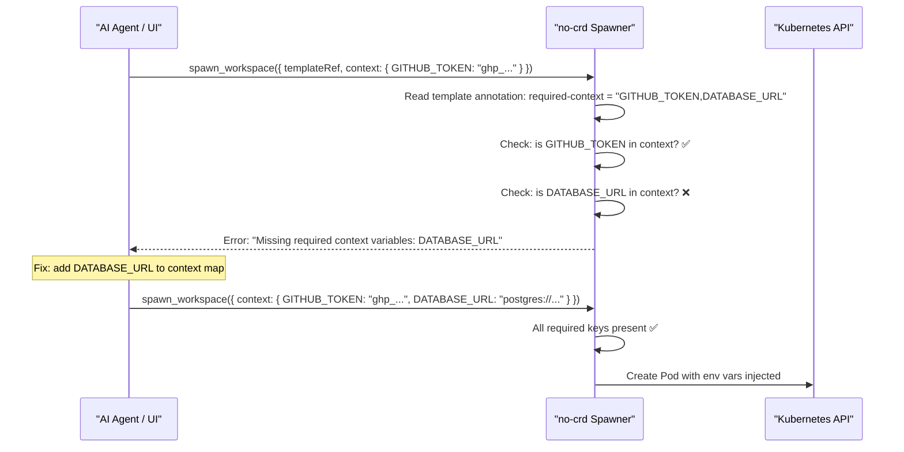
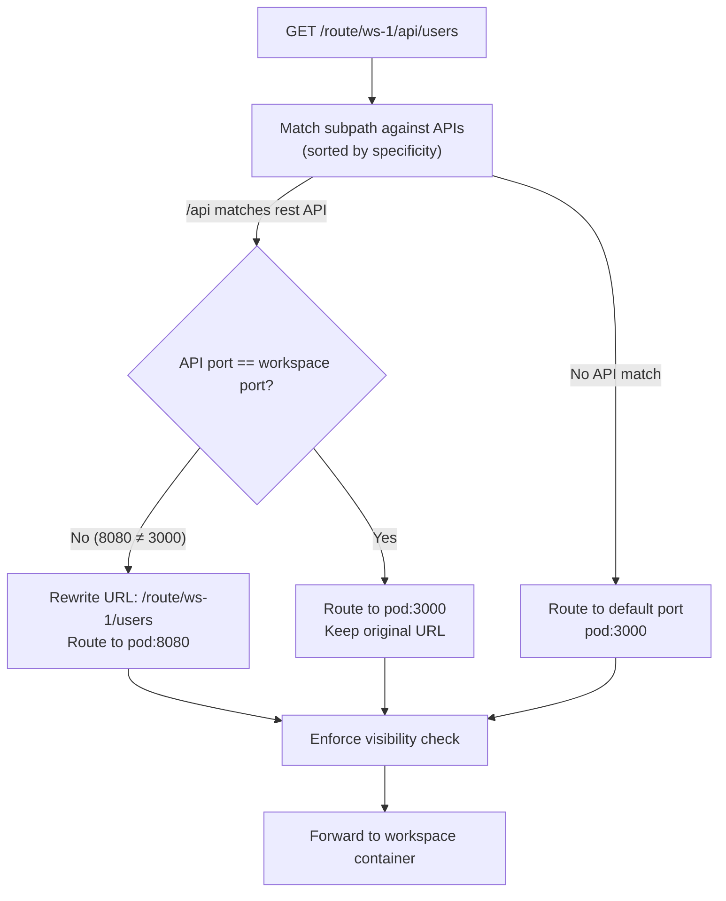

# Templates & Workspace Customization

Templates in `@nogoo9/no-crd` can be loaded from **three sources** (highest to lowest priority):

1. **Kubernetes ConfigMaps** — labeled with `nogoo9/pod-template: "true"` (original mechanism)
2. **Custom local directory** — set via `TEMPLATES_DIR` env var (YAML or JSON files)
3. **Built-in templates** — shipped with the npm package (disable with `BUILTIN_TEMPLATES=false`)

---

## 🏷️ Supported Annotations

Pod templates and inline specifications can declare special annotations that direct the Spawner to inject extra features, security configurations, and lifecycle hooks into the spawned workspace pod:

<!-- TEMPLATE_ANNOTATIONS_TABLE_START -->

| Annotation / Label Key | Type | Description |
|---|---|---|
| `nogoo9/workspace-auth-mode` | Annotation (Comma-separated) | Configures authorization modes for the workspace proxy. Comma-separated list of: `token-api` (exposes token retrieval endpoints at `_auth/token` & `_auth/authorize` for SPAs), `inject-headers` (rewrites headers to forward user identity like `x-user-sub` and JWTs to container; enabled by default if `AUTH_ENABLED=true`), `no-auth` (bypasses all auth/owner checks for public workspaces). *(Available from v0.6.0, no-auth from v0.8.0)* |
| `nogoo9/auth-require-token` | Annotation ("true" | "false") | Determines if the workspace strictly requires a valid, raw OIDC access/refresh token to function. If set to `true`, session cookie authentication via `nocr_sess` alone is treated as unauthorized for routing proxy access, forcing a redirection to the dashboard login page to authenticate and retrieve a new JWT token. *(Available from v0.9.0)* |
| `nogoo9/template-version` | Annotation (String) | Specifies the version of the pod template. Used to track if workspaces are outdated. *(Available from v0.8.0)* |
| `nogoo9/workspace-name` | Annotation (String) | Stores the user-defined display name of the workspace. *(Available from v0.4.0)* |
| `nogoo9/template-ref` | Annotation (String) | The reference to the pod template used to spawn the workspace (e.g. `default/workspace-terminal`). *(Available from v0.4.0)* |
| `nogoo9/managed-by` | Label (String) | Used to label workspace pods created by this MCP server to restrict operational scope. *(Available from v0.5.0)* |
| `nogoo9/pod-template` | Label (`"true"`) | Identifies a Kubernetes `ConfigMap` as a reusable pod template. |
| `nogoo9/type` | Label (`"workspace"`) | Applied automatically by the spawner to identify running agent workspace pods. |
| `nogoo9/workspace-id` | Label | Identifies the unique agent session / workspace ID associated with the running pod. |
| `nogoo9/user-sub` | Label / Annotation | Represents the authenticated user subject (owner) of the workspace pod, used for access control validation and ServiceAccount labeling. |
| `nogoo9/description` | Annotation (String) | A friendly, human-readable summary of the template's purpose and contents. |
| `nogoo9/tag` | Annotation (String) | A version or tag associated with the template environment (e.g. `node-20`). |
| `nogoo9/required-context` | Annotation (Comma-separated) | Validates that target environment variables are provided in the tool call's `context` parameter (e.g. `GITHUB_TOKEN,DATABASE_URL`). |
| `nogoo9/iam-role-arn` | Annotation (AWS Role ARN) | Instructs the spawner to provision a dedicated Kubernetes `ServiceAccount` annotated for EKS IAM Role mapping (IRSA). |
| `nogoo9/init-image` | Annotation (Image string) | The container image to run in the dynamic `spawner-init` init-container. |
| `nogoo9/init-command` | Annotation (Shell command) | The shell command to run in the init-container. It automatically shares the main container's volume mounts. |
| `nogoo9/init-share-volumes` | Annotation ("true" | "false") | Determines if the dynamic init-container shares the main container's volume mounts. Defaults to `true`. *(Available from v0.5.5)* |
| `nogoo9/pre-stop-command` | Annotation (Shell command) | A shell command executed in a Kubernetes `preStop` lifecycle exec hook when the workspace is terminated (e.g. to save/push state). |
| `nogoo9/pre-stop-sidecar-image` | Annotation (Image string) | If specified alongside `pre-stop-command`, runs the pre-stop command inside a dedicated sidecar container instead of the main container. |
| `nogoo9/default-grace-period` | Annotation (Number in seconds) | Overrides the Pod's `terminationGracePeriodSeconds` (defaults to `60` if a pre-stop command is defined) to give cleanup commands time to finish. |
| `nogoo9/workspace-port` | Annotation (Number) | The port inside the container to proxy traffic to. Defaults to `DEFAULT_WORKSPACE_PORT` or `3000`. |
| `nogoo9/workspace-path` | Annotation (String) | The default URL subpath mapping for the workspace web interface (defaults to `/`). |
| `nogoo9/workspace-type` | Annotation (String) | The format specification of the main entry point (e.g. `iframe`, `novnc`). |
| `nogoo9/preview-path` | Annotation (String) | The default folder or file subpath to render in the UI files preview tab. |
| `nogoo9/preview-type` | Annotation (String) | Fallback preview rendering mode for the preview tab (e.g. `markdown`, `html`). |
| `nogoo9/api.<api-name>.port` | Annotation (Number) | Defines an additional HTTP service port exposed by the workspace. |
| `nogoo9/api.<api-name>.visibility` | Annotation (String) | Specifies access visibility for the custom API endpoint. Supported values: `private` (accessible only by the workspace owner), `internal` (accessible by any logged-in user), `admin` (accessible by the owner or users with the admin scope and role), `scope:<scope_name>` (accessible by users possessing the specified OIDC scope), `role:<role_name>` (accessible by users possessing the specified user role), or a comma-separated list of allowed user subjects. |
| `nogoo9/api.<api-name>.path` | Annotation (String) | Defines the subpath routing prefix for this specific API (e.g. `/terminal`). |
| `nogoo9/api.<api-name>.desc` | Annotation (String) | A short description of this additional API, shown in the UI interface. |
| `nogoo9/api.<api-name>.method` | Annotation (String) | Comma-separated list of supported HTTP methods (e.g. `GET,POST`, `*`, defaults to any method). |
| `nogoo9/api.<api-name>.refresh` | Annotation (Duration) | Sets the refresh frequency for custom stats/activity or other mini API views in the dashboard cards (e.g. `10s`, `1m`, or `init` to query only once on startup). |
| `nogoo9/api.stats.refresh` | Annotation (Duration) | Explicitly configures the reload frequency for the reserved `stats` API metrics on the workspace dashboard card (e.g., `10s`, `30s`, `init`). |
| `nogoo9/api.last_activity.refresh` | Annotation (Duration) | Explicitly configures the reload frequency for the reserved `last_activity` epoch timestamp API on the workspace dashboard card (e.g., `30s`, `1m`, `init`). |

<!-- TEMPLATE_ANNOTATIONS_TABLE_END -->

---

## 🔄 Pod Injection Lifecycle

The diagram below shows the order in which init-containers, main containers, and pre-stop lifecycle hooks execute within a spawned workspace:



---

## 🔀 Template Variable Interpolation

Templates support **dynamic variable placeholders** that the spawner replaces at pod creation time. Variables use the `${{name}}` syntax and are interpolated in **all** of the following locations:

- Pod spec JSON (container commands, args, env values, image tags)
- Template annotation values (e.g. `nogoo9/init-command`, `nogoo9/pre-stop-command`)
- Template label values

### Supported Variables

| Variable | Resolves To | Example Value |
|---|---|---|
| `${{user}}` | Authenticated user's OIDC `sub` claim, or `"guest"` if auth is disabled or no JWT is present | `john.doe@company.com` |
| `${{workspace_id}}` | The workspace ID passed to `spawn_workspace` | `my-project-ws` |
| `${{workspace}}` | Alias for `${{workspace_id}}` (identical behavior) | `my-project-ws` |

### Where Interpolation Runs



Every `${{user}}`, `${{workspace_id}}`, and `${{workspace}}` occurrence is replaced by a simple string `replaceAll` — no escaping or nesting is needed.

### Example: Per-User Workspace with Dynamic Labels

```yaml
apiVersion: v1
kind: ConfigMap
metadata:
  name: user-workspace-template
  namespace: nogoo9
  labels:
    nogoo9/pod-template: "true"
    # Labels are interpolated too
    team: "frontend-${{user}}"
  annotations:
    nogoo9/description: "Per-user dev workspace"
    # Init command uses the user variable
    nogoo9/init-image: "alpine/git:latest"
    nogoo9/init-command: "git clone https://github.com/${{user}}/project /workspace"
    # Pre-stop uses workspace_id for commit message
    nogoo9/pre-stop-command: "cd /workspace && git commit -am 'autosave ${{workspace_id}}' && git push"
data:
  spec: |
    {
      "containers": [{
        "name": "workspace",
        "image": "node:22-alpine",
        "command": ["sleep", "infinity"],
        "env": [
          { "name": "WORKSPACE_USER", "value": "${{user}}" },
          { "name": "WORKSPACE_ID", "value": "${{workspace_id}}" },
          { "name": "ROUTE_PREFIX", "value": "/route/${{workspace_id}}/" }
        ]
      }]
    }
```

When spawned by user `alice` with workspace ID `dev-1`, the variables resolve to:
- `${{user}}` → `alice`
- `${{workspace_id}}` → `dev-1`
- Init command → `git clone https://github.com/alice/project /workspace`
- `ROUTE_PREFIX` env var → `/route/dev-1/`

---

## 📋 Required Context Validation

The `nogoo9/required-context` annotation lets template authors **mandate** that specific environment variables are provided at spawn time. If any required keys are missing, the spawn fails immediately with a clear error.

### How It Works



### Validation Rules

1. The annotation value is a **comma-separated list** of required environment variable names
2. The spawner checks that every listed key exists in the `context` parameter of `spawn_workspace`
3. If any keys are missing, the tool returns an error: `Missing required context variables: KEY1, KEY2`
4. Context values are injected as **environment variables** into:
   - The **main container** (first container in the spec)
   - The **init container** (if `nogoo9/init-image` and `nogoo9/init-command` are specified)
   - The **sidecar container** (if `nogoo9/pre-stop-sidecar-image` is specified)

### Template Example

```yaml
annotations:
  nogoo9/required-context: "GITHUB_TOKEN,DATABASE_URL,REDIS_URL"
  nogoo9/init-image: "alpine/git:latest"
  nogoo9/init-command: "git clone https://$GITHUB_TOKEN@github.com/org/repo /workspace"
```

### Spawn Call

```json
{
  "id": "backend-ws",
  "templateRef": "backend-template",
  "context": {
    "GITHUB_TOKEN": "ghp_abc123",
    "DATABASE_URL": "postgres://db:5432/myapp",
    "REDIS_URL": "redis://cache:6379"
  }
}
```

All three env vars are injected into the pod containers. The init container can reference them directly via `$GITHUB_TOKEN` (standard shell variable expansion).

> [!NOTE]
> Context variables use **standard shell `$VAR` syntax** inside commands (for Kubernetes/shell expansion at runtime), while template variables use `${{var}}` syntax (for spawner-time string replacement). They serve different purposes and can be combined.

---

## 🔌 Workspace API Endpoints & Visibility

Workspaces can expose **multiple HTTP services** on different ports, each with independent access control. This is configured entirely through annotations — no CRDs or Ingress changes needed.

### Declaring Custom APIs

Use the `nogoo9/api.<api-name>.*` annotation pattern to declare additional HTTP endpoints:

```yaml
annotations:
  # Main workspace UI on default port (3000)
  nogoo9/workspace-port: "3000"
  nogoo9/workspace-path: "/"

  # REST API on port 8080
  nogoo9/api.rest.port: "8080"
  nogoo9/api.rest.path: "/api"
  nogoo9/api.rest.desc: "Backend REST API"
  nogoo9/api.rest.method: "GET,POST,PUT,DELETE"
  nogoo9/api.rest.visibility: "private"

  # Health/stats endpoint on port 9090
  nogoo9/api.stats.port: "9090"
  nogoo9/api.stats.path: "/metrics"
  nogoo9/api.stats.desc: "Prometheus metrics"
  nogoo9/api.stats.refresh: "30s"
  # stats defaults to visibility: "admin" (no annotation needed)

  # Shared terminal on the main port
  nogoo9/api.terminal.port: "3000"
  nogoo9/api.terminal.path: "/terminal"
  nogoo9/api.terminal.desc: "Web terminal"
  nogoo9/api.terminal.visibility: "internal"
```

### Annotation Fields per API

| Field | Required | Description |
|---|---|---|
| `nogoo9/api.<name>.port` | **Yes** | Container port to route to. Without this, the API is ignored. |
| `nogoo9/api.<name>.path` | No | URL subpath prefix (default: `/`). Requests matching this prefix are routed to the API port. |
| `nogoo9/api.<name>.desc` | No | Description shown in the dashboard UI. |
| `nogoo9/api.<name>.method` | No | Comma-separated HTTP methods (e.g. `GET,POST`). Use `*` for any method. Default: any. |
| `nogoo9/api.<name>.refresh` | No | Dashboard polling interval (e.g. `10s`, `1m`, `init`). Used for stats/activity mini-views. |
| `nogoo9/api.<name>.visibility` | No | Access control mode (see table below). Default: `private`. |

### Visibility Modes

| Mode | Who Can Access | Example |
|---|---|---|
| `private` | **Workspace owner only** | Personal workspace UI |
| `internal` | **Any authenticated user** | Shared docs viewer |
| `admin` | **Owner + users with admin scope AND admin role** | Admin dashboards |
| `scope:<name>` | **Users with the specified OIDC scope** | `scope:analytics:read` |
| `role:<name>` | **Users with the specified user role** | `role:data-engineer` |
| `user1,user2,...` | **Owner + explicitly listed user subjects** | `alice@co.com,bob@co.com` |

> [!IMPORTANT]
> **Default visibility rules:**
> - APIs named `stats` or `last_activity` automatically default to `admin` visibility
> - All other APIs default to `private` visibility
> - You can always override the default by setting the `visibility` annotation explicitly

### How Route Proxying Works

When a request arrives at `/route/<workspace-id>/<subpath>`:

1. The proxy parses all `nogoo9/api.*` annotations from the workspace pod
2. APIs are sorted by path length (longest/most-specific match wins)
3. The request subpath is matched against each API's `path` prefix
4. If a match is found:
   - The request is routed to the **API's port** (instead of the default workspace port)
   - If the API port differs from the main workspace port, the **URL is rewritten** to strip the API path prefix
   - The visibility check is enforced before proxying
5. If no API matches, the request is routed to the default workspace port (`nogoo9/workspace-port` or `3000`)



### Complete Multi-Port Template Example

```yaml
apiVersion: v1
kind: ConfigMap
metadata:
  name: fullstack-workspace
  namespace: nogoo9
  labels:
    nogoo9/pod-template: "true"
  annotations:
    nogoo9/description: "Full-stack workspace with frontend, API, and metrics"
    nogoo9/workspace-port: "3000"
    nogoo9/workspace-path: "/"
    nogoo9/workspace-auth-mode: "inject-headers,token-api"

    # Backend API — owner-only access, routed to port 8080
    nogoo9/api.backend.port: "8080"
    nogoo9/api.backend.path: "/api"
    nogoo9/api.backend.desc: "Express REST API"
    nogoo9/api.backend.method: "GET,POST,PUT,DELETE"
    nogoo9/api.backend.visibility: "private"

    # Metrics — admin-only, polled every 30s for dashboard card
    nogoo9/api.stats.port: "9090"
    nogoo9/api.stats.path: "/metrics"
    nogoo9/api.stats.desc: "CPU & memory metrics"
    nogoo9/api.stats.refresh: "30s"

    # Shared preview — any logged-in user can view
    nogoo9/api.preview.port: "3000"
    nogoo9/api.preview.path: "/preview"
    nogoo9/api.preview.desc: "Live preview of frontend"
    nogoo9/api.preview.visibility: "internal"
data:
  spec: |
    {
      "containers": [
        {
          "name": "frontend",
          "image": "node:22-alpine",
          "command": ["npx", "serve", "-s", "/app", "-l", "3000"],
          "ports": [{ "containerPort": 3000 }]
        },
        {
          "name": "backend",
          "image": "node:22-alpine",
          "command": ["node", "/api/server.js"],
          "ports": [{ "containerPort": 8080 }],
          "env": [
            { "name": "WORKSPACE_OWNER", "value": "${{user}}" }
          ]
        },
        {
          "name": "metrics",
          "image": "prom/node-exporter:latest",
          "ports": [{ "containerPort": 9090 }]
        }
      ]
    }
```

---

## 📖 Practical Example

Here is a complete end-to-end walk-through of declaring a template, spawning a workspace using the MCP tool, and reviewing the generated Kubernetes manifest.

### 1. Template ConfigMap (`dev-environment-template.yaml`)

This ConfigMap defines a basic node workspace template and sets annotations to mandate environment keys, use an Alpine container to clone a repository, and hook up a `git push` cleanup command:

```yaml
apiVersion: v1
kind: ConfigMap
metadata:
  name: dev-node-template
  namespace: nogoo9
  labels:
    nogoo9/pod-template: "true"
  annotations:
    nogoo9/required-context: "GITHUB_TOKEN,GIT_REPO_URL"
    nogoo9/init-image: "alpine/git:latest"
    nogoo9/init-command: "git clone $GIT_REPO_URL /workspace"
    nogoo9/pre-stop-command: "cd /workspace && git add -A && git commit -m 'save state' && git push"
    nogoo9/default-grace-period: "120"
data:
  spec: |
    {
      "containers": [
        {
          "name": "workspace",
          "image": "node:22-alpine",
          "command": ["sleep", "infinity"],
          "volumeMounts": [
            {
              "name": "code-volume",
              "mountPath": "/workspace"
            }
          ]
        }
      ],
      "volumes": [
        {
          "name": "code-volume",
          "emptyDir": {}
        }
      ]
    }
```

### 2. MCP Tool Call (`spawn_workspace`)

The AI agent invokes `spawn_workspace` using the template reference and satisfies the context requirements:

```json
{
  "id": "agent-session-45",
  "templateRef": "dev-node-template",
  "namespace": "nogoo9",
  "context": {
    "GITHUB_TOKEN": "ghp_1234567890abcdef",
    "GIT_REPO_URL": "https://github.com/myorg/workspace-project.git"
  }
}
```

### 3. Generated Kubernetes Pod Manifest (Result)

The Spawner processes the parameters and submits the following Pod to the Kubernetes API:

```yaml
apiVersion: v1
kind: Pod
metadata:
  name: ws-anonymous-agent-session-45
  namespace: nogoo9
  labels:
    nogoo9/type: "workspace"
    nogoo9/workspace-id: "agent-session-45"
    nogoo9/managed-by: "nogoo9-spawner"
    nogoo9/user-sub: "anonymous"
spec:
  terminationGracePeriodSeconds: 120
  initContainers:
    - name: spawner-init
      image: alpine/git:latest
      command: ["/bin/sh", "-c", "git clone $GIT_REPO_URL /workspace"]
      volumeMounts:
        - name: code-volume
          mountPath: "/workspace"
      env:
        - name: GITHUB_TOKEN
          value: "ghp_1234567890abcdef"
        - name: GIT_REPO_URL
          value: "https://github.com/myorg/workspace-project.git"
  containers:
    - name: workspace
      image: node:22-alpine
      command: ["sleep", "infinity"]
      volumeMounts:
        - name: code-volume
          mountPath: "/workspace"
      env:
        - name: GITHUB_TOKEN
          value: "ghp_1234567890abcdef"
        - name: GIT_REPO_URL
          value: "https://github.com/myorg/workspace-project.git"
      lifecycle:
        preStop:
          exec:
            command: ["/bin/sh", "-c", "cd /workspace && git add -A && git commit -m 'save state' && git push"]
  volumes:
    - name: code-volume
      emptyDir: {}
```

---

## 🔒 Private Registries & Image Pull Secrets

The spawner natively supports pulling workspace images from private registries (such as private Docker Hub repos, GitHub Container Registry (GHCR), or AWS ECR) by specifying `imagePullSecrets` in your workspace templates.

### Configuring imagePullSecrets in a Template

To use a private image, define the `imagePullSecrets` array at the root of your JSON specification:

```yaml
apiVersion: v1
kind: ConfigMap
metadata:
  name: private-workspace-template
  namespace: nogoo9
  labels:
    nogoo9/pod-template: "true"
  annotations:
    nogoo9/description: "Workspace pulling from a private registry"
data:
  spec: |
    {
      "imagePullSecrets": [
        { "name": "my-registry-key" }
      ],
      "containers": [
        {
          "name": "workspace",
          "image": "my-private-registry.com/org/private-image:latest",
          "command": ["sleep", "infinity"]
        }
      ]
    }
```

> [!NOTE]
> The referenced secret (e.g., `my-registry-key`) must exist in the target namespace (usually `nogoo9`) before spawning the workspace. You can create it using:
> `kubectl -n nogoo9 create secret docker-registry my-registry-key --docker-server=... --docker-username=... --docker-password=...`
