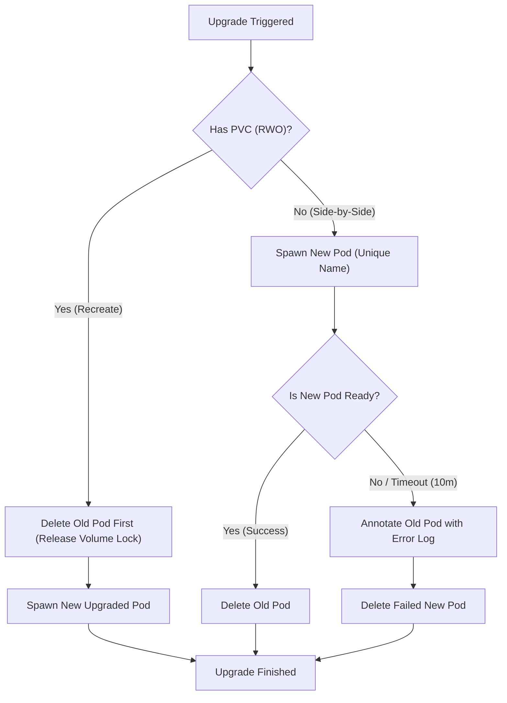

# Workspace Template Upgrades & Versioning

To ensure dynamic workspaces remain up-to-date with template changes (such as updated container images, new port configurations, or revised security settings), `@nogoo9/no-crd` provides a non-blocking background upgrade mechanism.

---

## 🏷️ Template Versioning

Workspace template versions are managed via annotations on the template source definitions.

### How to Version a Template
To define or update a template's version, add or modify the `nogoo9/template-version` annotation on your template ConfigMap or local YAML definition:

```yaml
apiVersion: v1
kind: ConfigMap
metadata:
  name: workspace-nodejs
  labels:
    nogoo9/pod-template: "true"
  annotations:
    nogoo9/template-version: "2.1.0" # [Your Template Version]
    nogoo9/description: "Node.js development environment"
data:
  spec: |
    {
      "containers": [
        {
          "name": "workspace",
          "image": "node:20-alpine",
          ...
        }
      ]
    }
```

### Detection of Outdated Workspaces
1. When a workspace is spawned, the Spawner stamps the template's current version onto the workspace pod's annotations:
   `nogoo9/template-version: "2.1.0"`.
2. The server compares the pod's stamped template version with the latest version available in the active template definition (ConfigMap or local template).
3. If they differ, the workspace is marked as `isOutdated: true` in the output of `list_workspaces` and `get_workspace`, and the `latestTemplateVersion` is exposed to help users/agents trigger upgrades.

---

## 🔄 The Upgrade Process (ADR-024)

When an upgrade is requested for a workspace via the `upgrade_workspace` or `upgrade_all_workspaces` tool, the server initiates a non-blocking background upgrade flow.



### 1. Non-Blocking In-Flight Execution
The upgrade tool schedules the workflow in the background and resolves immediately with status `"upgrading"` and the `podName` tracking ID. This prevents client timeouts when container images take time to download.

### 2. Upgraded Pod Naming
To support concurrent execution during side-by-side upgrades, the new pod is spawned with a unique DNS-1123 compliant name including a random suffix:
`ws-<user>-<workspace-id>-up-<suffix>` (e.g. `ws-john-my-workspace-up-a2f5c`).

### 3. Volume Lock Fallback (RWO PVCs)
*   **Side-by-Side Upgrades (Default)**: For workspaces with no volumes or ReadWriteMany volumes, the Spawner spawns the new pod *alongside* the old pod. It waits for the new pod to become ready before terminating the old one, minimizing downtime.
*   **Recreate-Style Upgrades**: Kubernetes PersistentVolumeClaims (PVCs) using `ReadWriteOnce` (RWO) access mode cannot be mounted by multiple pods concurrently. If the Spawner detects an RWO PVC, it falls back to a recreate flow: it deletes the old pod **first** to unmount the volume and release volume attachment locks, and then spawns the upgraded new pod.

---

## 🔀 Traffic Routing & Cutover

During a side-by-side upgrade, both the old and new pods exist simultaneously. The HTTP proxy and WebSocket proxy handle traffic cutover seamlessly:

*   **Active Routing Target**: The proxies query all matching workspace pods, sort them by `creationTimestamp` in descending order (newest first), and route traffic to the **first running and ready pod**.
*   **WebSocket Persistence**: Active WebSocket connections (such as terminals) stay connected to the old pod and are only terminated when the old pod is deleted. Once terminated, the client automatically reconnects, routing cleanly to the upgraded new pod.

---

## 📝 Error Logging & Reconciliation

### Upgrade Error Log
If the new pod fails to start or become ready within a 10-minute timeout (e.g., due to `ImagePullBackOff`, OOM, or spec errors):
1.  The upgrade is aborted.
2.  The failed new pod is deleted to free cluster resources.
3.  The detailed failure log is annotated onto the old pod under `nogoo9/last-upgrade-error`:
    ```json
    {
      "metadata": {
        "annotations": {
          "nogoo9/last-upgrade-error": "Upgrade failed at 2026-07-06T15:29:41Z: ErrImagePull: rpc error: code = NotFound desc = failed to pull and unpack image..."
        }
      }
    }
    ```
4.  The old pod remains running and active, preventing user outage.

### Interruption Reconciliation
If the MCP server crashes or restarts during an in-flight upgrade, a reconciliation scan runs on server startup. It scans all workspaces in the namespace, completes the deletion of old pods if the new ones are ready, or rolls back and cleans up failed new pods if they timed out during the offline period.
