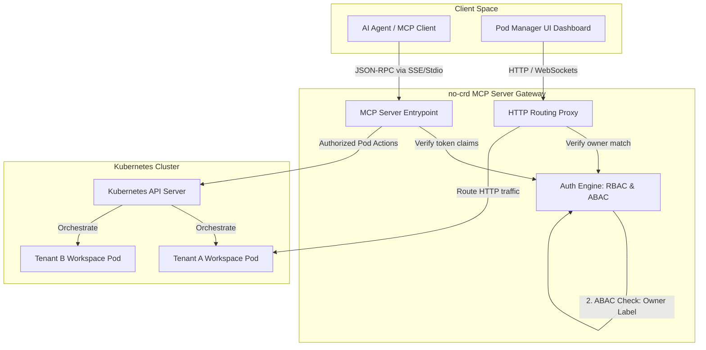

# Getting Started

`nogoo9` is a platform for agent-driven, on-demand pod orchestration in Kubernetes (k8s/k3s) **without Custom Resource Definitions (CRDs)**. It allows developers and AI agents to dynamically spin up, route to, and manage ephemeral workloads.

## Architecture Topology



## Installation

Add the package to your project or install globally:

```bash
bun install @nogoo9/no-crd
```

## Running the MCP Server

You can run the server using Bun, Deno, or Node.js from the source file `src/server-entry.ts` or by using the global CLI.

### Using Bun (Recommended)

```bash
bun run src/server-entry.ts
```

> [!WARNING]
> **WebSocket Proxy Limitation in Bun**:
> When running the HTTP server under **Bun**, WebSocket connections (used for terminal/GUI access to workspace pods) will fail or hang due to an open regression in Bun's Node compatibility layer (`socket.write()` drops data on upgraded connections).
> If your workspaces rely on WebSocket proxying (e.g. terminals, Obsidian, VNC), you **must** run the server using **Node.js** (e.g., `npx tsx src/server-entry.ts` or `node dist/server-entry.js`). See [oven-sh/bun#28871](https://github.com/oven-sh/bun/pull/28871) for details.

### Using Node.js

```bash
npx tsx src/server-entry.ts
```

### Using Deno

```bash
deno run --allow-all src/server-entry.ts
```

## Configuration

The server can be configured via environment variables or CLI flags:

### 🔌 Server Configuration

| CLI Option | Environment Variable | Default | Allowed Values | Description |
|---|---|---|---|---|
| `-t, --transport` | `TRANSPORT` | `http` | `http`, `stdio`, `both` | Server transport mode. `both` fires up both transports simultaneously. |
| `-p, --port` | `PORT` | `3000` | Number | HTTP server port for SSE transport. |
| `-H, --host` | `HOST` | `0.0.0.0` | String | Host interface to bind the HTTP/SSE server to. |
| `--base-url` | `BASE_URL` | - | Path string | Base URL path prefix for hosting behind a reverse proxy (e.g. `/gateway/no-crd`). |
| - | `STATELESS` | `false` | `true`, `false` | Enable stateless request handling (no session affinity). |
| `-l, --log-level` | `LOG_LEVEL` | `info` | `debug`, `info`, `warning`, `error`, `fatal` | Logging verbosity filter. |
| - | `LOG_FILE` | `nogoo9-mcp.log` | String | Output file path for file logging. |

### 🔒 TLS Configuration

| CLI Option | Environment Variable | Default | Allowed Values | Description |
|---|---|---|---|---|
| `--tls-cert` | `TLS_CERT` | - | Path string | Path to TLS certificate file to enable HTTPS. |
| `--tls-key` | `TLS_KEY` | - | Path string | Path to TLS private key file to enable HTTPS. |
| `--tls-ca` | `TLS_CA` | - | Path string | Path to TLS CA certificate file for HTTPS client/verification. |
| - | `NODE_TLS_REJECT_UNAUTHORIZED` | `1` (true) | `0` (false), `1` (true) | Set to `0` to bypass TLS verification (for development/testing only). |

### 🌐 CORS Configuration

| CLI Option | Environment Variable | Default | Allowed Values | Description |
|---|---|---|---|---|
| `--cors-origin` | `CORS_ALLOWED_ORIGIN`, `CORS_ORIGIN` | `*` | String | CORS Allowed Origin header. |
| `--cors-methods` | `CORS_ALLOWED_METHODS`, `CORS_METHODS` | `GET, POST, OPTIONS` | String | CORS Allowed Methods header. |
| `--cors-headers` | `CORS_ALLOWED_HEADERS`, `CORS_HEADERS` | `Content-Type, Authorization, mcp-protocol-version, mcp-session-id` | String | CORS Allowed Headers header. |
| `--cors-allow-credentials` | `CORS_ALLOW_CREDENTIALS`, `CORS_CREDENTIALS` | `false` | `true`, `false` | Enable CORS Access-Control-Allow-Credentials header. |
| `--cors-expose-headers` | `CORS_EXPOSED_HEADERS`, `CORS_EXPOSED` | `mcp-session-id` | String | Custom CORS Access-Control-Expose-Headers header. |
| `--cors-max-age` | `CORS_MAX_AGE` | - | Number | Custom CORS Access-Control-Max-Age header in seconds. |

### ☸️ Kubernetes Configuration

| CLI Option | Environment Variable | Default | Allowed Values | Description |
|---|---|---|---|---|
| `-m, --mode` | `MODE` | `cluster` | `cluster`, `namespaced` | Kubernetes access scope. `namespaced` locks operations to a single namespace. |
| `-n, --namespace` | `NAMESPACE`, `DEFAULT_NAMESPACE` | `nogoo9` | String | Default Kubernetes namespace for operations. |
| `--disable-permission-checks` | `DISABLE_PERMISSION_CHECKS` | `false` | `true`, `false` | Disable Kubernetes RBAC permission checks and assume all tools are enabled. |
| `--default-workspace-port` | `DEFAULT_WORKSPACE_PORT` | `3000` | Number | Default target port inside the workspace pods to proxy traffic to. |
| - | `REGISTRY_URL` | - | URL string | Target container registry URL to query for images (e.g. `http://localhost:5001`). |

### 🔑 Authentication Configuration

| CLI Option | Environment Variable | Default | Allowed Values | Description |
|---|---|---|---|---|
| `--auth-enabled` | `AUTH_ENABLED` | `false` | `true`, `false` | Enables JWT token authentication on MCP tools and route proxy. |
| - | `JWT_VERIFICATION_REQUIRED` | `true` | `true`, `false` | Enable/disable JWT signature verification (signature checks). |
| `--jwt-secret` | `JWT_SECRET` | - | String | Symmetric HMAC-SHA256 secret for token verification. |
| `--jwt-public-key` | `JWT_PUBLIC_KEY` | - | String | PEM encoded RSA/ECDSA public key for asymmetric token verification. |
| `--jwks-uri` | `JWKS_URI` | - | URL string | Remote JWKS endpoint URL to dynamically retrieve verification keys. |
| - | `INTROSPECTION_ENDPOINT`, `JWT_INTROSPECTION_ENDPOINT` | - | URL string | Endpoint for token introspection/validation. |
| - | `OAUTH_CLIENT_ID` | - | String | OAuth client ID for auth configuration. |
| - | `OAUTH_CLIENT_SECRET` | - | String | OAuth client secret for auth configuration. |
| - | `JWT_AUDIENCE` | - | String | Expected token audience. Falls back to `OAUTH_CLIENT_ID` if set. |
| `--auth-issuer` | `AUTH_ISSUER`, `JWT_ISSUER` | `""` | URL string | Identifier URL for the Authorization Server advertised in metadata discovery. |
| `--auth-sub-jsonpath` | `AUTH_SUB_JSONPATH` | `$.sub` | JSONPath | Payload path to extract unique user identity from JWT payload. |
| `--auth-scope-jsonpath` | `AUTH_SCOPE_JSONPATH` | `$.scope` | JSONPath | Payload path to extract scopes claim from JWT payload. |
| `--auth-roles-jsonpath` | `AUTH_ROLES_JSONPATH`, `AUTH_ADMIN_JSONPATH` | `$.realm_access.roles` | JSONPath | Payload path to extract user roles from JWT payload. |
| - | `AUTH_ADMIN_ROLE` | `nogoo9-admin` | String | Role name signifying administrator access. |
| `--auth-required-read-scope` | `AUTH_REQUIRED_READ_SCOPE` | - | String | OAuth scope required for read operations. If not set, read scope check is bypassed. |
| `--auth-required-write-scope` | `AUTH_REQUIRED_WRITE_SCOPE` | - | String | OAuth scope required for write/mutation operations. If not set, write scope check is bypassed. |
| `--auth-required-read-role` | `AUTH_REQUIRED_READ_ROLE` | - | String | User role required for read operations. If not set, read role check is bypassed. |
| `--auth-required-write-role` | `AUTH_REQUIRED_WRITE_ROLE` | - | String | User role required for write/mutation operations. If not set, write role check is bypassed. |

### 🖥️ UI & Themes Configuration

| CLI Option | Environment Variable | Default | Allowed Values | Description |
|---|---|---|---|---|
| - | `UI_ENABLED` | `true` | `true`, `false` | Enables the embedded HTML Pod Manager UI resource. |
| - | `THEMES_DIR` | `themes` | Path string | Local directory path containing custom CSS UI themes. |
| - | `THEMES_CONFIGMAP` | - | String | Name of Kubernetes ConfigMap containing custom UI theme configurations. |
| - | `DOCS_DIR` | `/app/docs` (Docker) or `docs/.vitepress/dist` (Local) | Path string | Base directory from which static documentation files are served. |
| - | `OAUTH_DISCOVERY_URL` | `""` | URL string | Discovery URL for the OAuth authorization server used by the UI client. |
| - | `OAUTH_CLIENT_ID` | `""` | String | OAuth client ID for UI authorization. |
| - | `OAUTH_LOGIN_METHOD` | `"redirect"` | `redirect`, `popup` | Login interaction mode for UI OAuth client. |
