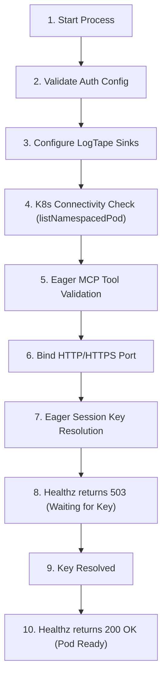

# Getting Started

`nogoo9` is a platform for agent-driven, on-demand pod orchestration in Kubernetes (k8s/k3s) **without Custom Resource Definitions (CRDs)**. It allows developers and AI agents to dynamically spin up, route to, and manage ephemeral workloads.


## Architecture Topology

<!-- 
PROMPT FOR FUTURE AGENTS:
This image is a professional software architecture diagram for 'nogoo9-no-crd'.
Prompt used for generation:
"A professional and modern software architecture diagram for a system called 'nogoo9-no-crd'. The diagram is laid out horizontally in a sleek dark theme with three clean columns or spaces: 1. Client Space (left): showing boxes for 'AI Agent / MCP Client' and 'Pod Manager UI Dashboard'. 2. MCP Server Gateway (middle): showing boxes for 'MCP Server Entrypoint', 'HTTP Routing Proxy', and 'Auth Engine: RBAC & ABAC'. 3. Kubernetes Cluster (right): showing 'Kubernetes API Server', 'Tenant A Workspace Pod', and 'Tenant B Workspace Pod'. Clear, glow-effect arrows connect them: Agent connects to MCP Entrypoint; UI connects to Routing Proxy; both query the Auth Engine; MCP Entrypoint sends commands to Kubernetes API; Routing Proxy forwards traffic directly to Tenant Pods; Kubernetes API Server orchestrates the Tenant Pods. Premium design with soft gradient glows, clean sans-serif typography, and subtle tech aesthetics."
To regenerate or refine, use the generate_image tool with this prompt.
-->


## Installation

The package is published and available on npm: [@nogoo9/no-crd](https://www.npmjs.com/package/@nogoo9/no-crd).

Add the package to your project or install globally:

```bash
bun install @nogoo9/no-crd
```

## Running the MCP Server

You can run the server using Bun, Deno, or Node.js from the source file `src/server-entry.ts`, run via Docker, or by using the global CLI.

### Using Docker

The official container image is published on GitHub Container Registry (GHCR) as [`ghcr.io/nogoo9/no-crd`](https://github.com/nogoo9/no-crd/pkgs/container/no-crd). You can run the server in a container by mounting your local Kubernetes configuration:

```bash
docker run -d -p 3000:3000 \
  -v "$HOME/.kube/config:/app/.kube/config:ro" \
  -e KUBECONFIG=/app/.kube/config \
  ghcr.io/nogoo9/no-crd:latest
```

### Using Bun (Recommended)

```bash
bun run src/server-entry.ts
```

> [!WARNING]
> **WebSocket Proxy Limitation in Bun**:
> When running the HTTP server under **Bun**, WebSocket connections (used for terminal/GUI access to workspace pods) will fail or hang due to an open regression in Bun's Node compatibility layer (`socket.write()` drops data on upgraded connections).
> If your workspaces rely on WebSocket proxying (e.g. terminals, Obsidian, VNC), you **must** run the server using **Node.js** (e.g., `npx tsx src/server-entry.ts` or `node dist/server-entry.js`). See [oven-sh/bun#28871](https://github.com/oven-sh/bun/pull/28871) for details.

### Using Node.js

```bash
npx tsx src/server-entry.ts
```

### Using Deno

```bash
deno run --allow-all src/server-entry.ts
```

## Service Startup Sequence

When you boot the `nogoo9-no-crd` server (in HTTP or both transports), the service undergoes a sequential startup validation process to fail fast on configuration errors and prevent unhealthy routing:


```mermaid
graph TD
    Start["1. Start Process"] --> AuthVal["2. Validate Auth Config"]
    AuthVal --> LogSetup["3. Configure LogTape Sinks"]
    LogSetup --> K8sProbe["4. K8s Connectivity Check (listNamespacedPod)"]
    K8sProbe --> McpRegister["5. Eager MCP Tool Validation"]
    McpRegister --> BindPort["6. Bind HTTP/HTTPS Port"]
    BindPort --> ResolSession["7. Eager Session Key Resolution"]
    ResolSession --> HealthWait["8. Healthz returns 503 (Waiting for Key)"]
    HealthWait --> KeyResolved["9. Key Resolved"]
    KeyResolved --> Ready["10. Healthz returns 200 OK (Pod Ready)"]
```

### Detailed Startup Steps:

1. **Polyfill & Validation**: Global polyfills (such as `Buffer`) are loaded first for Deno/Node compatibility. If authentication is enabled (`AUTH_ENABLED=true`), the OIDC URL configurations are validated.
2. **Logging Initialization**: Configures `LogTape` logger sinks. If utilizing the `stdio` transport, the console logging outputs are suppressed (`console.log = () => {}`) to preserve stdin/stdout protocol integrity.
3. **Eager Kubernetes Connectivity Check**: Probes the Kubernetes API server using a `listNamespacedPod` request (with `limit: 1`). If the connection is refused or the API is unreachable, the server exits immediately with actionable hints.
4. **Eager MCP Tool Registration Validation**: Constructs a throwaway MCP server instance to verify that the pod's RBAC service account holds the required permissions to list resources and register tools.
5. **Fastify Server Binding**: Binds the HTTP/HTTPS listeners to the designated host and port.
6. **Eager Session Key Resolution**: Initiates the session key negotiation/resolution cascade (`resolveSessionSecret()`):
   - Reads environment variables (`PROXY_SESSION_SECRET` / `JWT_SECRET`).
   - Attempts to read or create a Kubernetes Secret (`nogoo9-session-key`).
   - Queries sibling pods via `/internal/session-key` if RBAC writes are disabled.
   - Generates a random key in-memory as a fallback.
7. **Liveness & Readiness Block**: Until the session key is resolved, `/healthz` and `/mcp/healthz` endpoints will respond with `503 Service Unavailable`. This blocks Kubernetes ingress traffic from routing to the booting pod until it has successfully aligned on the session key.

---

## Configuration

The server can be configured via command-line flags or environment variables.

For the full startup sequence checklist, configuration details, and descriptions of all environment variables, please refer to the [Configuration & Env Variables Guide](./deploy/configuration.md).

