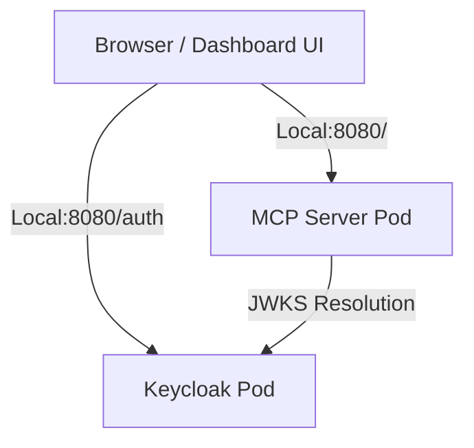
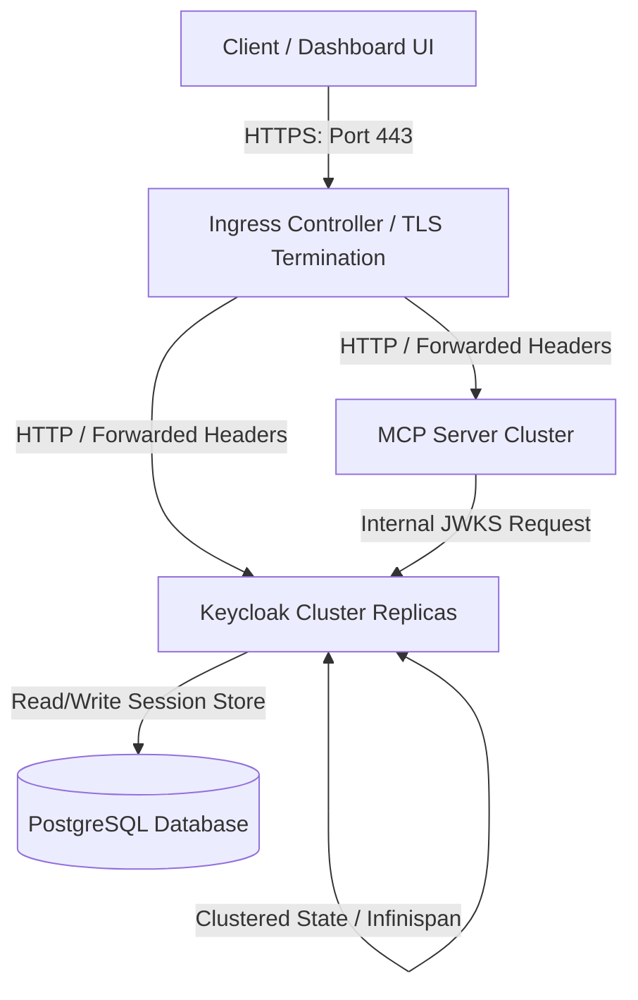

# Keycloak OIDC Setup & Integration Guide

This document details the configuration, architecture, and deployment patterns of the OIDC identity provider (Keycloak) for securing `@nogoo9/no-crd` in both local sandbox environments and production-grade Kubernetes deployments.

---

## 1. Local Sandbox Architecture

The local development and E2E test setup uses a single-instance Keycloak container running in developer mode inside the local k3d sandbox.



When the local sandbox is initialized, the Traefik Ingress Controller routing is configured as:
- Paths prefixed with `/auth` route to the Keycloak service (`keycloak:8080`).
- Catch-all `/` routes to the MCP Server service (`nogoo-mcp:3000`).

---

## 2. Keycloak Realm Configuration

For local development and testing, OIDC configuration is pre-configured and automatically loaded via a ConfigMap mount inside the Keycloak container.

- **Realm Name**: `nogoo9`
- **OIDC Client**:
  - **Client ID**: `nogoo9-mcp`
  - **Flow**: Authorization Code Flow with PKCE (Standard Flow)
  - **Redirect URIs**: `*` (Wildcard for development flexibility)
  - **Web Origins**: `*` (Allow CORS requests)
  - **Client Scopes**: Includes `mcp:read` and `mcp:write` configured as default client scopes to automatically populate scopes in issued tokens.
- **Roles**:
  - `mcp-reader`: Default role for read-only actions (mapping to read tools/endpoints).
  - `mcp-writer`: Default role for mutation actions (mapping to write/delete tools/endpoints).
  - `nogoo9-admin`: Assigned to administrative test accounts to verify admin-only operations and pod escalation.
- **Default Users**:
  - **Read-Only User**: `readuser` / `password` (has `mcp-reader` role)
  - **Read-Write User**: `writeuser` / `password` (has `mcp-writer` and `mcp-reader` roles)
  - **Admin User**: `adminuser` / `password` (has `nogoo9-admin` role)

---

## 3. Local Sandbox Container Deployment Spec

Keycloak is deployed using `quay.io/keycloak/keycloak:26.0` running in developer mode (`start-dev` mode) which bypasses HTTPS requirements and simplifies dev setups.

We mount the imported realm JSON from a ConfigMap at `/opt/keycloak/data/import/nogoo9-realm.json` and pass the `--import-realm` CLI flag.

### Local Verification

Run the bootstrap script to spin up the cluster with Keycloak pre-integrated:
```bash
# Spin up k3d and deploy Keycloak + MCP server
moon run k3d:bootstrap
```

You can then access:
- **Keycloak Admin Console**: `http://localhost:8080/auth` (Credentials: `admin`/`admin`)
- **OpenID Configuration**: `http://localhost:8080/auth/realms/nogoo9/.well-known/openid-configuration`
- **JWKS Endpoint**: `http://localhost:8080/auth/realms/nogoo9/protocol/openid-connect/certs`

### E2E Authentication & Resource Isolation Testing

A dedicated E2E integration test script validates the entire authentication, authorization, and tenant isolation flows against the local k3d cluster.

To run the E2E auth tests:
```bash
# Run the E2E auth test task
moon run mcp:test-e2e-auth
```

The test script automatically performs the following actions:
1. **Challenge Verification**: Calls the `/mcp` tools list without a token to verify it returns a `401 Unauthorized` challenge with compliance headers (`WWW-Authenticate` and `Link` as per RFC 9728).
2. **Token Retrieval**: Authenticates against Keycloak using direct access password grants to retrieve OIDC JWT tokens for `readuser`, `writeuser`, and `adminuser`.
3. **RBAC Validation**: Verifies that requests with a valid token load `/permissions` and successfully authenticate against the `/mcp` SSE/HTTP endpoints.
4. **Tenant Isolation**: 
   - Spawns a pod (`writeuser-e2e-pod`) as `writeuser` and another (`adminuser-e2e-pod`) as `adminuser`.
   - Verifies that `readuser` (lacking `mcp-writer` role) is blocked from creating a pod.
   - Verifies that `writeuser` can only see/list `writeuser-e2e-pod` and is blocked from reading `adminuser-e2e-pod` (`403 Forbidden`).
   - Verifies that `adminuser` can list all pods and access `writeuser-e2e-pod` via admin escalation.
5. **Proxy Cookie Auth**: Initiates a proxy request to the pod via `/route/writeuser-e2e-pod/` and asserts that a path-scoped session cookie (`nocr_token`) is returned. It then makes subsequent sub-resource requests using only the cookie to verify authentication state persistence.
6. **Cleanup**: Gracefully deletes all created pods.

---

## 4. Production Readiness & Deployment

Transitioning from a local developer setup to a production-grade identity infrastructure requires moving away from the ephemeral sandbox setup.



### 4.1 Production Optimization vs Developer Mode

In production, run Keycloak in production mode using the `start` command instead of `start-dev`. Developer mode is highly insecure and exhibits behaviors unsafe for production:
- It uses HTTP instead of enforcing HTTPS.
- It uses an embedded, local H2 file database.
- It auto-builds configurations at runtime, causing slow startup speeds.

To build and run Keycloak in production, execute the following commands in the container or configure them in the Helm values/operator CRD:
```bash
# 1. Build optimized Keycloak image (enabling DB and feature flags)
/opt/keycloak/bin/kc.sh build --db=postgres --features=token-exchange,preview

# 2. Start the server in production mode
/opt/keycloak/bin/kc.sh start
```

### 4.2 Production Database (PostgreSQL)

Never use the H2 database in production. Configure a dedicated, high-availability database cluster (e.g., PostgreSQL). Set the following environment variables:

| Environment Variable | Description | Example Value |
|---|---|---|
| `KC_DB` | Database vendor | `postgres` |
| `KC_DB_URL` | JDBC database connection URL | `jdbc:postgresql://postgres-ha.db.svc.cluster.local:5432/keycloak` |
| `KC_DB_USERNAME` | Database username | `keycloak` |
| `KC_DB_PASSWORD` | Database password | *Set via Kubernetes Secret* |
| `KC_DB_POOL_MIN_SIZE` | Minimum connection pool size | `10` |
| `KC_DB_POOL_MAX_SIZE` | Maximum connection pool size | `50` |

### 4.3 TLS, Hostname, and Ingress Setup

For production, Keycloak must operate behind a secure TLS boundary. 

> [!IMPORTANT]
> Always enforce strict TLS on Keycloak. Under no circumstances should tokens be transmitted over unencrypted HTTP.

#### Ingress Edge TLS Termination
When running behind an Ingress Controller (e.g. Nginx, Traefik, AWS ALB) that terminates TLS:
1. Configure Keycloak to trust proxy headers (`X-Forwarded-For`, `X-Forwarded-Proto`, etc.):
   ```bash
   KC_PROXY=edge
   ```
2. Enable HTTP listener to receive traffic forwarded from the Ingress Controller:
   ```bash
   KC_HTTP_ENABLED=true
   ```
3. Set the public front-end hostname to prevent Keycloak from generating incorrect links (e.g., in email validation or redirect checks):
   ```bash
   KC_HOSTNAME=sso.yourdomain.com
   ```

### 4.4 Deployment via Keycloak Operator

The recommended way to manage Keycloak on Kubernetes is using the official CNCF Keycloak Operator. It automates deployment, scaling, database schemas, and realm state synchronization.

#### Keycloak Custom Resource (CR)
Below is an example production deployment manifest utilizing the Keycloak Operator:

```yaml
apiVersion: k8s.keycloak.org/v2alpha1
kind: Keycloak
metadata:
  name: production-keycloak
  namespace: security
spec:
  instances: 3
  db:
    vendor: postgres
    host: postgres-ha.db.svc.cluster.local
    usernameSecret:
      name: keycloak-db-secret
      key: username
    passwordSecret:
      name: keycloak-db-secret
      key: password
    database: keycloak
  http:
    tlsSecret: production-keycloak-tls-secret
  ingress:
    enabled: true
    className: nginx
    annotations:
      cert-manager.io/cluster-issuer: letsencrypt-prod
  additionalOptions:
    - name: proxy
      value: edge
    - name: hostname
      value: sso.yourdomain.com
```

#### Synchronizing Realms programmatically
Instead of manually clicking around the admin console or using ephemeral sandbox `--import-realm` flags, declare your realms as Custom Resources:

```yaml
apiVersion: k8s.keycloak.org/v2alpha1
kind: KeycloakRealmImport
metadata:
  name: nogoo9-realm-production
  namespace: security
spec:
  keycloakCRName: production-keycloak
  realm:
    realm: nogoo9
    enabled: true
    displayName: "Nogoo9 Identity Realm"
    clients:
      - clientId: nogoo9-mcp
        enabled: true
        protocol: openid-connect
        publicClient: true
        redirectUris:
          - "https://nocrd.yourdomain.com/*"
        webOrigins:
          - "https://nocrd.yourdomain.com"
        defaultClientScopes:
          - "openid"
          - "profile"
          - "email"
          - "mcp:read"
          - "mcp:write"
```

### 4.5 High Availability (HA) & Clustering

To ensure service uptime during cluster updates or node failures, configure Keycloak to run multiple replicas:
- **Instances**: Deploy a minimum of `3` instances.
- **Infinispan Caching**: Keycloak uses Infinispan to store user sessions, authorization tokens, and login failures. The Keycloak Operator automatically configures Infinispan in clustered mode.
- **JGroups Discovery**: In Kubernetes, nodes must find each other to synchronize memory state. Keycloak uses JGroups for cluster discovery. Ensure network policies permit UDP/TCP traffic on ports `7800` (JGroups) and `11222` (Infinispan).
- **Graceful Shutdown**: Configure container lifecycle hooks to ensure connections are drained before pods are terminated.

> [!TIP]
> Ensure that `podAntiAffinity` is configured so that Keycloak replicas are scheduled on different physical Kubernetes worker nodes. This prevents a single hardware node failure from causing service downtime.
