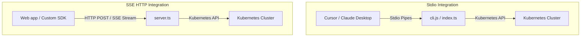

# MCP Client Integration Guide

This guide explains how to connect and interact with the `@nogoo9/no-crd` Model Context Protocol (MCP) server. 

The MCP server exposes powerful tools and resources directly to AI coding assistants and API clients, enabling them to dynamically orchestrate Kubernetes workspaces, manage templates, query pod logs, and view an embedded React-based Pod Manager dashboard.

---

## 🔌 Connection Architectures

The server supports two transport protocols:
1. **Stdio Transport (Standard Input/Output):** Recommended for local IDE integrations (like Cursor, Claude Desktop, and Cline) where the client spawns the server as a child process.
2. **SSE Transport (Server-Sent Events / HTTP):** Recommended for remote deployments, web clients, or programmatic orchestrators.



---

## 🛠️ Configuring Popular AI Clients

Below are configuration patterns for standard developer environments. Choose the block corresponding to your target setup.

### 1. Claude Desktop
Add the following to your Claude Desktop configuration file:
* **macOS:** `~/Library/Application Support/Claude/config.json`
* **Windows:** `%APPDATA%\Claude\config.json`
* **Linux:** `~/.config/Claude/config.json`

```json
{
  "mcpServers": {
    "no-crd": {
      "command": "npx",
      "args": [
        "-y",
        "@nogoo9/no-crd",
        "--transport",
        "stdio",
        "--mode",
        "cluster",
        "--namespace",
        "nogoo9"
      ]
    }
  }
}
```

### 2. Cursor
To configure the server in Cursor:
1. Open Cursor and navigate to **Settings** > **Features** > **MCP**.
2. Click **+ Add New MCP Server**.
3. Configure the fields as follows:
   * **Name:** `no-crd`
   * **Type:** `stdio`
   * **Command:** `npx -y @nogoo9/no-crd --transport stdio --mode cluster --namespace nogoo9`

### 3. Cline / Roo Code (VS Code Extension)
Open or edit your global `mcp_settings.json` (usually located in VS Code's global extensions configuration folder):

```json
{
  "mcpServers": {
    "no-crd": {
      "command": "npx",
      "args": [
        "-y",
        "@nogoo9/no-crd",
        "--transport",
        "stdio",
        "--mode",
        "cluster",
        "--namespace",
        "nogoo9"
      ]
    }
  }
}
```

### 4. Local Development / Cross-Runtime Configurations
If you are developing locally or running the server directly from the source repository, you can register the local server with your MCP client using one of the following configurations:

#### Bun (Source execution)
Recommended for development on Bun:
```json
    "nogoo9-no-crd-local-bun": {
      "command": "bun",
      "args": ["run", "src/index.ts"],
      "env": {
        "TRANSPORT": "stdio",
        "NODE_TLS_REJECT_UNAUTHORIZED": "0"
      }
    }
```

#### Deno (Source execution)
Runs the server directly from source using Deno. The flags ensure sloppier Node compatibility imports and ignore self-signed certificate issues with local Kubernetes APIs:
```json
    "nogoo9-no-crd-local-deno": {
      "command": "deno",
      "args": [
        "run",
        "--allow-all",
        "--unstable-sloppy-imports",
        "--unsafely-ignore-certificate-errors",
        "src/index.ts"
      ],
      "env": {
        "TRANSPORT": "stdio",
        "NODE_TLS_REJECT_UNAUTHORIZED": "0"
      }
    }
```

#### Node.js (Pre-compiled execution)
Runs the compiled bundle using Node.js:
```json
    "nogoo9-no-crd-local-node": {
      "command": "node",
      "args": ["dist/index.js"],
      "env": {
        "TRANSPORT": "stdio",
        "NODE_TLS_REJECT_UNAUTHORIZED": "0"
      }
    }
```
*(Make sure to run `bun run build` first to compile the code into the `dist/` directory).*

---

## 🔍 Debugging Connections with MCP Inspector

You can inspect all available tools, resources, and schemas using the official MCP Inspector. Run the preconfigured command:

```bash
bun run inspect
```

Alternatively, invoke it directly via `npx`:

```bash
TRANSPORT=stdio npx @modelcontextprotocol/inspector bun run dist/index.js
```

This launches a web-based inspector UI on `http://localhost:5173` where you can view tools, schemas, and trigger tool calls manually to verify cluster access.
