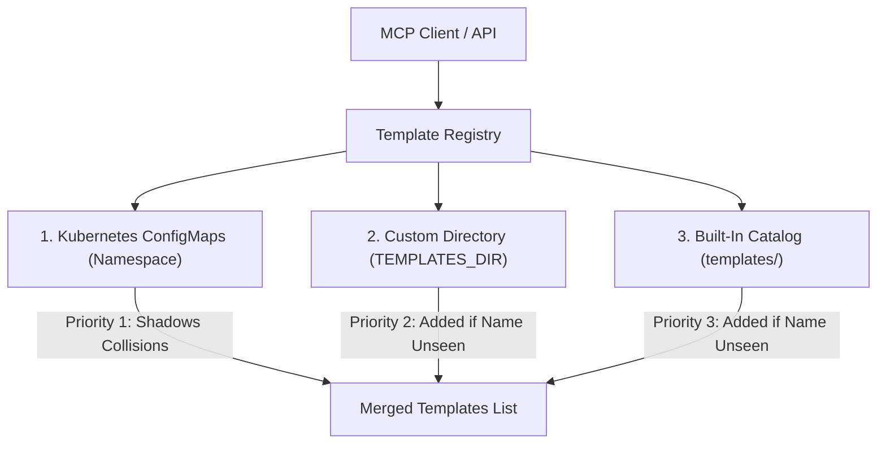

# Pod Templates & Dynamic Variables

In `@nogoo9/no-crd`, pod definitions are templated as standard Kubernetes ConfigMaps. This allows AI agents and API clients to discover and spawn workspace environments dynamically, using pre-configured specifications without requiring CRDs or custom operators in the cluster.

---

## 📄 Template Structure

A pod template is a Kubernetes `ConfigMap` defined in a target namespace. It must follow these criteria:

1. **Labels**: Must have the label `nogoo9/pod-template` set to `"true"`.
2. **Metadata Annotations**: Configures display descriptions, required variables, and container lifecycle hooks.
3. **Spec Data**: The actual pod specification must be stored as a stringified JSON under the `spec` key in the `data` block of the ConfigMap.

### Basic ConfigMap Template Example

Here is a minimal YAML definition of a workspace template:

```yaml
apiVersion: v1
kind: ConfigMap
metadata:
  name: basic-node-template
  namespace: nogoo9
  labels:
    nogoo9/pod-template: "true"
  annotations:
    nogoo9/description: "A lightweight Node.js developer environment"
    nogoo9/tag: "node"
data:
  spec: |
    {
      "containers": [
        {
          "name": "workspace",
          "image": "node:22-alpine",
          "command": ["sleep", "infinity"]
        }
      ]
    }
```

---

## 🏷️ Supported Annotations & Lifecycle Hooks

You can define spawner-specific annotations on the template `ConfigMap` to inject initialization actions, sidecar services, credentials, or cleanup scripts into spawned pods:

<!-- TEMPLATE_ANNOTATIONS_TABLE_START -->

| Annotation / Label Key | Type | Description |
|---|---|---|
| `nogoo9/pod-template` | Label (`"true"`) | Identifies a Kubernetes `ConfigMap` as a reusable pod template. |
| `nogoo9/type` | Label (`"workspace"`) | Applied automatically by the spawner to identify running agent workspace pods. |
| `nogoo9/workspace-id` | Label | Identifies the unique agent session / workspace ID associated with the running pod. |
| `nogoo9/user-sub` | Label / Annotation | Represents the authenticated user subject (owner) of the workspace pod, used for access control validation and ServiceAccount labeling. |
| `nogoo9/description` | Annotation (String) | A friendly, human-readable summary of the template's purpose and contents. |
| `nogoo9/tag` | Annotation (String) | A version or tag associated with the template environment (e.g. `node-20`). |
| `nogoo9/required-context` | Annotation (Comma-separated) | Validates that target environment variables are provided in the tool call's `context` parameter (e.g. `GITHUB_TOKEN,DATABASE_URL`). |
| `nogoo9/iam-role-arn` | Annotation (AWS Role ARN) | Instructs the spawner to provision a dedicated Kubernetes `ServiceAccount` annotated for EKS IAM Role mapping (IRSA). |
| `nogoo9/init-image` | Annotation (Image string) | The container image to run in the dynamic `spawner-init` init-container. |
| `nogoo9/init-command` | Annotation (Shell command) | The shell command to run in the init-container. It automatically shares the main container's volume mounts. |
| `nogoo9/init-share-volumes` | Annotation ("true" | "false") | Determines if the dynamic init-container shares the main container's volume mounts. Defaults to `true`. |
| `nogoo9/pre-stop-command` | Annotation (Shell command) | A shell command executed in a Kubernetes `preStop` lifecycle exec hook when the workspace is terminated (e.g. to save/push state). |
| `nogoo9/pre-stop-sidecar-image` | Annotation (Image string) | If specified alongside `pre-stop-command`, runs the pre-stop command inside a dedicated sidecar container instead of the main container. |
| `nogoo9/default-grace-period` | Annotation (Number in seconds) | Overrides the Pod's `terminationGracePeriodSeconds` (defaults to `60` if a pre-stop command is defined) to give cleanup commands time to finish. |
| `nogoo9/workspace-port` | Annotation (Number) | The port inside the container to proxy traffic to. Defaults to `DEFAULT_WORKSPACE_PORT` or `3000`. |
| `nogoo9/workspace-path` | Annotation (String) | The default URL subpath mapping for the workspace web interface (defaults to `/`). |
| `nogoo9/workspace-type` | Annotation (String) | The format specification of the main entry point (e.g. `iframe`, `novnc`). |
| `nogoo9/preview-path` | Annotation (String) | The default folder or file subpath to render in the UI files preview tab. |
| `nogoo9/preview-type` | Annotation (String) | Fallback preview rendering mode for the preview tab (e.g. `markdown`, `html`). |
| `nogoo9/api.<api-name>.port` | Annotation (Number) | Defines an additional HTTP service port exposed by the workspace. |
| `nogoo9/api.<api-name>.path` | Annotation (String) | Defines the subpath routing prefix for this specific API (e.g. `/terminal`). |
| `nogoo9/api.<api-name>.desc` | Annotation (String) | A short description of this additional API, shown in the UI interface. |
| `nogoo9/api.<api-name>.method` | Annotation (String) | Comma-separated list of supported HTTP methods (e.g. `GET,POST`, `*`, defaults to any method). |

<!-- TEMPLATE_ANNOTATIONS_TABLE_END -->

---

## 📂 Local & Built-In Templates

In addition to cluster-level Kubernetes `ConfigMap` templates, `@nogoo9/no-crd` supports loading templates from local file filesystems. This enables simple template management alongside the codebase or mounting templates dynamically via volumes:

1. **Custom Templates Directory**: Configured by setting the `TEMPLATES_DIR` environment variable to an absolute path.
2. **Built-In Catalog**: Loaded automatically from the bundled `templates/` directory (enabled by default; can be disabled by setting the environment variable `BUILTIN_TEMPLATES=false`).

Local and built-in templates support both YAML (`.yaml`, `.yml`) and JSON (`.json`) formats.

<!-- 
PROMPT FOR FUTURE AGENTS:
This Mermaid diagram describes the template resolution and merge pipeline. It illustrates:
1. The three sources of templates: Kubernetes ConfigMaps, custom local folder, and built-in assets.
2. The precedence order (1 > 2 > 3) and how name collisions are resolved via shadowing.
To regenerate or extend, maintain this visual structure and list any new template providers (e.g. databases, HTTP endpoints) as parallel branches.
-->


### File Structure Example

```yaml
metadata:
  name: local-python-env
  annotations:
    nogoo9/description: "Local python development container"
    nogoo9/tag: "python"
spec:
  containers:
    - name: workspace
      image: python:3.11-alpine
      command: ["sleep", "infinity"]
```

### Template Precedence & Merging

When calling `list_templates` or spawning/retrieving a template, the template registry resolves names in the following order:
1. **Kubernetes ConfigMaps** (in the cluster namespace)
2. **Custom Templates Directory** (`TEMPLATES_DIR`)
3. **Built-In Templates** (the `templates/` directory)

If templates in different sources share the same name, the source with the higher priority will shadow/mask the lower-priority template.

---

## 👤 Dynamic Template Variable `${{user}}`

To support multi-tenant workspaces where storage directories, S3 folders, or resource paths must be isolated per user, the template engine supports the dynamic template variable `${{user}}`.

Before instantiating a template (whether calling `spawn_workspace` or `create_pod_from_template`), the server performs the following:

1. **Identity Extraction**: The server extracts the user identity/subject (`sub`) from the active JWT token, using the JSONPath expression configured via `AUTH_SUB_JSONPATH` (defaults to `"$.sub"`).
2. **Anonymous Fallback**: If authentication is disabled (`AUTH_ENABLED=false`), or if no JWT payload is present during execution, the variable `${{user}}` defaults to `"guest"`.
3. **Variable Interpolation**: The server replaces all occurrences of `${{user}}` in both:
   - The stringified Pod Spec JSON block (`data.spec`)
   - Every annotation value under `metadata.annotations`

This interpolation executes *before* the pod JSON is parsed and *before* spawner lifecycle hooks are constructed, enabling dynamic commands in init containers and termination hooks.

### Practical Example: User-Isolated S3 Synchronization

In this template, the `${{user}}` variable is used to synchronize development files from and to a user-specific folder prefix inside a shared S3 bucket:

```yaml
apiVersion: v1
kind: ConfigMap
metadata:
  name: s3-synced-workspace
  namespace: nogoo9
  labels:
    nogoo9/pod-template: "true"
  annotations:
    nogoo9/description: "Developer workspace with user-isolated S3 backup hooks"
    nogoo9/required-context: "AWS_ACCESS_KEY_ID,AWS_SECRET_ACCESS_KEY"
    # Pull code from user folder on startup
    nogoo9/init-image: "amazon/aws-cli:latest"
    nogoo9/init-command: "aws s3 sync s3://company-workspaces/homes/${{user}}/ /workspace"
    # Push back changes on workspace stop
    nogoo9/pre-stop-command: "aws s3 sync /workspace s3://company-workspaces/homes/${{user}}/"
    nogoo9/pre-stop-sidecar-image: "amazon/aws-cli:latest"
    nogoo9/default-grace-period: "120"
data:
  spec: |
    {
      "containers": [
        {
          "name": "workspace",
          "image": "node:22-alpine",
          "command": ["sleep", "infinity"],
          "volumeMounts": [
            {
              "name": "workspace-volume",
              "mountPath": "/workspace"
            }
          ]
        }
      ],
      "volumes": [
        {
          "name": "workspace-volume",
          "emptyDir": {}
        }
      ]
    }
```

If an authenticated user with subject `johndoe` spawns this workspace:
- The init container clones files from `s3://company-workspaces/homes/johndoe/`.
- The workspace pre-stop hook commits backup data to `s3://company-workspaces/homes/johndoe/`.

If spawned anonymously or without authentication enabled:
- The path resolves to `s3://company-workspaces/homes/guest/`.

---

## 🆔 Dynamic Workspace Variables `${{workspace_id}}` & `${{workspace}}`

To support templates that need to refer to their own dynamically generated workspace ID (for example, to configure routing path prefixes or subpath-based container variables), the template engine supports the dynamic placeholders `${{workspace_id}}` and `${{workspace}}`.

During the `spawn_workspace` execution, the server replaces all occurrences of `${{workspace_id}}` and `${{workspace}}` in:
- The stringified Pod Spec JSON block (`data.spec`)
- Every annotation value under `metadata.annotations`

### Example: Dynamic Subfolder Path Config for KasmVNC/Obsidian
In this example, the workspace ID is used to dynamically construct a unique subfolder prefix for the web application:

```yaml
data:
  spec: |
    {
      "containers": [{
        "name": "agent",
        "image": "lscr.io/linuxserver/obsidian:latest",
        "env": [
          {
            "name": "SUBFOLDER",
            "value": "/route/${{workspace_id}}/"
          }
        ]
      }]
    }
```

---

## 🌐 Subpath Routing & Prefix Preservation

When dynamic workspaces are accessed via path-based URLs (e.g. `http://localhost:8080/route/:workspaceId/`), the routing proxy behaves dynamically based on the pod configuration:

### The Strip-Prefix Default Behavior
By default, the Fastify reverse proxy matches the `/route/:workspaceId` prefix and strips it before forwarding traffic to the container.
- For example, a request to `/route/workspace-123/index.html` is forwarded to the pod as `GET /index.html`.
- This works perfectly for most applications (like `ttyd` terminal) which expect to be served from the root `/` of their port.

### The Prefix Preservation Behavior (e.g. for KasmVNC / Obsidian)
Applications powered by KasmVNC (like `linuxserver/obsidian`) require being served from their configured subfolder path to resolve asset links and WebSockets properly. They configure a subpath using the `SUBFOLDER` environment variable (e.g. `SUBFOLDER=/route/workspace-123/`).

- If the routing proxy detects that the target workspace pod has a `SUBFOLDER` environment variable defined in its spec, **it preserves the `/route/:workspaceId` path prefix**.
- It does this by rewriting the request path to `/route/:workspaceId/route/:workspaceId/...` before it reaches the proxy plugin, so that when the proxy strips the matched prefix once, the request forwarded to the pod remains prefixed with `/route/:workspaceId/...`.
- This prevents hitting the default server block in the container's internal web server and avoids showing the default Nginx welcome page.

---

## 🛠️ Managing Templates

Templates can be created, viewed, and deleted using the following MCP tools or programmatically:

### 1. Creating a Template (MCP tool)
Use the `create_template` tool, providing the name, optional description/annotations/labels, and standard JSON pod specification:

```json
{
  "name": "python-datascience",
  "description": "Python datascience sandbox with Jupyter notebooks",
  "spec": {
    "containers": [
      {
        "name": "jupyter",
        "image": "jupyter/datascience-notebook:latest",
        "command": ["start-notebook.sh", "--NotebookApp.token=''"]
      }
    ]
  }
}
```

### 2. Getting a Template (MCP tool)
Use `get_template` with the template name to fetch its ConfigMap annotations, labels, and spec JSON:

```json
{
  "name": "python-datascience"
}
```

### 3. Spawning a Pod from a Template (MCP tool)
Use `create_pod_from_template` to instantiate the template into a standard pod. You can pass runtime container overrides (like environment variables or resources) and top-level overrides:

```json
{
  "templateRef": "python-datascience",
  "name": "user-datascience-workspace",
  "containerOverrides": [
    {
      "name": "jupyter",
      "env": [
        { "name": "ENV_VAR_EXAMPLE", "value": "custom-value" }
      ]
    }
  ]
}
```
