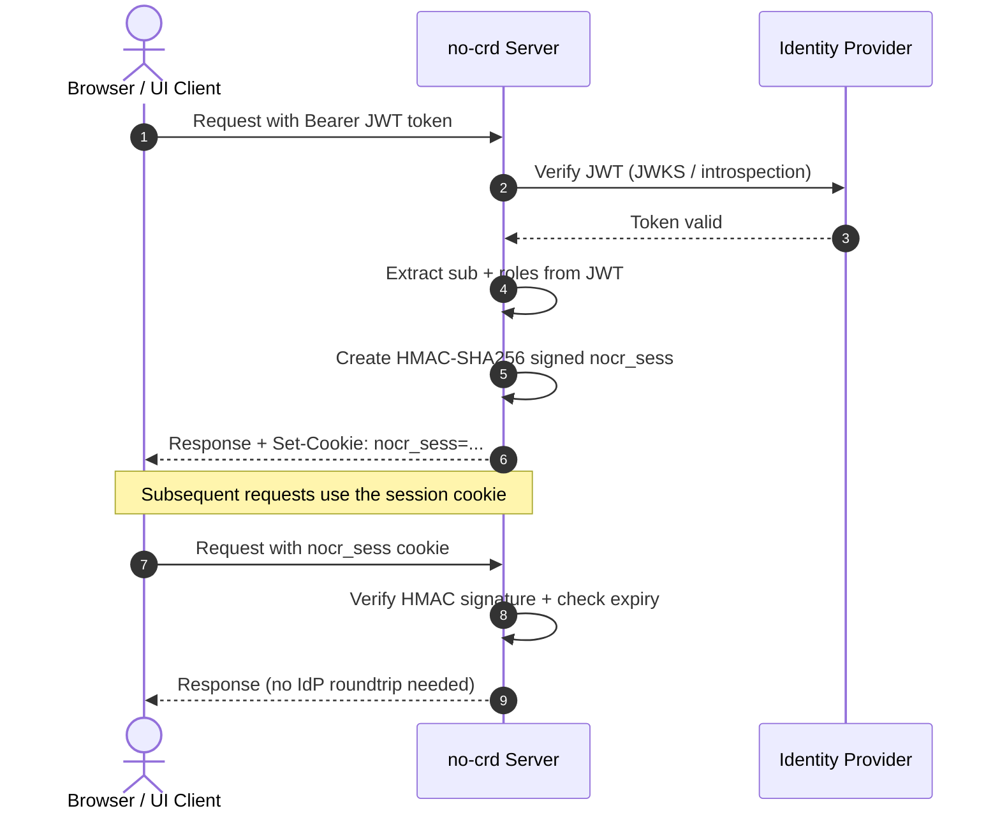

# Session & Cookie Management

This guide explains how `@nogoo9/no-crd` uses browser cookies to maintain authentication state across requests, enabling seamless workspace access without requiring a JWT token on every sub-resource load.

> [!TIP]
> For JWT configuration and signature verification setup, see the [Authentication Overview](/mcp-auth). This page focuses on what happens *after* a token is verified.

---

## Cookie Types

The server uses two distinct cookies with different purposes and scopes:

| Cookie | Purpose | Scope | TTL | Contents |
|--------|---------|-------|-----|----------|
| `nocr_sess` | Stateless session — avoids re-verifying JWT on every request | `Path=/` (root) | Configurable via `PROXY_SESSION_TTL` (default: 1800s / 30 min, sliding window) | HMAC-signed payload: `sub`, `roles`, `iat`, `exp` |
| `nocr_token` | Workspace proxy auth — allows sub-resources (CSS, JS, images) to load inside routed workspaces | `Path=/route/{workspaceId}/` | 24 hours (fixed) | Raw JWT token value |

Both cookies are set with `SameSite=Lax` and `HttpOnly` flags for security.

---

## How `nocr_sess` Works (Stateless Session Cookie)

When a user presents a valid JWT token, the server mints a lightweight `nocr_sess` cookie containing only the essential claims needed for authorization. Subsequent requests can authenticate via this cookie without requiring the full JWT verification flow (JWKS fetch, signature check, introspection call).



### Cookie Structure

The `nocr_sess` value is a two-part string: `{base64url_payload}.{hmac_signature}`

The payload contains:

```json
{
  "sub": "writeuser",
  "roles": ["mcp-writer", "nogoo9-admin"],
  "iat": 1748530000,
  "exp": 1748531800
}
```

- **`sub`** — User identity, extracted from the JWT using `AUTH_SUB_JSONPATH` (default: `$.sub`)
- **`roles`** — User roles, extracted using `AUTH_ROLES_JSONPATH` (default: `$.realm_access.roles`)
- **`iat`** — Issued-at timestamp (Unix seconds)
- **`exp`** — Expiry timestamp (sliding window: `iat + PROXY_SESSION_TTL`)

### Signing Algorithm

The cookie is signed with **HMAC-SHA256** using a session key resolved via a [5-step priority cascade](#session-key-resolution). The signature prevents tampering — if any byte of the payload is modified, the server rejects the cookie.

### Sliding Window TTL

Each time a valid JWT is presented, a fresh `nocr_sess` is minted with a new `exp` timestamp. This creates a sliding window effect: as long as the user keeps using the dashboard, their session stays alive without requiring OIDC re-authentication.

---

## How `nocr_token` Works (Workspace Proxy Cookie)

When a user accesses a routed workspace (e.g., `/route/my-workspace/`), the server sets a `nocr_token` cookie containing the raw JWT token, scoped to that workspace's path.

This solves a practical problem: workspace UIs (e.g., Open WebUI, VS Code, VNC) load sub-resources (CSS, JS, images, WebSocket connections) via relative URLs. These relative requests don't carry the `Authorization` header or `?token=` query parameter, so they would fail with `401 Unauthorized` without the cookie.

```mermaid
sequenceDiagram
    autonumber
    actor Browser
    participant Proxy as Routing Proxy

    Browser->>Proxy: GET /route/ws-1/ (with Bearer token)
    Proxy-->>Browser: HTML page + Set-Cookie: nocr_token=jwt; Path=/route/ws-1/
    Browser->>Proxy: GET /route/ws-1/style.css (cookie sent automatically)
    Proxy->>Proxy: Extract token from nocr_token cookie
    Proxy-->>Browser: CSS file
```

The cookie `Path` is scoped to `/route/{workspaceId}/`, so:
- It is only sent for requests within that workspace's route prefix
- It does not leak to other workspaces or the main dashboard
- Multiple workspace cookies can coexist independently

> [!NOTE]
> The cookie `Path` uses the raw value `/route/{id}/` without the `BASE_URL` prefix. This is consistent with how the proxy sets the cookie. See [ADR-011](/decisions/ADR-011-ui-base-url-and-cookie-path-consistency) for the full analysis.

---

## Token Extraction Priority Chain

When processing an incoming request, the server extracts the authentication token in the following priority order:

```
1. Authorization: Bearer <token>  header     (highest priority)
2. ?token=<token>                 query param
3. nocr_token                     cookie
4. nocr_sess                      session cookie (lowest — session only)
```

The first successfully extracted token is used. If a JWT is found (steps 1–3), it undergoes full verification. If only a `nocr_sess` session cookie is found (step 4), the server validates the HMAC signature and expiry without contacting the IdP.

> [!IMPORTANT]
> The `nocr_sess` cookie carries extracted claims (`sub`, `roles`), not the original JWT. It is sufficient for authorization decisions but does not contain the full token payload.

---

## Session Key Resolution

The HMAC key used to sign and verify `nocr_sess` cookies is resolved via a **5-step priority cascade** at server startup:

| Priority | Source | When to use |
|----------|--------|-------------|
| 1 | `PROXY_SESSION_SECRET` env var | Production — set explicitly for deterministic key |
| 2 | `JWT_SECRET` env var | Reuse the HMAC-SHA256 JWT signing key if available |
| 3 | Kubernetes Secret (`nogoo9-session-key`) | Multi-replica — shared secret stored in-cluster |
| 4 | Peer discovery (`/internal/session-key`) | Multi-replica — fetch key from a running sibling pod |
| 5 | Random in-memory key | Fallback — works for single-replica dev, but sessions don't survive restarts |

### Multi-Replica Deployments

In deployments with multiple replicas, all pods **must** share the same session key. Otherwise, a `nocr_sess` cookie signed by pod A will be rejected by pod B.

**Recommended approaches** (in order of preference):

1. **Set `PROXY_SESSION_SECRET`** in the deployment manifest — simplest and most reliable
2. **Let the server auto-create a Kubernetes Secret** — requires `secrets` RBAC permission, but works automatically across replicas
3. **Peer discovery** — pods query sibling pods at `http://{podIP}:{port}/internal/session-key` to adopt the key from the first replica that booted

For details on peer discovery, see [ADR-003](/decisions/ADR-003-peer-discovery-session-key).

---

## Cookie Lifecycle

### Setting Cookies

| Event | Cookie set | Location |
|-------|-----------|----------|
| JWT verified successfully on any request | `nocr_sess` at `Path=/` | `auth.ts` preHandler hook |
| Workspace proxy request with valid token | `nocr_token` at `Path=/route/{id}/` | `proxy.ts` onResponse callback |

### Clearing Cookies (Logout)

The UI calls `POST /logout` which triggers the server to clear all cookies:

1. **Per-workspace `nocr_token`**: The server queries Kubernetes for all workspace pods owned by the user, then sends a `Set-Cookie` with `Max-Age=0` for each workspace path
2. **Root `nocr_token`**: Cleared at `Path=/`
3. **Session `nocr_sess`**: Cleared at `Path=/`

```mermaid
sequenceDiagram
    autonumber
    actor Browser
    participant Server as no-crd Server
    participant K8s as Kubernetes API

    Browser->>Server: POST /logout (with Bearer token)
    Server->>K8s: List pods for user (label: nogoo9/user-sub)
    K8s-->>Server: [ws-1, ws-2, ws-3]
    Server-->>Browser: Set-Cookie: nocr_token=; Path=/route/ws-1/; Max-Age=0
    Server-->>Browser: Set-Cookie: nocr_token=; Path=/route/ws-2/; Max-Age=0
    Server-->>Browser: Set-Cookie: nocr_token=; Path=/route/ws-3/; Max-Age=0
    Server-->>Browser: Set-Cookie: nocr_token=; Path=/; Max-Age=0
    Server-->>Browser: Set-Cookie: nocr_sess=; Path=/; Max-Age=0
```

> [!NOTE]
> The UI also clears `localStorage` entries (`nocr_token`, `nocr_refresh_token`) client-side during logout, independently of the server response.

---

## Configuration Reference

| Variable | Default | Description |
|----------|---------|-------------|
| `PROXY_SESSION_SECRET` | *(none)* | Explicit HMAC key for signing `nocr_sess` cookies. Set this in production. |
| `PROXY_SESSION_TTL` | `1800` | Session cookie lifetime in seconds (default: 30 minutes, sliding window). |
| `AUTH_SUB_JSONPATH` | `$.sub` | JSONPath to extract the user identity from the JWT for the session `sub` claim. |
| `AUTH_ROLES_JSONPATH` | `$.realm_access.roles` | JSONPath to extract user roles from the JWT for the session `roles` claim. |

---

## Security Considerations

- **HttpOnly**: Both cookies are `HttpOnly`, preventing JavaScript access and mitigating XSS token theft.
- **SameSite=Lax**: Cookies are not sent on cross-origin requests, mitigating CSRF attacks. Workspace sub-resources load correctly because they are same-origin navigations.
- **HMAC integrity**: `nocr_sess` is signed — any tampering invalidates the cookie. The server does **not** encrypt the payload (claims are visible in base64), but integrity is guaranteed.
- **No refresh token in cookies**: The OIDC refresh token is stored in `localStorage` only and never sent to the server as a cookie.
- **Path scoping**: `nocr_token` is scoped per-workspace, preventing one workspace from reading another's token.

## Known Gotchas

> [!WARNING]
> **Never call `window.location.reload()` from a 401 handler in the UI.**
> The UI runs `initOidc()` and `app.connect()` concurrently at boot. If the MCP endpoint returns 401 (no token or expired token) and the handler reloads the page, the reload fires before `triggerRedirect()` can navigate to the IdP — creating an infinite refresh loop where the login prompt flashes but the user is never actually redirected.
>
> The correct approach is to show the login overlay (`loginOverlay.classList.remove("hidden")`) and return/throw, letting the OIDC flow handle the redirect independently. This was fixed in v0.5.3.

## Related Documentation

- [ADR-002: Stateless Signed Session Cookies](/decisions/ADR-002-stateless-session-cookies) — Design rationale
- [ADR-003: Peer Discovery for Session Key](/decisions/ADR-003-peer-discovery-session-key) — Multi-replica key sharing
- [ADR-005: Session Cookie Coverage for All Endpoints](/decisions/ADR-005-ui-proactive-oidc-refresh) — Why `Path=/`
- [ADR-011: UI BASE_URL & Cookie Path Consistency](/decisions/ADR-011-ui-base-url-and-cookie-path-consistency) — Cookie path analysis
- [Authentication Overview](/mcp-auth) — JWT verification configuration
- [Cryptographic Hardening](/auth-hardening) — Owner isolation and scope enforcement
