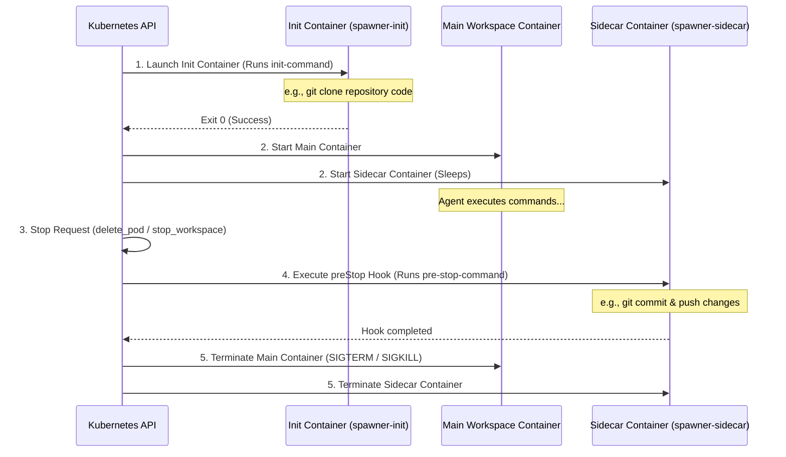

# Workspace Spawner & Annotations Guide

The Spawner subsystem in `@nogoo9/no-crd` is designed for agentic sandboxing. It allows AI agents and API clients to provision, list, and terminate isolated containerized workspaces (pods) on-demand using standard Kubernetes APIs without Custom Resource Definitions.

This guide covers the spawner architecture, tool configurations, supported lifecycle annotations, and concrete deployment examples.

---

## 🏗️ Spawner Architecture

When an agent invokes `spawn_workspace`, the spawner processes the request, loads the referenced template ConfigMap, applies annotations, and injects runtime configurations before committing the pod to the Kubernetes API.

<!-- 
PROMPT FOR FUTURE AGENTS:
This image is a professional architectural flow diagram for the Workspace Spawner subsystem.
Prompt used for generation:
"A clean, professional software flow diagram illustrating the 'Workspace Spawner Architecture' for a Kubernetes sandboxing system. Dark theme with soft glowing gradient accents. The diagram shows: 1. AI Agent / Client calling 'spawn_workspace' tool on the MCP Spawner Tool; 2. MCP Spawner Tool reading from 'ConfigMap Template'; 3. Spawner evaluating annotations and passing data to the 'Spec Injector'; 4. Spec Injector dynamically injecting: 'Init Containers', 'IAM Role ServiceAccount', and 'preStop Hooks' into the Pod spec; 5. Spawner deploying the final Pod to the Kubernetes API. Modern UI style with clean rounded boxes, glowing arrows, and clear visual layout."
To regenerate or refine, use the generate_image tool with this prompt.
-->


---

## 🏷️ Supported Annotations

Pod templates and inline specifications can declare special annotations that direct the Spawner to inject extra features, security configurations, and lifecycle hooks into the spawned workspace pod:

<!-- TEMPLATE_ANNOTATIONS_TABLE_START -->

| Annotation / Label Key | Type | Description |
|---|---|---|
| `nogoo9/pod-template` | Label (`"true"`) | Identifies a Kubernetes `ConfigMap` as a reusable pod template. |
| `nogoo9/type` | Label (`"workspace"`) | Applied automatically by the spawner to identify running agent workspace pods. |
| `nogoo9/workspace-id` | Label | Identifies the unique agent session / workspace ID associated with the running pod. |
| `nogoo9/user-sub` | Label / Annotation | Represents the authenticated user subject (owner) of the workspace pod, used for access control validation and ServiceAccount labeling. |
| `nogoo9/description` | Annotation (String) | A friendly, human-readable summary of the template's purpose and contents. |
| `nogoo9/tag` | Annotation (String) | A version or tag associated with the template environment (e.g. `node-20`). |
| `nogoo9/required-context` | Annotation (Comma-separated) | Validates that target environment variables are provided in the tool call's `context` parameter (e.g. `GITHUB_TOKEN,DATABASE_URL`). |
| `nogoo9/iam-role-arn` | Annotation (AWS Role ARN) | Instructs the spawner to provision a dedicated Kubernetes `ServiceAccount` annotated for EKS IAM Role mapping (IRSA). |
| `nogoo9/init-image` | Annotation (Image string) | The container image to run in the dynamic `spawner-init` init-container. |
| `nogoo9/init-command` | Annotation (Shell command) | The shell command to run in the init-container. It automatically shares the main container's volume mounts. |
| `nogoo9/init-share-volumes` | Annotation ("true" | "false") | Determines if the dynamic init-container shares the main container's volume mounts. Defaults to `true`. |
| `nogoo9/pre-stop-command` | Annotation (Shell command) | A shell command executed in a Kubernetes `preStop` lifecycle exec hook when the workspace is terminated (e.g. to save/push state). |
| `nogoo9/pre-stop-sidecar-image` | Annotation (Image string) | If specified alongside `pre-stop-command`, runs the pre-stop command inside a dedicated sidecar container instead of the main container. |
| `nogoo9/default-grace-period` | Annotation (Number in seconds) | Overrides the Pod's `terminationGracePeriodSeconds` (defaults to `60` if a pre-stop command is defined) to give cleanup commands time to finish. |
| `nogoo9/workspace-port` | Annotation (Number) | The port inside the container to proxy traffic to. Defaults to `DEFAULT_WORKSPACE_PORT` or `3000`. |
| `nogoo9/workspace-path` | Annotation (String) | The default URL subpath mapping for the workspace web interface (defaults to `/`). |
| `nogoo9/workspace-type` | Annotation (String) | The format specification of the main entry point (e.g. `iframe`, `novnc`). |
| `nogoo9/preview-path` | Annotation (String) | The default folder or file subpath to render in the UI files preview tab. |
| `nogoo9/preview-type` | Annotation (String) | Fallback preview rendering mode for the preview tab (e.g. `markdown`, `html`). |
| `nogoo9/api.<api-name>.port` | Annotation (Number) | Defines an additional HTTP service port exposed by the workspace. |
| `nogoo9/api.<api-name>.path` | Annotation (String) | Defines the subpath routing prefix for this specific API (e.g. `/terminal`). |
| `nogoo9/api.<api-name>.desc` | Annotation (String) | A short description of this additional API, shown in the UI interface. |
| `nogoo9/api.<api-name>.method` | Annotation (String) | Comma-separated list of supported HTTP methods (e.g. `GET,POST`, `*`, defaults to any method). |

<!-- TEMPLATE_ANNOTATIONS_TABLE_END -->

---

## 🔄 Pod Injection Lifecycle

The diagram below shows the order in which init-containers, main containers, and pre-stop lifecycle hooks execute within a spawned workspace:



---

## 📖 Practical Example

Here is a complete end-to-end walk-through of declaring a template, spawning a workspace using the MCP tool, and reviewing the generated Kubernetes manifest.

### 1. Template ConfigMap (`dev-environment-template.yaml`)

This ConfigMap defines a basic node workspace template and sets annotations to mandate environment keys, use an Alpine container to clone a repository, and hook up a `git push` cleanup command:

```yaml
apiVersion: v1
kind: ConfigMap
metadata:
  name: dev-node-template
  namespace: nogoo9
  labels:
    nogoo9/pod-template: "true"
  annotations:
    nogoo9/required-context: "GITHUB_TOKEN,GIT_REPO_URL"
    nogoo9/init-image: "alpine/git:latest"
    nogoo9/init-command: "git clone $GIT_REPO_URL /workspace"
    nogoo9/pre-stop-command: "cd /workspace && git add -A && git commit -m 'save state' && git push"
    nogoo9/default-grace-period: "120"
data:
  spec: |
    {
      "containers": [
        {
          "name": "workspace",
          "image": "node:22-alpine",
          "command": ["sleep", "infinity"],
          "volumeMounts": [
            {
              "name": "code-volume",
              "mountPath": "/workspace"
            }
          ]
        }
      ],
      "volumes": [
        {
          "name": "code-volume",
          "emptyDir": {}
        }
      ]
    }
```

### 2. MCP Tool Call (`spawn_workspace`)

The AI agent invokes `spawn_workspace` using the template reference and satisfies the context requirements:

```json
{
  "id": "agent-session-45",
  "templateRef": "dev-node-template",
  "namespace": "nogoo9",
  "context": {
    "GITHUB_TOKEN": "ghp_1234567890abcdef",
    "GIT_REPO_URL": "https://github.com/myorg/workspace-project.git"
  }
}
```

### 3. Generated Kubernetes Pod Manifest (Result)

The Spawner processes the parameters and submits the following Pod to the Kubernetes API:

```yaml
apiVersion: v1
kind: Pod
metadata:
  name: ws-anonymous-agent-session-45
  namespace: nogoo9
  labels:
    nogoo9/type: "workspace"
    nogoo9/workspace-id: "agent-session-45"
    nogoo9/managed-by: "nogoo9-spawner"
    nogoo9/user-sub: "anonymous"
spec:
  terminationGracePeriodSeconds: 120
  initContainers:
    - name: spawner-init
      image: alpine/git:latest
      command: ["/bin/sh", "-c", "git clone $GIT_REPO_URL /workspace"]
      volumeMounts:
        - name: code-volume
          mountPath: "/workspace"
      env:
        - name: GITHUB_TOKEN
          value: "ghp_1234567890abcdef"
        - name: GIT_REPO_URL
          value: "https://github.com/myorg/workspace-project.git"
  containers:
    - name: workspace
      image: node:22-alpine
      command: ["sleep", "infinity"]
      volumeMounts:
        - name: code-volume
          mountPath: "/workspace"
      env:
        - name: GITHUB_TOKEN
          value: "ghp_1234567890abcdef"
        - name: GIT_REPO_URL
          value: "https://github.com/myorg/workspace-project.git"
      lifecycle:
        preStop:
          exec:
            command: ["/bin/sh", "-c", "cd /workspace && git add -A && git commit -m 'save state' && git push"]
  volumes:
    - name: code-volume
      emptyDir: {}
```

---

## 🔒 Private Registries & Image Pull Secrets

The spawner natively supports pulling workspace images from private registries (such as private Docker Hub repos, GitHub Container Registry (GHCR), or AWS ECR) by specifying `imagePullSecrets` in your workspace templates.

### Configuring imagePullSecrets in a Template

To use a private image, define the `imagePullSecrets` array at the root of your JSON specification:

```yaml
apiVersion: v1
kind: ConfigMap
metadata:
  name: private-workspace-template
  namespace: nogoo9
  labels:
    nogoo9/pod-template: "true"
  annotations:
    nogoo9/description: "Workspace pulling from a private registry"
data:
  spec: |
    {
      "imagePullSecrets": [
        { "name": "my-registry-key" }
      ],
      "containers": [
        {
          "name": "workspace",
          "image": "my-private-registry.com/org/private-image:latest",
          "command": ["sleep", "infinity"]
        }
      ]
    }
```

> [!NOTE]
> The referenced secret (e.g., `my-registry-key`) must exist in the target namespace (usually `nogoo9`) before spawning the workspace. You can create it using:
> `kubectl -n nogoo9 create secret docker-registry my-registry-key --docker-server=... --docker-username=... --docker-password=...`

---

## 🌐 Workspace Routing Proxy (Experimental)
*(Available from v0.2.0 - Experimental)*

> [!WARNING]
> The workspace routing proxy is experimental and likely to change in the next version.

The server includes a built-in reverse proxy routing service. This enables clients (and AI agents) to access web services running inside workspace containers (e.g. IDE servers, Jupyter notebooks, mock servers) without creating Kubernetes Services or Ingress rules for every container.

### How it Works
When a client requests a URL matching:
`http://<gateway>/route/<workspaceId>/<subpath>`

The server performs the following steps:
1. **Identity & JWT Resolution:** Resolves the JWT token from the `Authorization: Bearer <token>` header or `?token=<token>` query string.
2. **Access Verification:** Checks if `AUTH_ENABLED` is true. If yes, it verifies that the `sub` (or configured subject claim) in the JWT token matches the pod's `nogoo9/user-sub` label. If it doesn't match, it returns a `403 Forbidden`.
3. **Target Selection:** Finds the corresponding workspace pod IP inside the cluster. It extracts the target port from the pod's `nogoo9/workspace-port` annotation (falling back to `DEFAULT_WORKSPACE_PORT` or `3000`).
4. **Streaming Proxy:** Performs an HTTP fetch to `http://<pod-ip>:<port>/<subpath>` and pipes request/response streams (headers, body, query parameters) back and forth.
### Configuration

You can configure the behavior of the routing proxy using the following settings:

| Environment Variable | Description | Default |
| --- | --- | --- |
| `DEFAULT_WORKSPACE_PORT` | The default container port to which the proxy forwards traffic if no template annotation is defined. | `3000` |
| `BASE_URL` | Subpath prefix for all server routes. If configured (e.g. `/proxy`), the routing proxy path shifts to `/proxy/route/<workspaceId>/<subpath>`. | *(None)* |
| `AUTH_ENABLED` | If set to `true`, enforces JWT signature verification and checks that the user's identity matches the pod's `nogoo9/user-sub` label. | `false` |

#### Customizing Ports via Template Annotations
For workspace templates running services on non-standard ports (such as `8888` for Jupyter notebooks or `8080` for code-server), define the `nogoo9/workspace-port` annotation on the template ConfigMap. The proxy service reads this annotation on startup/lookup to route traffic to the correct container port.

### Code Example: Workspace Pod with Target Port Annotation
Create a template specifying a custom workspace target port:

```yaml
apiVersion: v1
kind: ConfigMap
metadata:
  name: jupyter-workspace-template
  namespace: nogoo9
  labels:
    nogoo9/pod-template: "true"
  annotations:
    nogoo9/description: "Jupyter Notebook environment"
    nogoo9/workspace-port: "8888" # Proxy forwards requests to port 8888 inside the container
data:
  spec: |
    {
      "containers": [
        {
          "name": "jupyter",
          "image": "jupyter/base-notebook:latest",
          "command": ["start-notebook.sh", "--NotebookApp.token=''"],
          "ports": [
            { "containerPort": 8888 }
          ]
        }
      ]
    }
```

When this workspace is spawned with ID `session-a`, you can connect directly to the Jupyter notebook via the gateway:
`http://localhost:3000/route/session-a/?token=YOUR_JWT_HERE`

---

## 🔄 Lifecycle Hooks Examples
*(Available from v0.2.0)*

Provide hooks to pull state before starting workspaces and to backup/flush state before workspaces terminate.

### 1. State Setup (Git example)
Configure an init-container to pull code from Git at workspace startup:

```yaml
annotations:
  nogoo9/required-context: "GIT_REPO_URL"
  nogoo9/init-image: "alpine/git:latest"
  nogoo9/init-command: "git clone $GIT_REPO_URL /workspace"
```

### 2. State Backup (S3 example)
Configure a `preStop` termination hook to backup data to MinIO/S3 on container shutdown:

```yaml
annotations:
  nogoo9/required-context: "AWS_ACCESS_KEY_ID,AWS_SECRET_ACCESS_KEY,S3_BUCKET,S3_FOLDER"
  nogoo9/pre-stop-command: "aws s3 sync /workspace s3://$S3_BUCKET/$S3_FOLDER --endpoint-url http://minio-service:9000"
  nogoo9/pre-stop-sidecar-image: "amazon/aws-cli:latest"
  nogoo9/default-grace-period: "120"
```
