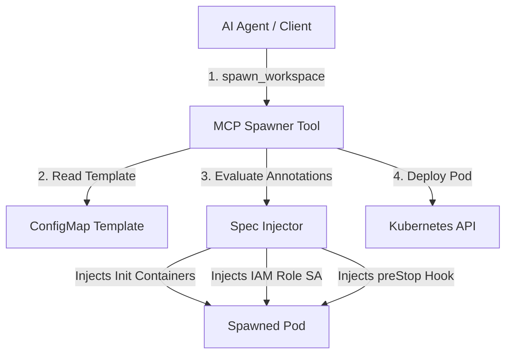
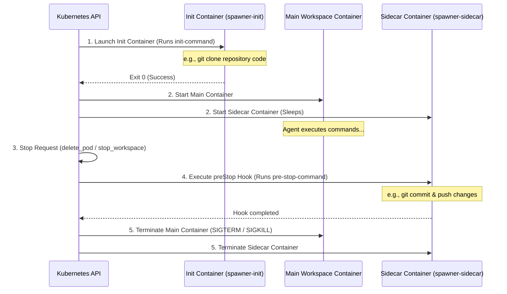

# Workspace Spawner & Annotations Guide

The Spawner subsystem in `@nogoo9/no-crd` is designed for agentic sandboxing. It allows AI agents and API clients to provision, list, and terminate isolated containerized workspaces (pods) on-demand using standard Kubernetes APIs without Custom Resource Definitions.

This guide covers the spawner architecture, tool configurations, supported lifecycle annotations, and concrete deployment examples.

---

## 🏗️ Spawner Architecture

When an agent invokes `spawn_workspace`, the spawner processes the request, loads the referenced template ConfigMap, applies annotations, and injects runtime configurations before committing the pod to the Kubernetes API.



---

## 🏷️ Supported Annotations

Pod templates and inline specifications can declare special annotations that direct the Spawner to inject extra features, security configurations, and lifecycle hooks into the spawned workspace pod:

| Annotation Key | Type | Description |
|---|---|---|
| `nogoo9/required-context` | `string` (comma-separated) | Validates that target environment variables are provided in the tool call's `context` parameter (e.g. `GITHUB_TOKEN,DATABASE_URL`). |
| `nogoo9/iam-role-arn` | `string` | Instructs the spawner to provision a dedicated `ServiceAccount` bound to this AWS/GCP IAM Role ARN and assign it to the pod. |
| `nogoo9/init-image` | `string` | The container image to use for a spawned init-container (e.g. `alpine`, `git`). |
| `nogoo9/init-command` | `string` | The shell command to run in the init-container. It automatically shares the main container's volume mounts. |
| `nogoo9/pre-stop-command` | `string` | A shell command to execute in the workspace before termination (e.g., to commit state or push logs). |
| `nogoo9/pre-stop-sidecar-image` | `string` | If specified, runs the `pre-stop-command` inside a dedicated sidecar container instead of the main workspace container. |
| `nogoo9/default-grace-period` | `number` | The termination grace period in seconds to assign to the pod (defaults to `60` if a pre-stop command is present). |

---

## 🔄 Pod Injection Lifecycle

The diagram below shows the order in which init-containers, main containers, and pre-stop lifecycle hooks execute within a spawned workspace:



---

## 📖 Practical Example

Here is a complete end-to-end walk-through of declaring a template, spawning a workspace using the MCP tool, and reviewing the generated Kubernetes manifest.

### 1. Template ConfigMap (`dev-environment-template.yaml`)

This ConfigMap defines a basic node workspace template and sets annotations to mandate environment keys, use an Alpine container to clone a repository, and hook up a `git push` cleanup command:

```yaml
apiVersion: v1
kind: ConfigMap
metadata:
  name: dev-node-template
  namespace: nogoo9
  labels:
    nogoo9/pod-template: "true"
  annotations:
    nogoo9/required-context: "GITHUB_TOKEN,GIT_REPO_URL"
    nogoo9/init-image: "alpine/git:latest"
    nogoo9/init-command: "git clone $GIT_REPO_URL /workspace"
    nogoo9/pre-stop-command: "cd /workspace && git add -A && git commit -m 'save state' && git push"
    nogoo9/default-grace-period: "120"
data:
  spec: |
    {
      "containers": [
        {
          "name": "workspace",
          "image": "node:22-alpine",
          "command": ["sleep", "infinity"],
          "volumeMounts": [
            {
              "name": "code-volume",
              "mountPath": "/workspace"
            }
          ]
        }
      ],
      "volumes": [
        {
          "name": "code-volume",
          "emptyDir": {}
        }
      ]
    }
```

### 2. MCP Tool Call (`spawn_workspace`)

The AI agent invokes `spawn_workspace` using the template reference and satisfies the context requirements:

```json
{
  "id": "agent-session-45",
  "templateRef": "dev-node-template",
  "namespace": "nogoo9",
  "context": {
    "GITHUB_TOKEN": "ghp_1234567890abcdef",
    "GIT_REPO_URL": "https://github.com/myorg/workspace-project.git"
  }
}
```

### 3. Generated Kubernetes Pod Manifest (Result)

The Spawner processes the parameters and submits the following Pod to the Kubernetes API:

```yaml
apiVersion: v1
kind: Pod
metadata:
  name: ws-anonymous-agent-session-45
  namespace: nogoo9
  labels:
    nogoo9/type: "workspace"
    nogoo9/workspace-id: "agent-session-45"
    nogoo9/managed-by: "nogoo9-spawner"
    nogoo9/user-sub: "anonymous"
spec:
  terminationGracePeriodSeconds: 120
  initContainers:
    - name: spawner-init
      image: alpine/git:latest
      command: ["/bin/sh", "-c", "git clone $GIT_REPO_URL /workspace"]
      volumeMounts:
        - name: code-volume
          mountPath: "/workspace"
      env:
        - name: GITHUB_TOKEN
          value: "ghp_1234567890abcdef"
        - name: GIT_REPO_URL
          value: "https://github.com/myorg/workspace-project.git"
  containers:
    - name: workspace
      image: node:22-alpine
      command: ["sleep", "infinity"]
      volumeMounts:
        - name: code-volume
          mountPath: "/workspace"
      env:
        - name: GITHUB_TOKEN
          value: "ghp_1234567890abcdef"
        - name: GIT_REPO_URL
          value: "https://github.com/myorg/workspace-project.git"
      lifecycle:
        preStop:
          exec:
            command: ["/bin/sh", "-c", "cd /workspace && git add -A && git commit -m 'save state' && git push"]
  volumes:
    - name: code-volume
      emptyDir: {}
```
