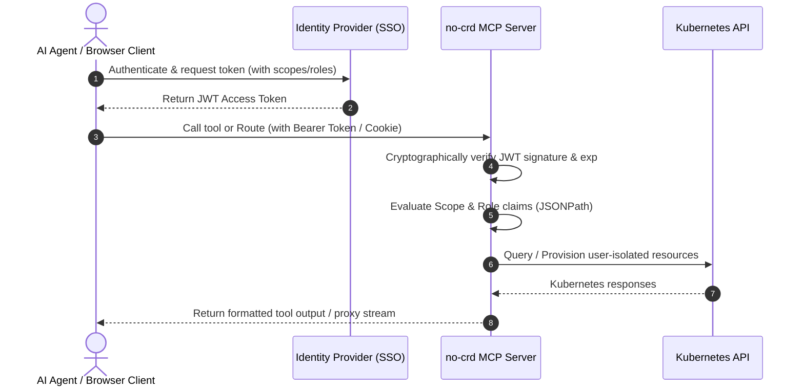

# SSO & Identity Provider Integration Guide

This guide details how to integrate the `@nogoo9/no-crd` MCP server with generic OpenID Connect (OIDC) / OAuth 2.0 Identity Providers (IdPs) and provides specific integration recipes for popular platforms including **Okta**, **Auth0**, **Microsoft Entra ID (Azure AD)**, **Keycloak**, and **PingIdentity (PingOne / PingFederate)**.

---

## 🌐 Generic OIDC Integration Architecture

At a high level, the MCP server acts as an **OAuth 2.0 Resource Server**. It consumes JSON Web Tokens (JWTs) issued by your Identity Provider to authenticate requests and enforce authorization parameters.



### Core Configuration Mapping

To integrate with any compliant OIDC provider, configure the following environment variables:

| Environment Variable | Description |
| :--- | :--- |
| `AUTH_ENABLED="true"` | Enables JWT token authentication and owner checks. |
| `AUTH_ISSUER` | Expected token issuer matching the `iss` claim in JWTs (e.g., `https://auth.company.com/oauth2/default`). |
| `JWKS_URI` | JWK Set containing public keys for signature validation. Supports HTTP/HTTPS URLs or local file paths (e.g., `/etc/mcp/jwks.json`, `file:///etc/mcp/jwks.json`). Keys are cached in memory for 5 minutes (`JWKS_CACHE_TTL = 300000ms`) for efficiency. |
| `JWT_AUDIENCE` | Expected audience claim value matching the `aud` claim (defaults dynamically to the server's protocol + host + subpath). |

### Granular Authorization Claims (Scope + Role)

The server evaluates access control claims by mapping token contents using **JSONPath** selectors:

| Variable | Selector Type | Fallback Check | Description |
| :--- | :--- | :--- | :--- |
| `AUTH_SUB_JSONPATH` | Subject | `$.sub` | Extract user ID to stamp and isolate pod namespace/labels. |
| `AUTH_ROLES_JSONPATH` | Roles | `$.realm_access.roles`, `$.roles` | JSONPath to the user's role string or array. |
| `AUTH_SCOPE_JSONPATH` | Scopes | `$.scope`, `$.scp` | JSONPath to the client's OAuth scopes string or array. |

To enforce restrictions, set the following parameters:
- `AUTH_REQUIRED_READ_SCOPE` / `AUTH_REQUIRED_WRITE_SCOPE`: Scopes required for read/write tools.
- `AUTH_REQUIRED_READ_ROLE` / `AUTH_REQUIRED_WRITE_ROLE`: Roles required for read/write tools.

---

## 🟢 Okta Integration

Okta organizes scopes and roles (groups) in customizable claims. 

### 1. Okta Admin Console Configuration
1. Register a **Single Page Application (SPA)** or **Web Application** client in Okta.
2. Ensure **Authorization Code Flow with PKCE** is enabled.
3. Configure the Authorization Server:
   - Go to **Security > API > Authorization Servers**.
   - Create or select a server (e.g. `default`).
   - In **Claims**, add a new Claim:
     - Name: `roles` or `groups`
     - Include in token type: `Access Token`
     - Value type: `Groups`
     - Filter: `Matches regex: .*` (or target specific user groups).

### 2. Environment Variables Configuration
```bash
AUTH_ENABLED="true"
AUTH_ISSUER="https://{yourOktaDomain}/oauth2/default"
JWKS_URI="https://{yourOktaDomain}/oauth2/default/v1/keys"
JWT_AUDIENCE="api://default"

# Subject Extraction
AUTH_SUB_JSONPATH="$.sub"

# Scope checks (Okta scopes space-separated)
AUTH_REQUIRED_READ_SCOPE="mcp:read"
AUTH_REQUIRED_WRITE_SCOPE="mcp:write"
AUTH_SCOPE_JSONPATH="$.scp" # Okta often populates scp array

# Group/Role checks
AUTH_ROLES_JSONPATH="$.groups" # Okta groups list mapped to groups claim
AUTH_REQUIRED_READ_ROLE="Everyone"
AUTH_REQUIRED_WRITE_ROLE="MCP-Developers"
AUTH_ADMIN_ROLE="MCP-Admins"
AUTH_ADMIN_JSONPATH="$.groups"
```

---

## 🟠 Auth0 Integration

Auth0 maps custom claims (like roles or permissions) using custom rules/actions because non-standard properties must be namespace-prefixed.

### 1. Auth0 Dashboard Configuration
1. Register an **API** representing the MCP server:
   - Set Identifier/Audience (e.g., `https://mcp.company.com`).
   - Define scopes (e.g., `mcp:read`, `mcp:write`).
2. Register a **SPA** client and authorize it to access the API.
3. Add User Roles to Token (via Auth0 Action):
   - Go to **Actions > Flows > Login > Add Action**.
   - Add roles to the access token custom claims namespace:
     ```javascript
     exports.onExecutePostLogin = async (event, api) => {
       const namespace = 'https://mcp.company.com';
       if (event.authorization) {
         api.accessToken.setCustomClaim(`${namespace}/roles`, event.authorization.roles);
       }
     };
     ```

### 2. Environment Variables Configuration
```bash
AUTH_ENABLED="true"
AUTH_ISSUER="https://{yourDomain}.auth0.com/"
JWKS_URI="https://{yourDomain}.auth0.com/.well-known/jwks.json"
JWT_AUDIENCE="https://mcp.company.com"

# Subject Extraction
AUTH_SUB_JSONPATH="$.sub"

# Scope checks (Auth0 permissions maps to scope parameter array/string)
AUTH_REQUIRED_READ_SCOPE="mcp:read"
AUTH_REQUIRED_WRITE_SCOPE="mcp:write"
AUTH_SCOPE_JSONPATH="$.scope"

# Role checks (resolving namespace-prefixed Auth0 roles claim)
AUTH_ROLES_JSONPATH="$.['https://mcp.company.com/roles']"
AUTH_REQUIRED_READ_ROLE="mcp-viewer"
AUTH_REQUIRED_WRITE_ROLE="mcp-creator"
AUTH_ADMIN_ROLE="mcp-admin"
AUTH_ADMIN_JSONPATH="$.['https://mcp.company.com/roles']"
```

---

## 🔵 Microsoft Entra ID (Azure AD)

Microsoft Entra ID populates user groups under a `groups` claim (containing Active Directory Object IDs) or uses App Roles.

### 1. Azure Portal Configuration
1. Navigate to **Microsoft Entra ID > App registrations > New registration**.
2. Set supported account types and configure Redirect URIs.
3. Expose an API:
   - Define **Application ID URI** (e.g. `api://{clientId}`).
   - Define scopes: `mcp.read` and `mcp.write`.
4. Configure User Groups:
   - In **Token configuration > Add groups claim**, select **Security groups**.
   - Note: This includes the Active Directory Group UUIDs in the `groups` claim.
5. Alternatively, define **App roles** in the App registration to map specific roles (e.g., `MCP.Reader`, `MCP.Writer`).

### 2. Environment Variables Configuration
```bash
AUTH_ENABLED="true"
AUTH_ISSUER="https://login.microsoftonline.com/{tenantId}/v2.0"
JWKS_URI="https://login.microsoftonline.com/{tenantId}/discovery/v2.0/keys"
JWT_AUDIENCE="api://{clientId}"

# Subject Extraction (using Microsoft preferred_username or oid)
AUTH_SUB_JSONPATH="$.preferred_username"

# Scope Checks
AUTH_REQUIRED_READ_SCOPE="mcp.read"
AUTH_REQUIRED_WRITE_SCOPE="mcp.write"
AUTH_SCOPE_JSONPATH="$.scp"

# Option A: Active Directory Group UUID checks
AUTH_ROLES_JSONPATH="$.groups"
AUTH_REQUIRED_READ_ROLE="9b736b6f-78db-43fa-b054-0820bb6b7e77" # Read group UUID
AUTH_REQUIRED_WRITE_ROLE="ad14b8f0-1c39-444f-bc61-a8dcbb224e77" # Write group UUID

# Option B: App Roles checks
# AUTH_ROLES_JSONPATH="$.roles"
# AUTH_REQUIRED_READ_ROLE="MCP.Reader"
# AUTH_REQUIRED_WRITE_ROLE="MCP.Writer"
# AUTH_ADMIN_ROLE="MCP.Admin"
# AUTH_ADMIN_JSONPATH="$.roles"
```

---

## 🔴 Keycloak Integration

Keycloak is an open-source IAM that supports flexible realm role mappings and token scope customizations out-of-the-box. (See the [Keycloak Integration Guide](./keycloak-integration.md) for details).

### 1. Keycloak Admin Console Configuration
1. Go to **Client scopes** and create `mcp:read` and `mcp:write` OIDC client scopes.
2. In **Clients > nogoo9-mcp > Client scopes**, add these scopes as **Default** or **Optional** client scopes.
3. Configure User Roles under **Realm roles** (e.g., `nogoo9-admin` or `mcp-developer`). Assign these roles to users.
4. Keycloak automatically outputs user roles under the `realm_access.roles` token payload.

### 2. Environment Variables Configuration
```bash
AUTH_ENABLED="true"
AUTH_ISSUER="http://{keycloak-host}:8080/auth/realms/nogoo9"
JWKS_URI="http://{keycloak-host}:8080/auth/realms/nogoo9/protocol/openid-connect/certs"
JWT_AUDIENCE="http://{mcp-host}:3000"

# Subject Extraction
AUTH_SUB_JSONPATH="$.sub"

# Scope Checks
AUTH_REQUIRED_READ_SCOPE="mcp:read"
AUTH_REQUIRED_WRITE_SCOPE="mcp:write"
AUTH_SCOPE_JSONPATH="$.scope"

# Role Checks
AUTH_ROLES_JSONPATH="$.realm_access.roles"
AUTH_REQUIRED_READ_ROLE="mcp-user"
AUTH_REQUIRED_WRITE_ROLE="mcp-developer"
AUTH_ADMIN_ROLE="nogoo9-admin"
AUTH_ADMIN_JSONPATH="$.realm_access.roles"
```

---

## 🟣 PingIdentity (PingOne / PingFederate) Integration

PingIdentity provides enterprise identity solutions via **PingOne** (cloud-based) and **PingFederate** (on-premise). Both support standard OIDC/OAuth 2.0, allowing you to map user group memberships to token claims.

### 1. PingIdentity Configuration

#### Option A: PingOne (Cloud)
1. Log in to the **PingOne Admin Console** and navigate to your environment.
2. Go to **Connections > Applications** and click **Add Application**.
3. Create a **Web App** or **Single Page Application (SPA)** using **Authorization Code Flow with PKCE**.
4. To map groups to token claims:
   - Go to **Attribute Mapping** for the newly created application.
   - Click **Add Attribute**.
   - Set the **Target Claim** to `groups` or `roles`.
   - Set the **Source Attribute** to `Member of Group Names` or map specific group memberships.
5. In **Resources**, ensure your application is authorized to request OIDC scopes (e.g., standard scopes or custom scopes like `mcp:read`, `mcp:write` if defined as custom resources).

#### Option B: PingFederate (On-Premise)
1. Open the **PingFederate Administration Console**.
2. Navigate to **Applications > OAuth Clients** and register a new client.
3. Configure the client to support the **Authorization Code** grant type.
4. Under **Access Token Management (ATM)**:
   - Create or select an ATM instance.
   - Extend the ATM's **Attribute Contract** to include a `groups` or `roles` claim.
5. In **Access Token Mapping**:
   - Create a mapping from your user source (e.g., Active Directory / LDAP) to the ATM.
   - Map the user groups attribute (e.g., `memberOf`) to the `groups` or `roles` claim. (You can optionally use OGNL expressions to extract CNs from full LDAP Distinguished Names).

### 2. Environment Variables Configuration

Configure the MCP server to parse the claims emitted by PingIdentity:

```bash
AUTH_ENABLED="true"

# --- Provider Specific Settings ---
# For PingOne:
AUTH_ISSUER="https://auth.pingone.com/{environmentId}/as"
JWKS_URI="https://auth.pingone.com/{environmentId}/as/jwks"

# For PingFederate:
# AUTH_ISSUER="https://{your-pingfederate-host}"
# JWKS_URI="https://{your-pingfederate-host}/pf/JWKS"

JWT_AUDIENCE="api://nogoo9-mcp"

# --- Claim Extraction ---
AUTH_SUB_JSONPATH="$.sub"

# Scope checks
AUTH_REQUIRED_READ_SCOPE="mcp:read"
AUTH_REQUIRED_WRITE_SCOPE="mcp:write"
AUTH_SCOPE_JSONPATH="$.scope"

# Role/Group checks
AUTH_ROLES_JSONPATH="$.groups" # Matches the target claim mapped in PingOne/PingFederate
AUTH_REQUIRED_READ_ROLE="MCP-Readers"
AUTH_REQUIRED_WRITE_ROLE="MCP-Writers"
AUTH_ADMIN_ROLE="MCP-Admins"
AUTH_ADMIN_JSONPATH="$.groups"
```
