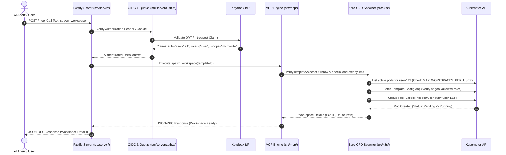

# Architecture Overview & System Boundaries

`nogoo9` is an agent-driven platform for on-demand pod orchestration in Kubernetes (k8s/k3s) **without Custom Resource Definitions (CRDs)** or cluster-level operators. It enables AI agents, CLI tools, and web dashboards to dynamically spawn, route traffic to, and manage ephemeral workspace pods.

---

## 🏛️ Architectural Principles

1. **Zero-CRD Philosophy**: Uses native Kubernetes primitives (`Pod`, `ConfigMap`, `Secret`, `PersistentVolumeClaim`) without registering custom resource definitions or requiring cluster-admin CRD permissions.
2. **Isomorphic Runtime Compatibility**: Cross-runtime support for **Bun**, **Deno**, and **Node.js** execution targets pinned via `.prototools` and `.moon/toolchain.yml`.
3. **Stateless / Leaderless Gateway**: Multiple gateway replicas run in parallel without stateful databases (Postgres/Redis), negotiating encryption secrets via Kubernetes Secrets.
4. **Strict Security Boundaries**: Identity-aware access control enforcing per-user isolation, RFC 9728 OIDC protected resource discovery, RBAC scope/role validation, non-admin concurrent workspace quotas (ADR-026), and template role/scope authorization annotations (ADR-027).
5. **Modular Component Architecture**: Decoupled frontend components (`src/ui/components/`), stateless proxy routing (`src/server/routes/proxy.ts`), and AsyncLocalStorage-backed MCP request context propagation (`src/server/request-context.ts`, ADR-025).

---

## 🔄 End-to-End Request Flow Sequence

---

## 📂 Source Code Map

| Subsystem | Primary Location | Key Responsibilities |
|---|---|---|
| **Server Gateway** | [`src/server/index.ts`](file:///home/eterna2/github/nogoo9-no-crd/src/server/index.ts) | HTTP/WebSocket bootstrap, rate limiting, CORS, SSE session cleanup |
| **Auth & Crypto** | [`src/server/auth.ts`](file:///home/eterna2/github/nogoo9-no-crd/src/server/auth.ts), [`src/k8s/auth.ts`](file:///home/eterna2/github/nogoo9-no-crd/src/k8s/auth.ts) | OIDC discovery, AES-256-GCM session cookies, singleflight refresh deduplication, template role/scope authorization |
| **Routing Proxy** | [`src/server/routes/proxy.ts`](file:///home/eterna2/github/nogoo9-no-crd/src/server/routes/proxy.ts) | Direct pod IP tunneling, header injection (`X-User-Sub`), WebSocket upgrade piping |
| **MCP Engine** | [`src/mcp/server.ts`](file:///home/eterna2/github/nogoo9-no-crd/src/mcp/server.ts) | Protocol initialization, tool registration, capabilities reporting, AsyncLocalStorage context |
| **Spawner Handlers**| [`src/mcp/spawner/handlers/index.ts`](file:///home/eterna2/github/nogoo9-no-crd/src/mcp/spawner/handlers/index.ts) | Workspace spawn, stop, upgrade, concurrency quota enforcement (`MAX_WORKSPACES_PER_USER`), and event streaming tool logic |
| **Kubernetes Client**| [`src/k8s/index.ts`](file:///home/eterna2/github/nogoo9-no-crd/src/k8s/index.ts) | Pod spec construction, annotation expansion, PVC binding, RBAC security |
| **Peer Discovery** | [`src/server/peer-discovery.ts`](file:///home/eterna2/github/nogoo9-no-crd/src/server/peer-discovery.ts) | Multi-replica secret negotiation via K8s secrets |
| **Frontend UI** | [`src/ui/`](file:///home/eterna2/github/nogoo9-no-crd/src/ui/), [`src/ui/components/`](file:///home/eterna2/github/nogoo9-no-crd/src/ui/components/) | React web dashboard, OIDC PKCE hooks, subcomponents (`WorkspaceCard`, `WorkspaceConsoleView`, `Modals`, `TweaksPanel`), MCP client bridge |
