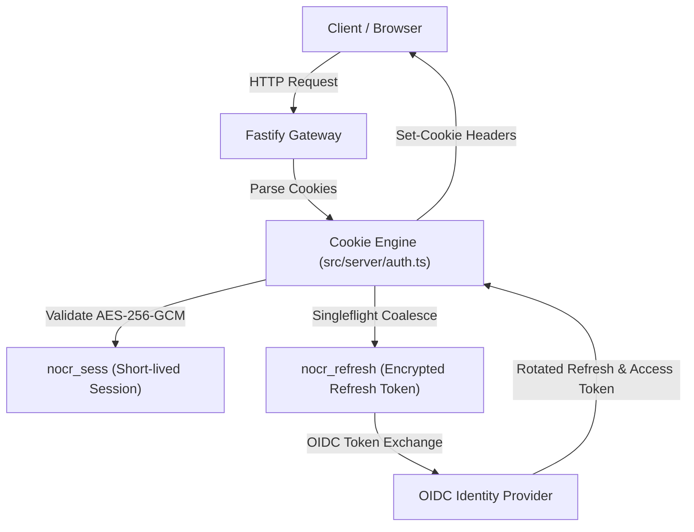

# Auth & Security Model

`nogoo9` implements identity-aware authorization, session cookie security, singleflight request deduplication, template access control annotations, and fine-grained Role-Based Access Control (RBAC) to ensure complete tenant isolation across multi-user environments.

---

## 🔒 Session & Cookie Security Architecture



---

## 🔑 Key Security Components

### 1. RFC 9728 Compliance
- Unauthenticated requests to protected endpoints return `HTTP 401 Unauthorized` with standard RFC 9728 challenge headers:
  ```http
  WWW-Authenticate: Bearer resource_metadata="http://localhost:8080/nocr/.well-known/oauth-protected-resource"
  Link: <http://localhost:8080/nocr/.well-known/oauth-protected-resource>; rel="oauth-protected-resource"
  ```

### 2. Cookie Cryptography (`nocr_sess` & `nocr_refresh`)
- `nocr_sess`: Encrypted payload containing user subject (`sub`), roles, issue time (`iat`), and expiration (`exp`).
- `nocr_refresh`: AES-256-GCM encrypted refresh token tied to the cluster session secret.

### 3. Singleflight Token Refresh Deduplication ([`src/server/auth-singleflight.ts`](file:///home/eterna2/github/nogoo9-no-crd/src/server/auth-singleflight.ts))
- Concurrent refresh requests using the same refresh token are coalesced into a single outbound IdP round-trip via `deduplicateRefreshCall`.
- Prevents race conditions and invalidation errors during OIDC Refresh Token Rotation (RTR).

### 4. Per-User RBAC Isolation
- Normal users can only see, query logs for, stop, or upgrade their own workspaces (`nogoo9/user-sub`).
- Users with `nogoo9:admin` or cluster admin roles can manage across all tenant boundaries.

### 5. Non-Admin Workspace Concurrency Quotas ([`src/config/auth.ts`](file:///home/eterna2/github/nogoo9-no-crd/src/config/auth.ts), ADR-026)
- Limits the number of concurrent active workspaces a non-admin user can own (`MAX_WORKSPACES_PER_USER`). Administrators bypass quotas.

### 6. Template Role & Scope Authorization Annotations ([`src/k8s/auth.ts`](file:///home/eterna2/github/nogoo9-no-crd/src/k8s/auth.ts), ADR-027)
- Restricts pod template workspace creation to callers possessing matching OIDC roles (`nogoo9/allowed-roles`) and scopes (`nogoo9/allowed-scopes`) using `verifyTemplateAccessOrThrow`.
- Unprivileged users attempting to spawn from restricted templates receive structured `403 Forbidden` error messages detailing missing roles or scopes.
