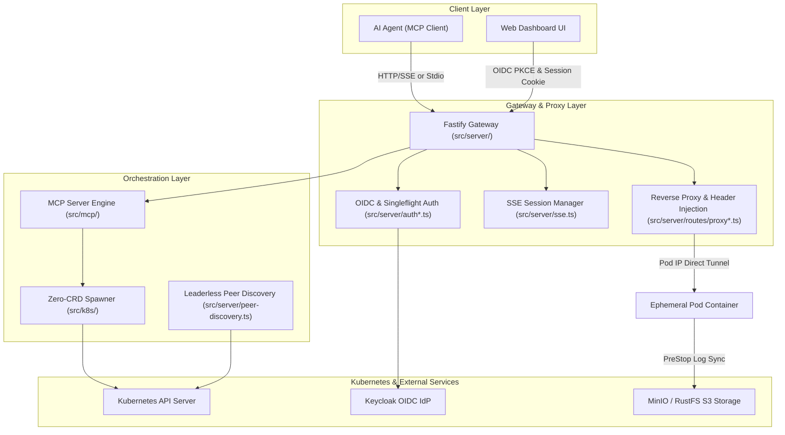

# Deep Wiki Knowledge Base

Welcome to the **nogoo9 Deep Wiki Knowledge Base**. This section provides deep architectural documentation, component interaction sequence diagrams, state machine specifications, security threat models, and subsystem designs for the `nogoo9` platform.

---

## 🗺️ System Architecture & Subsystems

---

## 📚 Deep Wiki Directory

| Section | Description | Key Topics |
|---|---|---|
| [**Architecture Overview**](./architecture-overview.md) | End-to-end component topology and system boundaries | Gateway design, zero-operator philosophy, request pathways |
| [**Zero-CRD Pod Lifecycle**](./zero-crd-pod-lifecycle.md) | Pod orchestration & upgrade state machines | Pod spec generation, annotations, PVC locking, 1-by-1 vs bulk upgrades |
| [**Auth & Security Model**](./auth-and-security-model.md) | OIDC authentication & cookie crypto | RFC 9728 metadata, AES-256-GCM cookies, singleflight refresh deduplication |
| [**Routing Proxy & Tunneling**](./routing-proxy-and-tunneling.md) | Dynamic reverse proxying & auth modes | Header rewriting (`X-User-Sub`), WS piping, `token-api` / `inject-headers` |
| [**Peer Discovery & HA**](./peer-discovery-and-ha.md) | Multi-replica secret negotiation | Leaderless startup, shared session keys, zero-database HA |
| [**MCP Tool Engine & Schemas**](./mcp-tool-engine-and-schemas.md) | MCP protocol implementation | Transport adapters, tool registration, spawner & pod handler contracts |
| [**UI & MCP Client Integration**](./ui-and-mcp-client-integration.md) | Frontend web dashboard & client bridge | React hooks (`useOidcAuth`, `useMcpClient`), OIDC PKCE flow, handshake rules |
