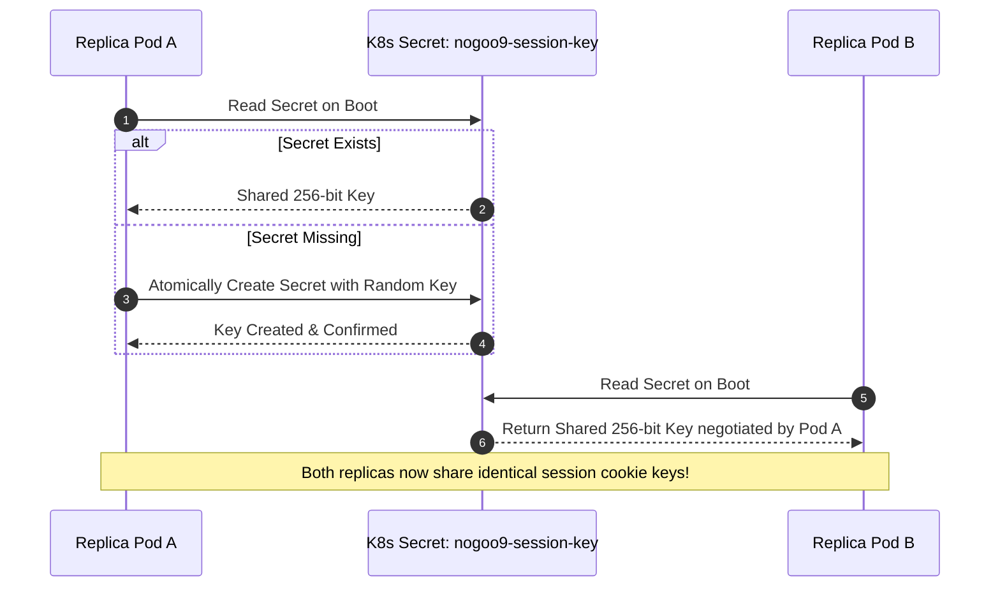

# Leaderless Peer Discovery & High Availability

`nogoo9` achieves High Availability (HA) and multi-replica scalability without stateful databases (Postgres, Redis, or Etcd) by employing a Kubernetes Secret-backed peer discovery mechanism ([`src/server/peer-discovery.ts`](file:///home/eterna2/github/nogoo9-no-crd/src/server/peer-discovery.ts)).

---

## 🤝 Peer Key Negotiation Protocol

---

## 🛡️ Guarantees

1. **Zero Database Dependency**: Eliminates external database infrastructure for session state management.
2. **Atomic Conflict Resolution**: Simultaneous replica boots resolve races cleanly through Kubernetes API atomic secret creation semantics (`409 Conflict` fallback to read).
3. **Seamless Stateless Scaling**: Any replica can decrypt session cookies (`nocr_sess`) and refresh tokens (`nocr_refresh`) issued by any other replica.
