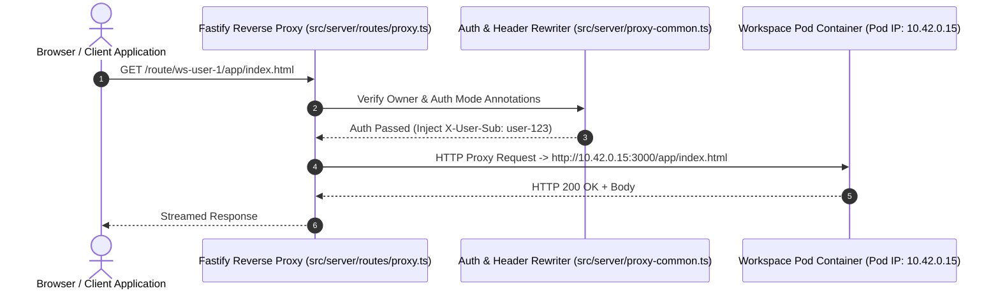

# Routing Proxy & Dynamic Tunneling

The `nogoo9` routing proxy ([`src/server/routes/proxy.ts`](file:///home/eterna2/github/nogoo9-no-crd/src/server/routes/proxy.ts)) provides dynamic, zero-config HTTP and WebSocket reverse-proxying directly to pod IP addresses.

---

## 🔀 Reverse Proxy & WebSocket Architecture

---

## 🏷️ Workspace Auth Mode Annotations

Workspaces support fine-grained routing behavior configured via template annotations:

| Mode Annotation | Parameter Value | Behavior Description |
|---|---|---|
| `inject-headers` | `true` / `false` | Injects `X-User-Sub`, `X-User-Roles`, and `X-Workspace-JWT` headers into upstream pod requests. |
| `redirect` | `true` / `false` | Unauthenticated browser requests are redirected to Keycloak OIDC login. |
| `token-api` | `true` / `false` | Enables path-scoped token endpoints (`/_auth/token`, `/_auth/authorize`, `/_auth/refresh`). |
| `no-auth` | `true` / `false` | Bypasses identity verification (open public preview mode). |

---

## 🌐 HTTP Fallback Transport Client (`src/ui/fallback.ts`)

When running the React Web Dashboard directly in a browser outside of an MCP Client host (e.g. Claude Desktop), the dashboard automatically falls back to sending tool requests over the HTTP transport (`/mcp` endpoint) using `initHttpFallback` and `callServerToolFallback`.

---

## 🔌 WebSocket Upgrade Piping

WebSocket traffic is intercepted at the HTTP server level in [`src/server/ws-proxy.ts`](file:///home/eterna2/github/nogoo9-no-crd/src/server/ws-proxy.ts) and piped directly to the target pod IP, preserving sub-protocols and session headers.
