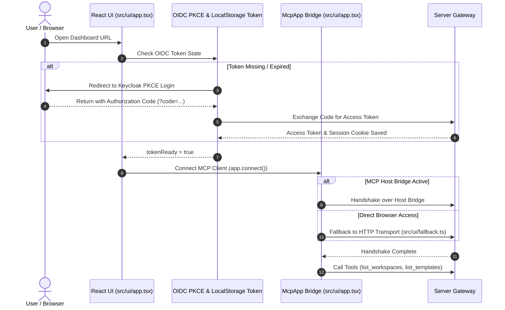

# UI & MCP Client Integration

The `nogoo9` web dashboard ([`src/ui/`](file:///home/eterna2/github/nogoo9-no-crd/src/ui/)) provides an interactive SPA for workspace management, template browsing, live log streaming, visual theme customization, and workspace access controls.

---

## 🤝 Client Authentication & Handshake Rules

Per [MCP Client Rules](file:///home/eterna2/github/nogoo9-no-crd/.agents/rules/mcp-client.md), clients strictly enforce OIDC authentication before completing the MCP handshake:

---

## 🧩 Modular Component Architecture (`src/ui/components/`)

The UI codebase is broken down into clean, single-responsibility subcomponents:

| Component / Utility File | Description & Key Responsibilities |
|---|---|
| [`src/ui/app.tsx`](file:///home/eterna2/github/nogoo9-no-crd/src/ui/app.tsx) | App root component (`Dashboard`), top navigation bar, authentication handlers, and tool orchestration. |
| [`src/ui/types.ts`](file:///home/eterna2/github/nogoo9-no-crd/src/ui/types.ts) | Shared TypeScript interfaces (`Workspace`, `Template`, `Capabilities`, `Toast`, modal props). |
| [`src/ui/icons.tsx`](file:///home/eterna2/github/nogoo9-no-crd/src/ui/icons.tsx) | Centralized SVG icon dictionary (`I.lock`, `I.plus`, `I.trash`, `I.spark`, `I.settings`, etc.). |
| [`src/ui/utils.ts`](file:///home/eterna2/github/nogoo9-no-crd/src/ui/utils.ts) | Helper utilities (`decodeJwt`, `checkTemplateAccess`, `formatRelativeTime`, `jsonToYaml`, `applyThemeStyles`). |
| [`src/ui/fallback.ts`](file:///home/eterna2/github/nogoo9-no-crd/src/ui/fallback.ts) | HTTP fallback transport client (`initHttpFallback`, `callServerToolFallback`). |
| [`src/ui/components/WorkspaceCard.tsx`](file:///home/eterna2/github/nogoo9-no-crd/src/ui/components/WorkspaceCard.tsx) | Workspace card component (stats interval polling, status indicators, outdated badges, launching). |
| [`src/ui/components/WorkspaceConsoleView.tsx`](file:///home/eterna2/github/nogoo9-no-crd/src/ui/components/WorkspaceConsoleView.tsx) | Detailed workspace console (interactive shell, web preview, logs stdout, Pod YAML manifest, APIs table). |
| [`src/ui/components/Modals.tsx`](file:///home/eterna2/github/nogoo9-no-crd/src/ui/components/Modals.tsx) | Grouped modal dialogs (`TokenSettingsModal`, `SpawnWorkspaceModal`, `CreateTemplateModal`, `TemplateSpecModal`, `LogsViewModal`, `EventsViewModal`, `SystemInfoModal`, `WorkspacePreviewModal`). |
| [`src/ui/components/TweaksPanel.tsx`](file:///home/eterna2/github/nogoo9-no-crd/src/ui/components/TweaksPanel.tsx) | Visual customizer panel (`TweaksWidgetPanel`) and `MeowEasterEgg`. |

---

## 🔒 Template Authorization & Access Indicators

The UI uses `checkTemplateAccess` in [`src/ui/utils.ts`](file:///home/eterna2/github/nogoo9-no-crd/src/ui/utils.ts) to evaluate the user's JWT claims against template restrictions:
- Restricted templates display lock icons, role/scope badges (`role:*`, `scope:*`), grayed-out cards, and disabled "Restricted" buttons with tooltip explanations.
