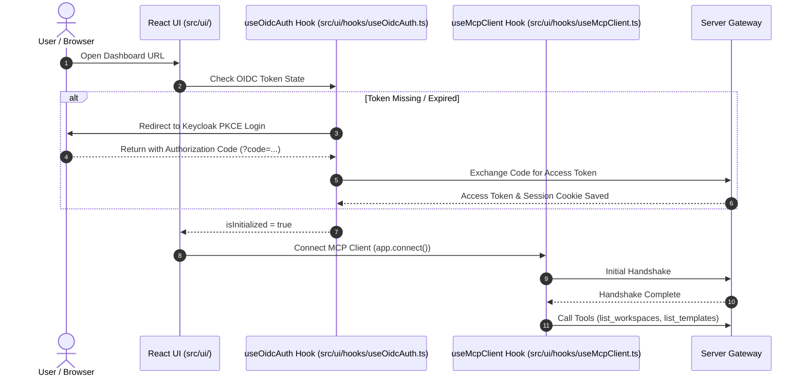

# UI & MCP Client Integration

The `nogoo9` web dashboard ([`src/ui/`](file:///home/eterna2/github/nogoo9-no-crd/src/ui/)) provides an interactive SPA for workspace management, template browsing, live log streaming, and theme customization.

---

## 🤝 Client Authentication & Handshake Rules

Per [MCP Client Rules](file:///home/eterna2/github/nogoo9-no-crd/.agents/rules/mcp-client.md), clients strictly enforce OIDC authentication before completing the MCP handshake:

---

## 🧩 Modular React Hooks

- [`src/ui/hooks/useOidcAuth.ts`](file:///home/eterna2/github/nogoo9-no-crd/src/ui/hooks/useOidcAuth.ts): Manages Keycloak OIDC PKCE login flow, token storage, token auto-refresh, and identity state.
- [`src/ui/hooks/useMcpClient.ts`](file:///home/eterna2/github/nogoo9-no-crd/src/ui/hooks/useMcpClient.ts): Manages the web standard HTTP transport connection to `/mcp`, exposing ready state and tool invocation wrappers.
