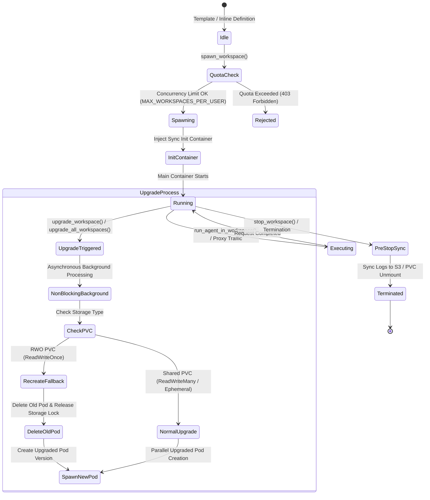

# Zero-CRD Pod Lifecycle & Recreate Upgrade State Machine

This article documents how `nogoo9` manages pod creation, container overrides, storage binding, annotation processing, shutdown hooks, concurrency quotas, and recreate-style zero-downtime workspace upgrades without requiring Kubernetes CRDs.

---

## 🔁 Workspace Lifecycle State Machine

---

## 🔒 Quotas & Concurrency Limits (ADR-026)

Before creating a pod, `spawn_workspace` evaluates user limits in [`src/mcp/spawner/handlers/index.ts`](file:///home/eterna2/github/nogoo9-no-crd/src/mcp/spawner/handlers/index.ts):

1. **Configurable Limit**: Set via `--max-workspaces-per-user` CLI argument or `MAX_WORKSPACES_PER_USER` environment variable (default: unlimited `0`).
2. **Non-Admin Scope**: Quota enforcement strictly targets non-admin callers. Admin users (`isAdmin: true`) bypass concurrency caps to allow administrative operations.
3. **Active Pod Counting**: Counts running and pending pods matching `nogoo9/user-sub=<owner>` across the current namespace.

---

## 🛠️ Pod Spec & Annotation Expansion

When `spawn_workspace` is invoked, `nogoo9` constructs a standard Kubernetes `Pod` object via [`src/k8s/spawner.ts`](file:///home/eterna2/github/nogoo9-no-crd/src/k8s/spawner.ts) and [`src/k8s/annotations.ts`](file:///home/eterna2/github/nogoo9-no-crd/src/k8s/annotations.ts):

1. **Labels & Identity**:
   - `nogoo9/type`: `workspace`
   - `nogoo9/workspace-id`: `<workspaceId>`
   - `nogoo9/user-sub`: `<ownerSubjectId>`
   - `nogoo9/template-version`: `<version>`

2. **Annotation Expansion Helpers**:
   - `validateRequiredContext`: Ensures required runtime context keys are provided.
   - `injectInitContainer`: Pre-populates files/scripts from S3 or ConfigMaps into workspace volumes before container startup.
   - `injectPreStopHook`: Attaches lifecycle preStop termination hooks to execute log/state synchronization scripts before pod deletion.

---

## 🚀 Non-Blocking Recreate-Style Workspace Upgrades (ADR-024)

Workspace upgrades support both 1-by-1 user upgrades and bulk admin upgrades (`upgrade_all_workspaces`):

1. **Owner Preservation**: The original `nogoo9/user-sub` label is strictly preserved across template version upgrades.
2. **Non-Blocking Background Tasks**: Long-running image pull and pod recreation steps run asynchronously without timing out HTTP/MCP tool calls.
3. **RWO PVC Storage Safety**: For pods with ReadWriteOnce (RWO) persistent volume claims, `nogoo9` safely deletes the old pod first to release volume locks before spawning the upgraded pod instance.
4. **Event Streaming**: Upgrade progress and any failure state (`nogoo9/last-upgrade-error`) are broadcast live via `get_workspace_events`.
