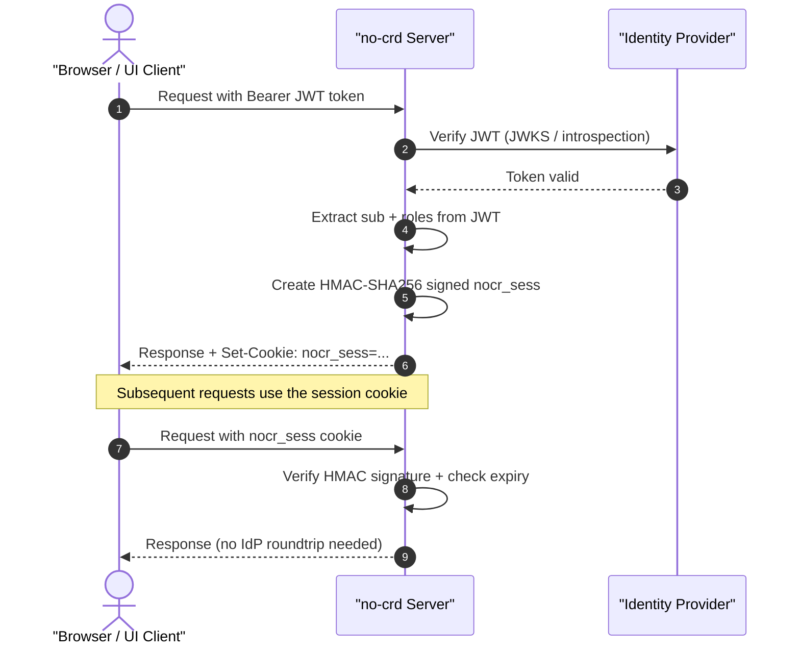

# Workspace Application Integration & Session Management

This guide explains how applications running inside workspace pods (e.g., custom development environments, code editors, internal dashboards, or custom single-page applications) authenticate users, how the gateway manages stateless sessions via cookies, and how to retrieve OIDC credentials.

> [!IMPORTANT]
> **Experimental Feature**: Workspace application routing and authorization are available from **v0.2.0** and are currently marked as experimental.

By implementing the **Backend-for-Frontend (BFF) pattern**, the `@nogoo9/no-crd` gateway handles token verification, cookie management, session key sharing, and OIDC token refresh server-side. This keeps workspace containers safe from credential theft and simplifies the codebase of applications running inside them.

---

## 🗺️ Architecture Overview & Cookie Design

The following diagram illustrates how the gateway orchestrates authentication between the user's browser, the identity provider (OIDC/Keycloak), and the application running inside the workspace pod:

<!-- 
prompt: A sleek, modern software architecture diagram explaining Workspace App Authorization in a Kubernetes cluster. It illustrates: 1. User browser making a request to the gateway, 2. The gateway, labeled as the 'no-crd Backend Service / Gateway', acting as a Backend-for-Frontend (BFF) proxy and verifying cookies (nocr_sess, nocr_token, nocr_refresh), 3. 'no-crd Backend Service / Gateway' doing silent server-side token refresh with Keycloak/OIDC provider, 4. 'no-crd Backend Service / Gateway' injecting headers (X-User-Sub, Authorization) to the workspace container, 5. Frontend Single Page Apps (SPA) fetching token from path-scoped /_auth/token API. Design with dark mode aesthetics, clean gradients, sans-serif typography, and clear boxes.
-->


### The Security Guard Analogy (For Non-Technical Readers)
Imagine a secure apartment building. Instead of giving every guest a master key card that opens all doors (which they could lose or have stolen), a security guard sits at the entrance:
1. When a guest arrives, the guard checks their credentials (the session cookie).
2. For backend service staff inside the building (our backend apps), the guard walks them to their designated room and unlocks the door, passing them the required tools (header injection).
3. For visitors who need to fetch local items (frontend SPAs), the guard provides a temporary, room-restricted card (the path-scoped OIDC token).
4. If a key card expires, the guard silently issues a new one using the building's registration book (refresh token) without forcing the guest to walk all the way back to the front desk.

---

### Cookie Types

The gateway uses three distinct cookies with different purposes, scopes, and encryption mechanisms:

| Cookie | Purpose | Scope | TTL | Contents |
|--------|---------|-------|-----|----------|
| `nocr_sess` | Stateless session — avoids re-verifying JWT on every request | `Path=/` (root) | Configurable via `PROXY_SESSION_TTL` (default: 1800s / 30 min, sliding window) | HMAC-signed payload: `sub`, `roles`, `iat`, `exp` |
| `nocr_token` | Workspace proxy auth — allows sub-resources (CSS, JS, images) to load inside routed workspaces | `Path=/route/{workspaceId}/` | 24 hours (fixed) | Raw JWT token value |
| `nocr_refresh` | Encrypted refresh token — used for silent, server-side OIDC token rotation without frontend JS exposure | `Path=/` (root) | 7 days / 604800s (fixed) | AES-256-GCM encrypted refresh token value |

All three cookies are set with `SameSite=Lax` and `HttpOnly` flags to protect against XSS and CSRF token exfiltration.

---

## 🔑 Session & Security Mechanics

### How `nocr_sess` Works (Stateless Session Cookie) *(Available from v0.4.0)*

When a user presents a valid JWT token, the server mints a lightweight `nocr_sess` cookie containing only the essential claims needed for authorization. Subsequent requests can authenticate via this cookie without requiring the full JWT verification flow (JWKS fetch, signature check, or introspection call).



The `nocr_sess` value is a two-part string: `{base64url_payload}.{hmac_signature}`

The payload contains:
```json
{
  "sub": "writeuser",
  "roles": ["mcp-writer", "nogoo9-admin"],
  "iat": 1748530000,
  "exp": 1748531800
}
```
The cookie is signed with **HMAC-SHA256** using a session key resolved via a priority cascade. Each time a valid JWT is presented, a fresh `nocr_sess` is minted with a new `exp` timestamp, creating a sliding window TTL.

---

### How `nocr_token` Works (Workspace Proxy Cookie) *(Available from v0.3.0)*

When a user accesses a routed workspace (e.g., `/route/my-workspace/`), the server sets a `nocr_token` cookie containing the raw JWT token, scoped to that workspace's path.

This solves a practical problem: workspace UIs (e.g., Open WebUI, VS Code, KasmVNC) load sub-resources (CSS, JS, images, WebSocket connections) via relative URLs. These relative requests don't carry the `Authorization` header or `?token=` query parameter, so they would fail with `401 Unauthorized` without the cookie.

```mermaid
sequenceDiagram
    autonumber
    actor Browser
    participant Proxy as "Routing Proxy"

    Browser->>Proxy: GET /route/ws-1/ (with Bearer token)
    Proxy-->>Browser: HTML page + Set-Cookie: nocr_token=jwt; Path=/route/ws-1/
    Browser->>Proxy: GET /route/ws-1/style.css (cookie sent automatically)
    Proxy->>Proxy: Extract token from nocr_token cookie
    Proxy-->>Browser: CSS file
```

The cookie `Path` is scoped strictly to `/route/{workspaceId}/`, so it is only sent for requests within that workspace's route prefix and does not leak to other workspaces or the main dashboard.

---

### Token Extraction Priority Chain

When processing an incoming request, the server extracts the authentication credentials in the following priority order:

```
1. Authorization: Bearer <token>  header     (highest priority)
2. ?token=<token>                 query param
3. nocr_token                     cookie       (scoped per-workspace)
4. nocr_sess                      session cookie (lowest — root-scoped)
```

The first successfully extracted token is used. If a JWT is found (steps 1–3), it undergoes full verification. If only a `nocr_sess` session cookie is found (step 4), the server validates the HMAC signature and expiry without contacting the IdP.

---

### Session Key Resolution *(Available from v0.4.0)*

The HMAC key used to sign `nocr_sess` and encrypt `nocr_refresh` cookies is resolved via a **5-step priority cascade** at server startup:

| Priority | Source | When to use |
|----------|--------|-------------|
| 1 | `PROXY_SESSION_SECRET` env var | Production — set explicitly for deterministic key |
| 2 | `JWT_SECRET` env var | Reuse the HMAC-SHA256 JWT signing key if available |
| 3 | Kubernetes Secret (`nogoo9-session-key`) | Multi-replica — shared secret stored in-cluster |
| 4 | Peer discovery (`/internal/session-key`) | Multi-replica — fetch key from a running sibling pod |
| 5 | Random in-memory key | Fallback — works for single-replica dev, but sessions don't survive restarts |

In deployments with multiple replicas, all pods **must** share the same session key. Otherwise, a session cookie signed by pod A will be rejected by pod B. For details on peer discovery, see [ADR-003](/decisions/ADR-003-peer-discovery-session-key).

---

### Cookie Lifecycle & Logout Flow

#### Setting Cookies
*   **`nocr_sess`**: Minted at `Path=/` on successful JWT verification via the global `preHandler` hook.
*   **`nocr_refresh`**: Minted at `Path=/` on OIDC auth code exchange.
*   **`nocr_token`**: Set at `Path=/route/{workspaceId}/` on response proxying when a valid token is present.

#### Clearing Cookies (Logout)
The UI calls `POST /logout` which triggers the server to clear all cookies:
1.  **Per-workspace `nocr_token`**: The server queries Kubernetes for all workspace pods owned by the user, then sends a `Set-Cookie` with `Max-Age=0` for each workspace path.
2.  **Root `nocr_token`**: Cleared at `Path=/`.
3.  **Session `nocr_sess`**: Cleared at `Path=/`.
4.  **Refresh `nocr_refresh`**: Cleared at `Path=/`.

```mermaid
sequenceDiagram
    autonumber
    actor Browser
    participant Server as "no-crd Server"
    participant K8s as "Kubernetes API"

    Browser->>Server: POST /logout (with Bearer token)
    Server->>K8s: List pods for user (label: nogoo9/user-sub)
    K8s-->>Server: [ws-1, ws-2, ws-3]
    Server-->>Browser: Set-Cookie: nocr_token=; Path=/route/ws-1/; Max-Age=0
    Server-->>Browser: Set-Cookie: nocr_token=; Path=/route/ws-2/; Max-Age=0
    Server-->>Browser: Set-Cookie: nocr_token=; Path=/route/ws-3/; Max-Age=0
    Server-->>Browser: Set-Cookie: nocr_token=; Path=/; Max-Age=0
    Server-->>Browser: Set-Cookie: nocr_sess=; Path=/; Max-Age=0
    Server-->>Browser: Set-Cookie: nocr_refresh=; Path=/; Max-Age=0
```

---

## ⚙️ Enabling Workspace Authentication

Authentication delivery is strictly **opt-in** on a per-workspace basis to respect the *Principle of Least Privilege*. Workspaces must explicitly declare their authentication requirements in their pod templates using the `nogoo9/workspace-auth-mode` annotation:

```yaml
apiVersion: v1
kind: Pod
metadata:
  name: workspace-user-123
  annotations:
    # Comma-separated list of active auth delivery modes
    nogoo9/workspace-auth-mode: "inject-headers,token-api"
spec:
  containers:
    - name: app
      image: node:22-alpine
```

### Supported Modes:
*   **`inject-headers`**: Forward-scoping. Automatically injects verified user identity context and raw bearer tokens as headers on all proxied HTTP and WebSocket requests.
*   **`token-api`**: Pull-scoping. Exposes a local, path-scoped API (`_auth/token`, `_auth/authorize`, and `_auth/refresh`) for browser-based Single-Page Apps (SPAs).

---

## 🖥️ Integration Walkthrough: Backend Applications (`inject-headers`)

When `inject-headers` is enabled, the gateway automatically intercepts and verifies the user's session. It then forwards the upstream HTTP/WebSocket request to the workspace container with the following headers:

| Header | Description | Example Value |
|--------|-------------|---------------|
| `Authorization` | Standard OAuth 2.0 Bearer access token | `Bearer eyJhbGciOiJSUzI1NiIsInR5cCI6...` |
| `X-Workspace-Jwt` | The raw JWT token value (same as above) | `eyJhbGciOiJSUzI1NiIsInR5cCI6...` |
| `X-User-Sub` | The user's unique OIDC subject identifier | `f81d4fae-7dec-11d0-a765-00a0c91e6bf6` |
| `X-User-Roles` | Comma-separated list of user roles | `developer,admin` |

Because headers are injected transparently, your workspace backend does not need OIDC client libraries, client secrets, or token endpoints. It simply reads standard headers:

::: code-group
```typescript [Node.js Express]
import express from 'express';
const app = express();

app.get('/api/data', (req, res) => {
  // Read identity context injected by the gateway
  const userSub = req.headers['x-user-sub'];
  const userRoles = req.headers['x-user-roles'];
  const rawToken = req.headers['x-workspace-jwt']; // Or req.headers['authorization']

  if (!userSub) {
    return res.status(401).json({ error: 'Unauthenticated by Gateway' });
  }

  // Use rawToken for downstream API fetches
  res.json({
    message: `Hello user ${userSub}`,
    roles: String(userRoles).split(','),
  });
});

app.listen(3000);
```

```python [Python FastAPI]
from fastapi import FastAPI, Header, HTTPException
from typing import Optional

app = FastAPI()

@app.get("/api/data")
def get_data(
    x_user_sub: Optional[str] = Header(None),
    x_user_roles: Optional[str] = Header(None),
    authorization: Optional[str] = Header(None)
):
    if not x_user_sub:
        raise HTTPException(status_code=401, detail="Unauthenticated by Gateway")
        
    return {
        "user_id": x_user_sub,
        "roles": x_user_roles.split(",") if x_user_roles else [],
        "authorized": True
    }
```

```go [Go (net/http)]
package main

import (
	"encoding/json"
	"net/http"
	"strings"
)

func dataHandler(w http.ResponseWriter, r *http.Request) {
	userSub := r.Header.Get("X-User-Sub")
	userRoles := r.Header.Get("X-User-Roles")

	if userSub == "" {
		http.Error(w, `{"error":"Unauthenticated"}`, http.StatusUnauthorized)
		return
	}

	response := map[string]interface{}{
		"userId": userSub,
		"roles":  strings.Split(userRoles, ","),
	}

	w.Header().Set("Content-Type", "application/json")
	json.NewEncoder(w).Encode(response)
}

func main() {
	http.HandleFunc("/api/data", dataHandler)
	http.ListenAndServe(":3000", nil)
}
```
:::

---

## 🌐 Integration Walkthrough: Frontend Applications (`token-api`) *(Available from v0.4.0)*

If your workspace runs a pure client-side Single-Page Application (SPA) loaded in the user's browser, the application cannot read `HttpOnly` session cookies directly. When `token-api` is active, the gateway exposes path-scoped helper endpoints relative to the workspace subpath:

### 1. Fetching the Active Token (`_auth/token`)
A client application can retrieve the current user's JWT from the relative endpoint `/route/:workspaceId/_auth/token`. 

```javascript
// Fetch token from relative path scoped to this workspace
const res = await fetch('./_auth/token');
if (res.ok) {
  const { token } = await res.json();
  console.log("Acquired active JWT:", token);
  // Use token in Authorization header for external API calls
}
```

### 2. The Authorization Redirect Flow (`_auth/authorize`)
For Single-Page Apps that follow standard OAuth2/OIDC implicit-style loops, you can redirect the user to `_auth/authorize?redirect_uri=<your_app_url>`. The gateway will redirect back with the token appended to the hash fragment:

```javascript
// Initiate authorize flow
const appUrl = window.location.origin + window.location.pathname;
window.location.href = `./_auth/authorize?redirect_uri=${encodeURIComponent(appUrl)}`;

// On return, extract the token from the hash
const token = new URLSearchParams(window.location.hash.substring(1)).get('token');
```
*Security Note: The gateway enforces strict Same-Origin checks on `redirect_uri` to prevent Open Redirect attacks.*

### 3. Background Token Refresh (`_auth/refresh`)
Access tokens are typically short-lived (e.g. 5 minutes). If your frontend is making continuous API requests, it must rotate expired tokens. Rather than redirecting the user and disrupting their session, the SPA can trigger a background refresh:

```javascript
async function ensureFreshToken() {
  // Try retrieving the current cached token
  const tokenRes = await fetch('./_auth/token');
  const { token } = await tokenRes.json();
  
  if (isTokenExpired(token)) {
    // Perform silent, background token refresh using rotated refresh token cookie
    const refreshRes = await fetch('./_auth/refresh', { method: 'POST' });
    if (refreshRes.ok) {
      const { token: newToken } = await refreshRes.json();
      return newToken;
    } else {
      throw new Error("Refresh failed, user must re-authenticate");
    }
  }
  return token;
}
```

---

## 🛡️ Security Design & Transparent Session Management

The gateway acts as an OAuth 2.0 **Backend-for-Frontend (BFF) Mediator**:

1.  **HttpOnly Cookie Isolation**: The OIDC `refresh_token` is encrypted using **AES-256-GCM** (with keys dynamically derived via **HKDF-SHA256** from the gateway session secret) and stored in a secure `HttpOnly` cookie named `nocr_refresh`. It is never exposed to JavaScript or workspace containers.
2.  **Transparent Auto-Refresh *(Available from v0.6.0)***: If a user visits their workspace and their access token has expired but the `nocr_refresh` cookie is still valid, the gateway's global `preHandler` hook intercepts the request, calls the OIDC provider's `/token` endpoint, rotates the refresh token cookie, and fulfills the request with the new credentials. This happens **transparently in the background** with zero interruptions.
3.  **Graceful Degradation**:
    *   If the refresh token has expired or is revoked, standard web requests (`GET` with `Accept: text/html`) are redirected to the login landing page for a seamless sign-in loop.
    *   API endpoints (`fetch` / `XMLHttpRequest` / `POST`) receive a `401 Unauthorized` response, allowing frontends to gracefully prompt users or store local state.
## 📡 Dynamic sub-API Registration & Visibility Control

Workspaces running within the cluster can expose multiple auxiliary endpoints or developer API services (such as administrative stats, debug consoles, or auxiliary services) alongside their main web interface. The gateway routing proxy handles authorization and path rewriting dynamically based on annotations declared on the workspace pod template.

### 1. API Registration Annotations
To register an auxiliary API on your workspace, define the following annotations on your pod template:

*   `nogoo9/api.<api-name>.port` (Required): The internal container port to route traffic to (e.g. `"8080"`).
*   `nogoo9/api.<api-name>.path` (Optional): The request path prefix suffix (e.g. `"/terminal"`, defaults to `/`).
*   `nogoo9/api.<api-name>.method` (Optional): Comma-separated HTTP methods allowed (e.g. `GET,POST`, defaults to `*`).
*   `nogoo9/api.<api-name>.visibility` (Optional): Access control visibility policy for the API.
*   `nogoo9/api.<api-name>.refresh` (Optional): Auto-refresh interval (e.g. `30s`, `1m`) or `init` to load once.

### 2. Visibility Access Control Matrix
The gateway reverse proxy matches incoming requests (`/route/:workspaceId/<api-path>`) and evaluates the `visibility` rule:

| Visibility Value | Access Check Logic |
| :--- | :--- |
| `private` (default) | Allowed only for the workspace creator (`userSub` matches the pod owner). |
| `internal` | Allowed for any authenticated session. |
| `admin` | Allowed if the caller is the owner, OR has the admin scope AND role. |
| `scope:<scope_name>` | Allowed if the caller's JWT contains the specified OAuth scope (e.g. `scope:mcp:read`). |
| `role:<role_name>` | Allowed if the caller's JWT contains the specified user role (e.g. `role:viewer`). |
| Comma-separated list | Allowed if the caller is the owner, OR their `userSub` matches a value in the list (e.g. `user-1,user-2`). |

### 3. Reserved API Defaults
For backward compatibility and out-of-the-box security, registered sub-APIs named `stats` or `last_activity` (and `last-activity`) automatically default to `admin` visibility if no custom `visibility` annotation is explicitly provided.

---

## Known Gotchas

> [!WARNING]
> **Never call `window.location.reload()` from a 401 handler in the UI.**
> The UI runs `initOidc()` and `app.connect()` concurrently at boot. If the MCP endpoint returns 401 (no token or expired token) and the handler reloads the page, the reload fires before `triggerRedirect()` can navigate to the IdP — creating an infinite refresh loop where the login prompt flashes but the user is never actually redirected.
>
> The correct approach is to show the login overlay (`loginOverlay.classList.remove("hidden")`) and return/throw, letting the OIDC flow handle the redirect independently.

---

## 📚 External Resources & Standards

For further reading on the security patterns and protocols utilized in this architecture:

*   **OAuth 2.0 Security Best Current Practice**: [RFC 9700 / Security Topics Draft](https://datatracker.ietf.org/doc/html/draft-ietf-oauth-security-topics) — Outlines why storing refresh tokens in the browser is discouraged, and mandates Backend-for-Frontend (BFF) patterns.
*   **The Backend-for-Frontend (BFF) Pattern**: [Microsoft Cloud Design Patterns](https://learn.microsoft.com/en-us/azure/architecture/patterns/backends-for-frontends) — Explains the architectural benefits of decoupling frontend clients from security-sensitive token handling.
*   **AES-256-GCM Cryptography**: [NIST SP 800-38D](https://nvlpubs.nist.gov/nistpubs/Legacy/SP/nistspecialpublication800-38d.pdf) — Standard specification for Galois/Counter Mode (GCM) encryption used to secure the cookies.
*   **HMAC-SHA256 Verification**: [RFC 2104](https://datatracker.ietf.org/html/rfc2104) — Outlines the keyed-hashing mechanism used to verify gateway session authenticity.
