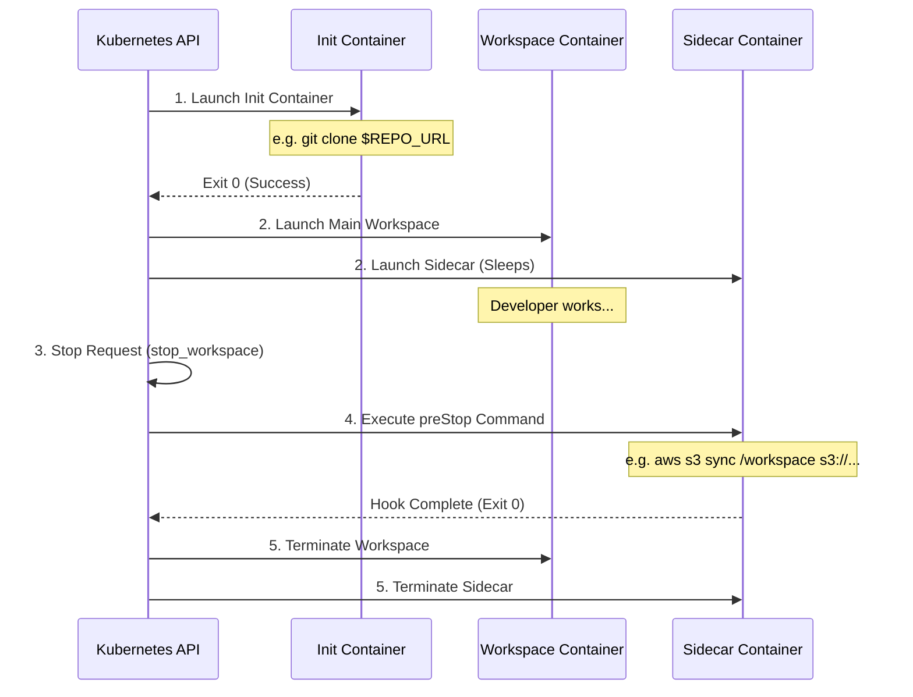

# Workspace Lifecycle Examples: Setup & Backup Hooks

This directory contains concrete, production-ready Kubernetes configuration templates showcasing how to manage workspace setup and backup lifecycles using spawner annotations.

---

## Workspace Lifecycle Flow

The spawner dynamically intercepts template definitions to configure:
1. **Init Containers (`spawner-init`):** Prepares files, clones code, or pulls credentials before the workspace starts.
2. **Pre-Stop Hooks (`spawner-sidecar`):** Runs a script (e.g. `git push`, `s3 sync`) when the pod is deleted or stopped.



---

## Included Examples

### 1. Git State Setup Example
*   **Template:** [setup-state-git.yaml](file:///home/eterna2/github/nogoo9-no-crd/examples/setup-state-git.yaml)
*   **Aquire State:** Dynamically clones a private Git repository using a token passed via the tool's execution `context`.

### 2. S3 State Backup Example
*   **Template:** [backup-state-s3.yaml](file:///home/eterna2/github/nogoo9-no-crd/examples/backup-state-s3.yaml)
*   **Backup State:** Uses a dedicated sidecar container running a `preStop` hook to sync the local workspace storage to an S3 bucket before the workspace terminates. Sets a custom `default-grace-period` (e.g., 180 seconds) to ensure large transfers finish.

---

## How to Register and Spawn

1. Deploy the template ConfigMap to your namespace:
   ```bash
   kubectl apply -f examples/setup-state-git.yaml
   ```

2. Spawn the workspace using the `spawn_workspace` tool:
   ```json
   {
     "id": "my-development-session",
     "templateRef": "setup-state-git",
     "context": {
       "GIT_REPO_URL": "https://github.com/my-org/my-project.git",
       "GIT_TOKEN": "ghp_securepersonalaccesstoken"
     }
   }
   ```
